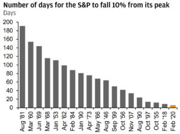
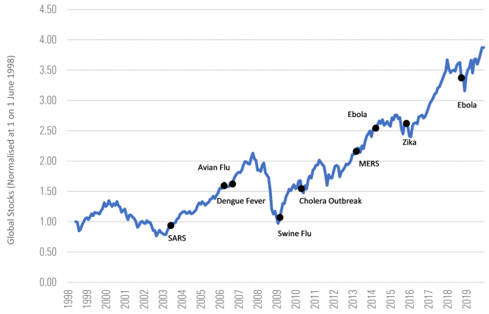
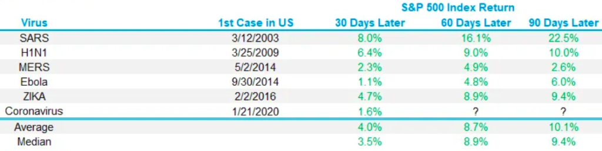
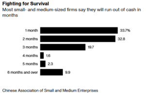
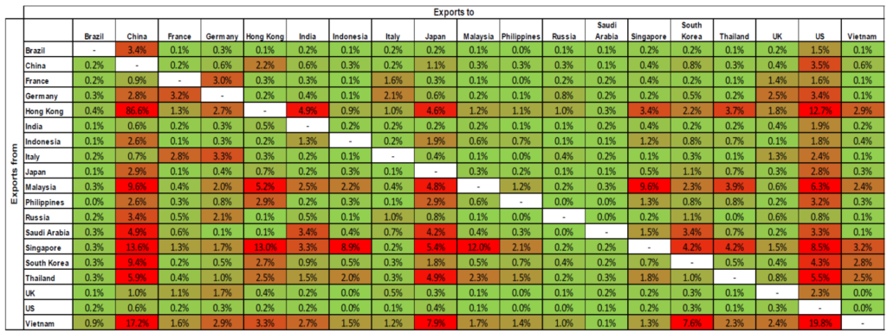
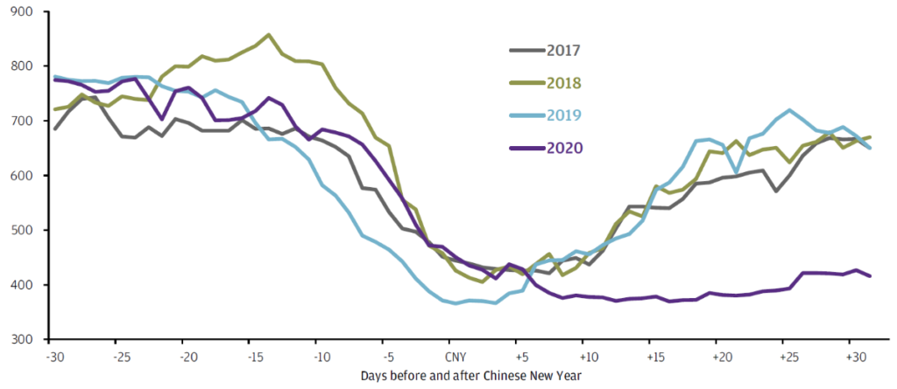
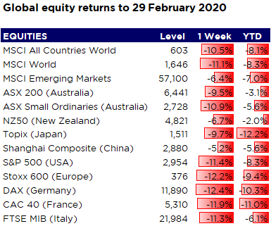
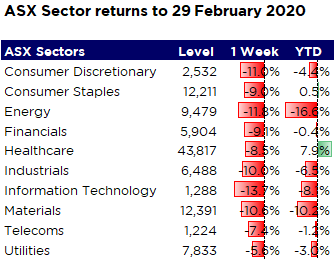
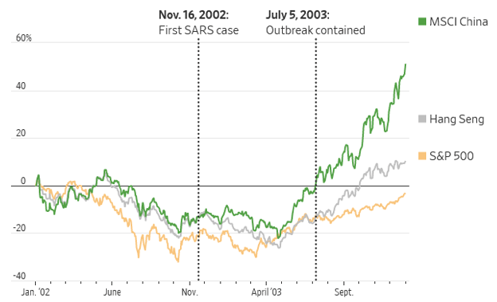

News that a form of coronavirus - known as COVID-19 - has spread to over 60 countries led to sharp falls in global markets last week, with many down over 10% for the week and 5% year to date.

The rapid nature of the correction in global equities caught investors off guard, though bond investors had been more prescient. Reviewing the previous 10% drops in the S&P 500 index, this correction is the fastest in history, taking only six days.

There are two questions that investors now have to grapple with. The first is whether the market reaction has been overdone given the figures surrounding the spread of the coronavirus outside of China remain low as a share of the population. The second is whether the market recovery will be as swift.

The market reaction has been steep and swift given the uncertainty that an epidemic, or pandemic, offers. Looking at past outbreaks, markets react strongly to this uncertainty but tend to recover by the six-month mark.

If we measure local returns after the first case of a secondary outbreak is identified, we see that in 6 previous cases in the US, the S&P 500 was up an average of 10.1% 60 days later.

While it is not unreasonable to expect that this epidemic might follow the path of previous epidemics, with similar results in financial markets, investors should be cognisant of the tail risks should this escalate quickly or last longer than previous epidemics.

Experts might be able to produce spread rates and mortality rates but no one can predict how factors that are unknowable might affect the spread of this or any other outbreak. The market reaction also adds to the sense of fear, creating a vicious cycle as individuals and companies reduce activity and spending.

Lonsec point out that this epidemic is likely to have a greater economic impact given China's dominant presence in the global economy the faster spread of the virus and the measures taken to combat it e.g extended closure of Chinese industry, restrictions on movement of people, disrupted supply chains, declines in commodity prices and the flow-on effect to confidence.

These factors, mirrored in other affected countries, could tip us into a global recession, with heavily indebted consumers and corporates defaulting en masse and leading us into another financial crisis.

This is especially pertinent for the high-yield debt market, with the amount of BBB issuance in recent years from companies with very high levels of leverage susceptible to downgrades. High yield bonds rallied hard in 2019, in the absence of any material acceleration of business sales or corporate earnings, as investors in Australia and elsewhere continued to reach for yield. A rise in defaults and downgrades could see yields in the high yield space soar, with an inverse impact on capital values.

We are already seeing the impact on the small to medium enterprise sector in China, with Bloomberg reporting that millions of Chinese firms face collapse. A survey of small and medium-sized companies conducted this month showed that a third of respondents only had enough cash to cover fixed expenses for a month, with another third running out within two months.

There are three channels to assess the risk of recession through economic contagion:

1. The impact of the crisis on the growth of countries reliant on crisis-hit areas for export demand
2. Global supply chain disruption
3. The risk of financial contagion if a country's capital markets are reliant on crisis-hit areas for corporate earnings.

## Export Demand

The table below from J.P. Morgan Asset Management summarises the inter-dependency of key economies. Green shading indicates low economic dependence for origin country on exports to the destination country and red shading indicates high economic dependence for origin country on exports to the destination country.

**Goods exports as % of origin country nominal GDP 2018.**

*Source: IMF, Refinitiv Datastream, J.P. Morgan Asset Management. Data as of 24 February 2020.*

## Supply Chain Disruption

China is an increasingly important part of the global economy, accounting for 28% of total global growth in 2018.

Some key manufacturing provinces, such as Guangdong, Jiangsu and Zhejiang, have seen new infection numbers come down significantly and factories begin to reopen. These areas account for 27% of China's GDP and 55% of China's exports. However, workers are struggling to return to work, due to quarantine policy, travel restrictions and the imposition of stringent controls on factories that wish to reopen.

It is difficult to measure in real-time the impact of the epidemic on Chinese activity, and the pace of recovery. Traditional data sources such as Purchasing Managers' Index (PMI) surveys are released monthly with a lag.

JP Morgan Asset Management is using alternative sources of data to attempt to gauge activity with a shorter lag. Daily coal consumption reflects electricity and energy demand for broader economic activity. Per the purple 2020 line on the chart below, the rebound that is usually seen after the CNY holiday has yet to materialise.

*Source: Wind, J.P. Morgan Asset Management. CNY = Chinese New Year. Data as of 25 February 2020.*

Although controls may be relaxed somewhat in China, travel and quarantine restrictions are in place in many developed and emerging markets, now impacting multiple points along the global supply chain.

This is manifesting in sharply lower sea traffic and freight rates. SeaIntelligence in Copenhagen said that the loss of sea traffic is running at 300,000 containers a week, which will likely cause a logistical crunch in Europe in early March, even if the epidemic is brought under control quickly. A.P. Moller-Maersk A/S, the world’s largest container shipping company, is positioning itself for a strong rebound but they don't expect it within the next two months.

Anecdotally, we are hearing many stories of projects being delayed due to goods being quarantined or not manufactured at all, which is impacting small to medium enterprises in Australia. This will likely have an impact on growth and unemployment, even if the outbreak is relatively contained.

### Financial Contagion

For investors that don't have direct exposure to China or other affected regions, attention should be given to the effect of the crisis on the earnings of domestically listed companies.

There may be some impact to valuations in the short term as investors seek safer assets, though safe havens such as gold have also experienced selling, potentially as people sell to meet margin calls late last week. However, over the medium term, investors should remain focused on any disruption to earnings growth in the coming quarters.

China, Hong Kong, Macau and Taiwan account for 24% of Australia's total trade, with Japan the second-largest export market, so it is little wonder that the Australian equity market is sharply lower. Sustained weakness in these markets will transmit neatly to Australia, though we note that the focus has shifted to other markets where Australia is less exposed.

On a sector basis, energy, consumer discretionary, industrials and materials will likely remain vulnerable as infection undermines consumer confidence and economic activities, and we are likely to see earnings downgrades. High yield bonds, typically highly correlated to equities, may also underperform with growth concerns at micro and macro levels.

## Recovery

Historical data suggests that stock market gains have been the norm soon after the initial outbreak of various health crises reached the US. Previous outbreaks, such as Severe Acute Respiratory Syndrome (SARS) in 2002-03, H1N1 influenza virus in 2009 and Ebola in 2014, suggest that markets fall short term on heightened uncertainty but tend to bounce back relatively quickly.

Could COVID-19 impact the global economy more than previous epidemics and pandemics? Clearly a strong possibility, given supply chains have come to a halt in the world's second-largest economy (China). Corporate America just reported a very impressive earnings season, so the chances of a US earnings recession are buffered somewhat however the impact on both the demand and supply side cannot yet be gauged.

It is far too early to, and too unpredictable in its nature, to assess the ultimate impact of the coronavirus on economic activity and corporate earnings. The sooner the virus is confidently contained, the quicker the recovery in economic activity will be particularly given policy stimulus will no doubt be deployed to assist in that recovery.

However, the more the virus affects activity in other regions, and the longer the period of reduced travel to restrict the transfer of the infection, the greater will be the impact on corporate earnings and capital values.

There is no 'safe' approach for investors to take in these situations - liquidating holdings and trying to time the eventual rebound means you are likely crystalising losses and going to miss the rebound. Investors should maintain a diversified approach to asset allocation, given the uncertain nature of the outbreak.

It is worth noting that pullbacks and market corrections happen and are part of long-term investing. In fact, since 1980 the average year has experienced a pullback in the S&P 500 from peak to trough of 13.7%. Even more impressive, looking at the 29 years that the S&P 500 has been green since 1980, the average year had a correction of 10.9%.

### **Sources:**

* 'Coronavirus: An investment perspective' - Morningstar Investment Management
* 'Monitoring the global impact of COVID-19' - J.P. Morgan Asset Management
* 'Dominoes falling' in global shipping as coronavirus continues to grip China's economy' - www.telegraph.co.uk
* 'Beware the long tail of coronavirus risk' Lonsec. This article contains information first published by [Lonsec](http://www.lonsec.com.au/). Voted Australia’s #1 Research House for 2019