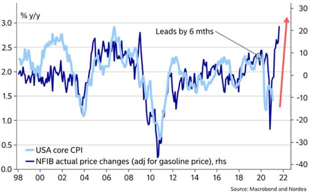

As vaccines continue to roll out globally, the rebound has shifted to cyclical sectors that the market expects will perform strongly as the world returns to normal. 

In the US, the style rotation has been apparent in the performance disparity between the ‘old economy’ Dow Jones Industrial Index, which rose 8.3% in the March quarter, and the 1.8% rise in the ‘new economy’ NASDAQ Composite Index 1.8%. 

Rising bond yields and steepening yield curves are aiding the rotation due to their effect on lofty valuations assigned to growth assets, especially in the technology sector.

## Australia

The Westpac-Melbourne Institute Index of Consumer Sentiment rose 2.7 points in March to 111.8 and is now just 0.2 points below the December level, which was a ten-year high. 

Key contributors to sentiment have been improving economic conditions on the back of global and local efforts to distribute vaccines and tighter labour market conditions. February employment numbers surged by 88,700, with the entire increase coming from full-time jobs and employment now sitting above the pre-pandemic level. 

As widely expected, the RBA maintained its current accommodative monetary policy settings at its April meeting. The board noted that it remains committed to the 3-year government bond yield target of 0.10% but will consider whether it retains the April 2024 bond or shift to the next maturity date. 

Australia’s manufacturing sector continued to expand in March, with the AIG Manufacturing PMI rising 1.1 points from 58.8 to 59.9. All six manufacturing sectors reported positive trading conditions.  Manufacturers of machinery and equipment, textiles, clothing, footwear, paper & printing products reported particularly buoyant conditions. 

Retail turnover was soft in February, falling 0.8% but showing a 9.1% increase through the year, demonstrating the importance of consumers in driving the recovery. Sales may soften as temporary support from JobKeeper and the JobSeeker subsidy concludes.  The recovery continues to be uneven, with travel retailers and small businesses in CBD locations bearing the brunt of the pandemic fallout.

## United States

The US economy continues its upward trajectory, with recent data pointing to an upswing in activity and improving confidence as the vaccine rollout increases pace. More than 100 million people have received at least one coronavirus vaccine dose, and US health workers administered over 1 million doses on a single day. 

The IMF expects US GDP to grow by 6.4% in 2021, an upgrade of 1.3 percentage points, driven mainly by the Biden administration’s $1.9 trillion stimulus. 

The manufacturing index rose to 59.0 as expected, while the services index surprised to the upside at 60.0 (above the expected 59.1). 

The ISM non-manufacturing PMI continued to strengthen in March, lifting from 55.3 to 63.7 and easily surpassing expectations of 59.0. The reading pointed to the strongest growth in services activity on record as the easing of coronavirus-related restrictions released pent-up demand for many services. 

Non-farm payrolls for March came in strongly at 916k, beating expectations of 647k, while consumer confidence surged 19.3 points in March to 109.7.  

The Federal Reserve maintained its accommodative policy stance at its March meeting, as widely expected. Fed Chair Jerome Powell stated that the unevenness in the economic recovery would see monetary policy remain accommodative for some time, with Fed fund futures now pricing in almost a full rate hike by December next year.

The relaxed stance on monetary policy comes amidst increasing angst on inflation. Nordea noted that the latest NFIB Business Optimism Index release indicates intense pressure on core inflation should usual correlations hold. 

## Europe

Europe’s battle against the coronavirus took a backward step as France and Italy were forced to impose nationwide lockdowns ahead of the Easter weekend following a surge in cases. 

The shortfall in what the bloc was producing compared with its full potential at the start of this year, known as the “output gap”, reflects and economy held back by tight restrictions on business and a slower rate of vaccinations when compared to developed market peers.  

The shortfall was double the equivalent differential in the US, meaning that the European economy created fewer jobs, yielding weaker demand and generating lower inflation.

Meanwhile, the UK remains on a steady path out of its three-month lockdown as the government considers a ‘vaccine passport’ to allow travellers proof of their vaccination. However, there are concerns regarding equity for those unable to access vaccines. 

UK GDP expanded 1.3% in the fourth quarter, surpassing expectations of 1.0%, and the Bank of England Chief Economist Andy Haldane noted that the UK could see a “rip-roaring” recovery even if consumers spend just a bit of the additional savings they have accumulated during the crisis. 

This potential spike in demand does raise fears of inflation, with 10 year gilt yields jumping in response.  Andrew Bailey, a Bank of England governor, said the risks of rising inflation were “increasingly two-sided”, although he said the bank was not about to raise rates.

## Asia

China is ramping up its vaccine diplomacy, with Chinese-made vaccines being used to inoculate millions of people in dozens of countries around the world. 

China is still lagging the US in the number of people vaccinated, prompting the Chinese Centre for Disease Prevention and Control to up its target for the number of people injected to 560 million, or 40% of its population, by the end of June. 

China’s economy returned to pre-pandemic levels last year and is projected by the IMF to grow by a further 8.4% in 2021, in contrast to most other major economies, which will not return to their pre-pandemic size until 2023 at the earliest. 

In terms of recent economic data, retail sales surged 33.8% year-on-year in the January-February period, above expectations of 32.0%, as sales cycled last year’s lows due to the coronavirus shutdown. 

Japan’s economic recovery has been stymied by a slow vaccine rollout and trepidation among consumers as daily cases continue to climb. 

The key focus for the government is the vaccination of people aged 65 and over, of which there are around 36 million. Once a critical mass within this demographic receive the vaccine, the government expects personal consumption to get a significant boost. 

India reported more than 100,000 daily Covid-19 cases in early April, a grim measure achieved only by the United States and Brazil. 

However, despite the economic pain wrought by the pandemic, which caused a record 8.0% drop in GDP over 2020, the IMF forecasts a 12.5% rebound in 2021, and further growth of 6.9% in 2022. 

India—along with the US, China, Indonesia and South Korea—will be among the only major economies to exceed pre-pandemic GDP levels by the end of 2021. 

## Equities

Following the March 2020 low, the subsequent rebound in global markets was initially fuelled by growth companies in technology and healthcare that performed well as the pandemic swept across the globe and strict lockdown measures were implemented in most countries. As vaccines continue to roll out globally, the rebound has shifted to more cyclical areas of the market that are expected to perform strongly as the world returns to ‘normal’. 

In the US, the style rotation has been most strongly depicted in the performance disparity between the ‘old economy’ Dow Jones Industrial Index, which rose 8.3% in the March quarter, and the ‘new economy’ NASDAQ Composite Index, which rose 1.8%. The rotation is being aided by rising bond yields, which challenge the lofty valuations that have been assigned to growth assets, especially in the technology sector. 

Australian shares extended their rally through March, gaining 2.4% but failing to keep pace with global markets, which have been buoyed by the vaccine story. In AUD terms, the S&P 500 advanced 6.10% during the month, while the FTSE 100 gained 4.48%.

Very low levels of community transmission and the rollout of the vaccine program have boosted optimism in Australia, particularly for sectors directly linked to the re-opening of the economy, such as consumer discretionary and industrials. Meanwhile, companies that benefited from Covid-19 (e.g. Coles and JB Hi-Fi) will have higher comparable sales to meet in upcoming result periods. 

Chinese shares remain under pressure as markets express concerns around potential policy normalisation as the economy recovers from the pandemic. In addition, uncertainty surrounding possible regulation for some industries and ongoing geopolitical tensions continue to dampen investor sentiment in the region. Emerging markets were weak in March, rising only 0.1% in Australian dollar terms, but have outperformed developed market shares over the past 12 months.

## Property

Debate in global property markets has turned to office markets and how the pandemic may have changed the demand for office space permanently. 

While the return to work in CBDs is progressive, there is a growing realisation that more flexibility to include working from home arrangements is possible and desired. 

As companies plan and leases come to an end, there is already a demand for core space plus an option for a flexible amount. 

After selling off heavily in early 2020, retail property REITs have had bursts of recovery during the last six months as investors react to a vaccine-led recovery. Food and necessity-based shopping centres have continued to trade well and remain in demand by investors. Shopping strips and malls with a high proportion of discretionary spending have been hard hit, and owners face a period of readjustment in tenant mix and rentals. 

In Australia, the residential housing market has been a surprising area of strength. The combination of a ‘lower for longer’ cash rate and a shortage of supply in the secondary market has seen prices escalate quickly. However, this may seem at odds with Australia’s underlying economic conditions, where broad fiscal support measures have ended along with mortgage deferral programs.

## Rates and Credit

Once again, the bond market is proving a critical barometer of the market’s mood. 

The US 10-year Treasury yield has risen from around 0.9% at the end of 2020 to over 1.7% at the end of March 2021.  The longest duration Treasury Bond ETF is now down over 30% from it’s all-time high, approaching it’s largest drawdown ever of 32% in 2012-13. 

The rise in market interest rates is consistent with the ongoing improvement in economic data. However, the rise in yields also reflects the market’s concern about inflation, which has been exacerbated by stimulus measures’ speed and scale.  Questions also remain around governments and central banks’ ability to withdraw or scale back these measures to manage inflation outcomes without threatening the recovery. 

Demand for government bonds has proved resilient despite the flood of supply. However, prices have been volatile, and investors monitor participation in bond auctions following the lapse of bank regulatory exemptions that have done much to buoy the bond market since the start of the pandemic. 

In Australia, the RBA remains committed to the 3-year government bond yield target of 0.10%. The initial $100 billion government bond purchase program will finish in April and the second $100 billion program will commence. 

In the short term, the RBA expects CPI inflation to rise due to the reversal of some Covid-related price reductions, but beyond this anticipates that underlying inflation will remain below 2.0% in coming years. 

## Commodities

Oil prices softened over March as ongoing lockdowns and delays to vaccine rollouts counteracted the recovery optimism. 

The Brent spot price fell 3.6% to US$63.5 per barrel, and the WTI spot price fell 3.8% to US$59.2 per barrel. Oil prices jumped late in March amid concerns global supplies of crude and refined products could be disrupted for weeks as workers try to dislodge a giant container ship blocking the Suez Canal. 

Base metals were mostly down in March, with falls in Nickel (-13.5%), Lead (-3.8%), Copper (-3.2%) and Tin (-1.1%), and gains in Aluminium (+2.7%) and Zinc (+0.9%). The gold price fell 1.3% to US $1,712 per ounce.

## FX

The Australian dollar was under pressure in March, softening 2.9% against the US dollar to end the month at around USD 0.76. 

Rising Treasury yields in the US have been supportive of the greenback, while the risk-on sentiment has also supported ‘commodity currencies’ like the Australian dollar in recent months. Both the RBA and US Federal Reserve remain highly accommodative.

**Sources**

This article contains information first published by [Lonsec](http://www.lonsec.com.au/). Voted Australia’s #1 Research House for 2019.

**General Advice Warning**

The information on this website contains general information and does not take into account your personal objectives, financial situation or needs. You should consider whether the information and any general advice provided is appropriate for your personal circumstances and where uncertain, seek further professional advice before taking any action.

**Important Information**

Walbrook Wealth Management is a trading name of Barbacane Advisors Pty Ltd (ABN 32 626 694 139; AFSL No. 512465). Barbacane Advisors Pty Ltd is authorised to provide financial services and advice. We have based this communication on information from sources believed to be reliable at the time of its preparation. Despite our best efforts, no guarantee can be given that all information is accurate, reliable and complete. Any opinions expressed in this email are subject to change without notice, and we are not under any obligation to notify you with changes or updates to these opinions. To the extent permitted by law, we accept no liability for any loss or damage as a result of any reliance on this information.