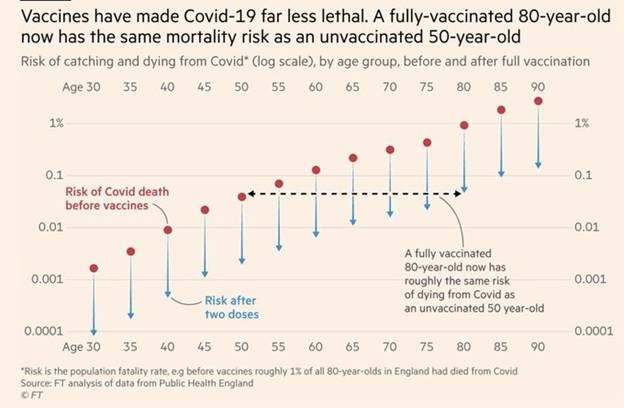
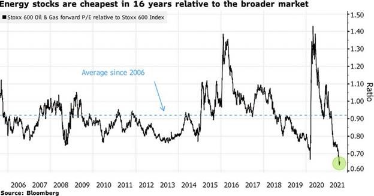
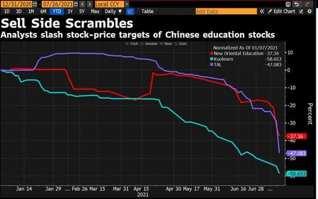
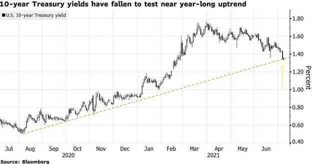
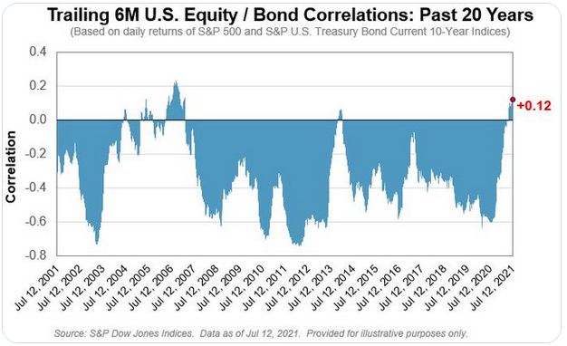
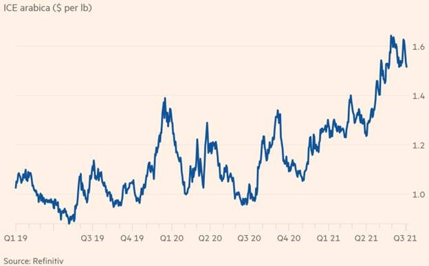
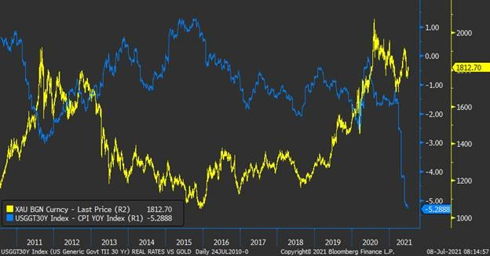
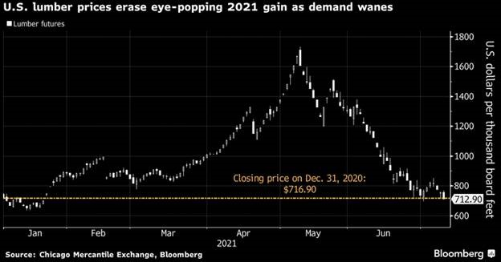
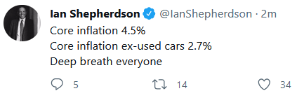

Global Covid-19 cases continue to rise, with numbers surpassing 197 million cases at the end of July, an increase of 14 million in the month. Vaccination remains critical as countries with high vaccination rates show lower hospitalisation and death rates, even with increased infection rates. 3.8 billion doses had been delivered globally as of the end of July.

## Equities

July saw a contrast in global equity performance across regions.  

Developed markets rose 4% in July, buoyed by vaccine rollouts, and remain supported by near term fiscal policy initiatives. The US Senate finalised a bi-partisan US$1 trillion infrastructure bill, whilst EU member states reached final approval of an €800b EU recovery fund support package.

The Australian share market reached all-time highs in July, with the S&P/ASX 200 gaining 1.1% for the month. 

The Materials sector was the clear standout, rising 7.1% as it benefited from solid gains in industrial and precious metals.  Industrials also performed strongly, with an increase of 4.3%. 

Information Technology gave up some of the impressive performance seen in June, with the sector retracing 6.9%. Energy and Financials were also weaker in July, both falling 2.5% and 1.4% respectively. 

The value rotation continued to show signs of weakening, with the S&P/ASX 200 Value Index down 0.3% for the month. Despite the recent weakness, value remains the leading factor year to date (+15.1%). 

Investors continue to favour quality as lockdowns are reinforced across the country amidst rising COVID cases, casting doubts over the pace of Australia’s economic recovery. The S&P/ASX 200 Quality Index was 3% higher for the month. 

Attention has turned to the reporting season, which commenced late last month, with investors eagerly waiting to see whether results can justify the impressive market rally from the COVID induced lows of last year.

Equally paramount will be any commentary offered by companies on their expectations for the future, given the dearth of outlook statements provided last year. 

Rio Tinto reported earnings on 28 July 2021, one of the more highly anticipated reports given the impressive rise in iron ore prices over the past year. The miner didn’t disappoint, reporting record half-year earnings which more than doubled from last year. Rio reported underlying earnings of US$12.2bn compared with US$4.8bn a year earlier. The company will pay out an impressive US$9.1bn in dividends, consisting of a special dividend of US$1.85 per share and an interim dividend of US$3.76 per share. 

In the US, of the 89% of S&P500 companies that have reported actual results for Q2 2021 to date, 87% have reported EPS results above analyst estimates. 

Emerging markets posted a 4.7% decline in Australian dollar terms over the month.  A deep sell-off in Chinese technology and education stocks towards the end of the month drove losses in emerging markets.

Chinese regulatory officials confirmed a leaked policy document banning for-profit tutoring, an industry with an estimated value of c.US$120 billion. This announcement triggered a sell-off in Chinese education stocks which spread to the Chinese technology sector, shaving off a combined US$1.0 trillion in company value, with the MSCI China index posting its largest decline since March 2020. 

Hong Kong was not immune to this mainland decline, with the broader Hang Seng index declining by 9.6% over the month. Volatility will remain in the medium term, as the market struggles to price in the continuation of heightened regulatory risk, which has always been a risk of Chinese equities. 

## Property

CoreLogic’s July 2021 update stated that Australian dwellings rose by 13.5% in the 2020-21 financial year, the highest annual growth rate since April 2004. Rents in June continued to increase, with year to June growing by 6.5%. In July, the 5-capital city aggregate advanced by 1.61%, with Sydney, Melbourne and Brisbane achieving 1.9%, 1.3% and 2.0%, respectively.

A-REIT’s advanced slightly during July, with the S&P/ASX 200 A-REIT Accumulation Index (XPJ) achieving 0.3% for the month, considerably less than the 5.5% advance in the prior month of June.

The lower monthly return can largely be attributed to the COVID-19 Delta variant outbreak, causing continued lockdowns across Sydney and shorter, periodic lockdowns across Brisbane and Melbourne. 

As measured by the FTSE EPRA/NAREIT Developed Ex Australia Index (Hedged to AUD), global property gained 4.2% for July.  

In the US, the Federal Reserve’s Senior Loan Officer Survey for August 2021 indicated stronger demand for commercial construction loans, multi-family properties, and other secured non-residential real estate, indicating strength in the sector. 

The cost of renting a home in US cities is also soaring, squeezing the finances of low-income households and posing a threat to the consensus that pandemic inflation will soon fade away.  The median national rent climbed 9.2% in the first half of 2021, and while part of the increase reflects a bounce-back in prices that dropped earlier in the pandemic, the real-estate firm Apartment List says rents are now higher than if they had stayed on their pre-Covid track.

## Rates and Credit

The Bond rally that started in June has continued throughout July, as yields plummeted. 

The Australian Sovereign 3 and 10-year yields fell by 16 and 30 basis points, respectively, with the 10-year rate ending the month at 1.19%, approaching the level it was at before February’s significant sell-off. 

July’s fall in yields can be attributed, at least in part, to ongoing concerns over the impact of the Delta variant of COVID and markets doubting whether the Reserve Bank of Australia will continue to slow down their Quantitative Easing program as Sydney remains in lockdown.

This same uncertainty has impacted credit markets, as credit spreads widened over the month, as can be seen by the iTraxx Australia Index increasing by slightly over four basis points from the start to the end of July. 

This increase in spreads pales in comparison to the sharp fall in the risk-free rate, which resulted in the AusBond Composite 0+ Yr Index returning 1.8% over the month. 

Globally, the story is much the same, with yields falling as the world grapples with the Delta variant of COVID. The Bloomberg Barclays Global Aggregate Index (AUD Hedged) Index returned 1.3%, or 3.5% for the unhedged variant, over the course of July.

With implications for traditional asset allocation strategies, the correlation between S&P 500 and benchmark UST 10Y index has moved positive for the first time since the “taper tantrum” era, meaning that when equity markets have moved up/down, bond prices have been moving in the same direction.

## Commodities

A surge in green coffee prices may soon filter into costs paid by consumers for their daily caffeine fix, in the latest sign of how hot commodity markets are affecting the broader global economy.

Coffee bean prices on international markets have surged as crops in Brazil, a top producer, have been damaged by the worst drought in almost a century, leading to the first supply shortfall in the coffee market in four years. Anti-government protests in Colombia halted exports earlier this year, further pushing up markets.

US oil prices rose to six-year highs as an OPEC deadlock raised the prospect of a summer in which crude production fails to keep up with rebounding demand from the crush of drivers hitting the roads.  The latest climb in crude markets came after a Saudi Arabia-backed deal to boost output and tame the price rally failed to garner agreement. 

Gold is susceptible to rising US interest rates, which increase the opportunity cost of holding bullion. Conversely, falling real interest rates due to higher inflation and lower nominal interest rates provide a huge tailwind for the yellow metal.

Lumber, which at one point was among the world’s best-performing commodities as the pandemic response sent construction demand soaring and stoked fears of inflation, has officially wiped out all of its staggering gains for the year.

## FX

In July, the Australian dollar continued to fall, dropping -2.0% against the greenback and -1.8% in trade-weighted terms. 

Domestic lockdowns in major economic centres of Australia continue to suppress investor confidence, further weakened by the rapidly growing outbreak of the highly infectious Delta variant of COVID-19 in New South Wales. 

Announcements earlier in the month from the RBA regarding the tapering of QE offered some support to the AUD, however, recent steep price declines in Iron Ore as we moved into August has offset this somewhat.

## Australian Economy

RBA left the cash rate unchanged at 0.1% during its August meeting, as widely expected, while upgrading the outlook for 2022 with economic growth expected to be 4.0% and the unemployment rate to be 4.25%. 

Inflation rose 0.8% in the second quarter, slightly above the expected 0.7% and lifting the annual rate to 3.8%. The labour market has continued to recover, with the unemployment rate falling to 4.9% in June, an 18-month low. The declining unemployment rate coincides with employers reporting high job vacancies and difficulties finding suitable people for them. 

The Westpac consumer confidence index rose 1.5% to 108.8 in July, beating expectations of a 2.5% fall, with concerns over the coronavirus outbreak and associated restrictions in New South Wales not (yet) spilling over to the rest of the country. 

The NAB business confidence index fell sharply to 11 in June, well below expectations of 19, amid COVID-19 lockdowns in New South Wales and Victoria. Confidence weakened across all industries except mining and manufacturing. The Markit Manufacturing PMI fell 1.7pts to 56.9 in July, slightly above expectations of 56.8. 

The trade surplus widened to $10.50 billion in June, surpassing expectations of $10.45 billion, as exports and imports rose 4% and 1%, respectively.

## U.S. Economy

The US Fed kept interest rates on hold at 0.25% as widely expected, indicating that it is moving closer towards tapering bond purchases. 

CPI rose 0.9% in June, the highest monthly print since June 2008, easily beating expectations of 0.5%. The yearly rate lifted to 5.4% against expectations of 4.9%. 

Core CPI lifted 0.9% in June, above the expected 0.4% while the yearly rate rose 0.7% to 4.5% (4.0% expected). 

The first estimate for 2Q21 GDP disappointed, coming in at a 6.5% annual growth rate, well below the expected 8.0%. 

Non-farm payrolls showed the economy added 943,000 jobs in July, surpassing expectations of 870,000 and up on the June revision. The robust gain in non-farm payrolls saw the unemployment rate fall to 5.4%, below expectations of 5.7%, which, coupled with a rise in the participation rate to 61.7%, reinforces the economy’s strength. 

Personal consumption expenditures grew strongly, posting an 11.8% annual growth rate, led by growth in services and nondurable goods. Personal income surprised in June, rising 0.1% against expectations of a 0.3% decline. 

The PMI Composite Index fell 4 points to 59.9 in July, from June’s 63.7, with the rate of expansion the softest since March amid a slower upturn in service sector activity.

## European Economy

Eurozone economic sentiment rose in July for the sixth month in a row to an all-time high of 119.0, ahead of the expected 118.7., reflecting the hope of a robust economic recovery due to the re-opening of economic activities. Retail sales expanded 1.5% in June.

The ECB left its interest rate policy-setting unchanged at its July meeting, as widely expected.  The Markit manufacturing PMI stood at 62.8 in July 2021, in line with expectations, while the Markit Services PMI rose 1.5pts to 59.8, missing expectations of 60.4. 

As widely expected, CPI rose 0.4% in July, while the yearly rate fell 0.2% to 2.3%. PPI rose 1.4% in June, while the annual rate increased 0.7% to 10.3%. The unemployment rate fell 0.3% to 7.7% in June, coming in below expectations of 7.9%. 

In the UK, CPI rose 0.5% in June, surpassing expectations of 0.2%, as the yearly rate increased 0.4% to 2.5% (2.2% expected), marking the highest inflation rate since August 2008. 

Retail sales increased 0.5% in June, broadly in line with expectations, with the yearly rate at 9.7%. 

The July Markit/CIPS Composite PMI fell more than expected to 59.2, well below the 61.7 estimates and signalling the slowest rate of private sector expansion in the UK for four months. COVID related restrictions were lifted in England on 19 July, with other jurisdictions following by the end of the month.

## Asian Economy

In June, China’s inflation rate unexpectedly fell 0.4%, while the unemployment rate printed at 5%, the lowest rate in two years. 

The Caixin Composite PMI jumped to 53.1 in July 2021, indicating a stronger rise in overall Chinese business activity. The acceleration in activity came after the epidemic in Guangdong province was brought under control and before Covid-19 resurged in Jiangsu province, the country’s most widespread outbreak in months. 

The trade surplus was US$56.6 billion in July, above the market consensus of US$51.5 billion, with exports and imports rising 19.3% and 28.1%, respectively. 

In Japan, Tokyo hit a new daily record of 3,177 new COVID-19 cases at the end of July, as pressure mounted on the hospital system and increased concerns about the ongoing Olympic games. 

Japanese consumer confidence rose 0.1pts to 37.5 in July, beating expectations, while Retail sales rose 0.1% year-on-year in June, the fourth straight month of growth in retail trade. 

CPI rose 0.3% in June, ahead of expectations of 0%, as the yearly rate increased to 0.2%.

**Sources**

This article contains information first published by [Lonsec](http://www.lonsec.com.au/). Voted Australia’s #1 Research House for 2019.

**General Advice Warning**

The information on this website contains general information and does not take into account your personal objectives, financial situation or needs. You should consider whether the information and any general advice provided is appropriate for your personal circumstances and where uncertain, seek further professional advice before taking any action.

**Important Information**

Walbrook Wealth Management is a trading name of Barbacane Advisors Pty Ltd (ABN 32 626 694 139; AFSL No. 512465). Barbacane Advisors Pty Ltd is authorised to provide financial services and advice. We have based this communication on information from sources believed to be reliable at the time of its preparation. Despite our best efforts, no guarantee can be given that all information is accurate, reliable and complete. Any opinions expressed in this email are subject to change without notice, and we are not under any obligation to notify you with changes or updates to these opinions. To the extent permitted by law, we accept no liability for any loss or damage as a result of any reliance on this information.