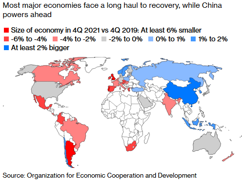
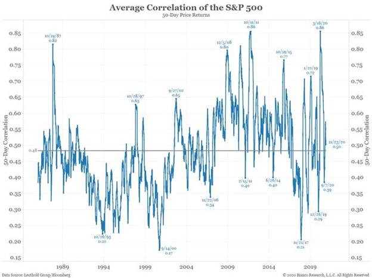
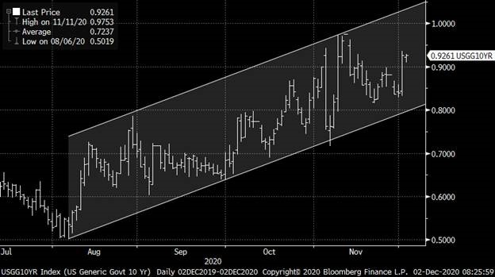
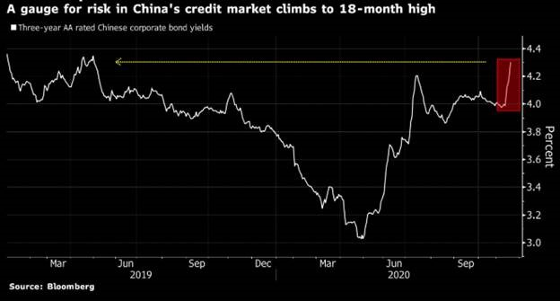
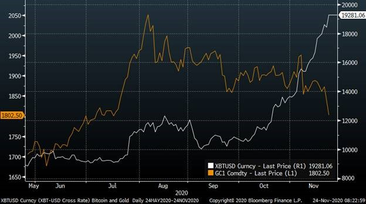

The global recovery is underway and is looking sufficiently V-shaped, but recent economic news has been mixed. Infection rates have risen in the US and Europe, causing a loss of momentum, but news of successful vaccine trials from multiple companies has boosted confidence. Central bank policy remains remarkably accommodative, and fiscal spending is supporting jobs and income.

Globally there were over 60 million confirmed Covid-19 cases at the start of December and numbers continue to rise in the US, South America and Europe. The UK has begun rolling out the Pfizer-BioNTech vaccine, while Australia and the US are preparing to do the same once the vaccine is approved. 

### Australia

Australia’s economic recovery has found solid footing, underpinned by low Covid-19 case numbers nationwide and news of successful vaccine trials.

At its December meeting, the Reserve Bank of Australia left interest rates unchanged at a record low 0.10%. The board anticipates no increase in the cash rate for at least three years, while the size of the bond purchase program will remain under review and dependent on the outlook for jobs and inflation.   The 3-year bond yield target remains at 0.10%.

Since the start of 2020, the RBA has expanded its balance sheet by $130 billion, and under its new quantitative easing program, the RBA will buy $100 billion worth of bonds over the next six months. These measures have helped to keep funding costs low, extend much-needed liquidity to businesses, and support balance sheets. RBA Governor Lowe stated the bank will continue to review its policy settings and is prepared to do more if necessary. Lowe said the bank is paying close attention to asset prices and household debt but considers unemployment to be the most significant risk to stability, rather than excess borrowing.

GDP grew 3.3% in the September quarter, beating expectations of 2.6%. Household consumption gained the most on record, increasing 7.9% following the sharp fall in the previous quarter of 12.5%, while government spending rose 1.4%. Recent data generally point to sustained growth, but we expect the recovery to be uneven and dependent on fiscal support. 

Retail sales increased 1.4% in October, slightly below the 1.6% expected, bouncing back from a 1.1% fall in the previous month. Building permits followed on from the 16.2% increase in September, gaining a further 3.8% in October, well ahead of expectations of a 3.0% fall. 

Labour force data showed employment surged in October, adding 178,800 jobs and confounding expectations for a fall of 30,000. The unemployment rate still rose to 7.0%, however, largely due to the participation rate unexpectedly climbing to 65.8%. Full-time employment increased by 97,000 to 8,643,700 people, and part-time employment increased by 81,800 to 4,130,200 people. 

The AiG Performance of Manufacturing Index revealed continued expansion in the manufacturing sector, but at a significantly slower pace, falling to 52.1 in November from 56.3 in the previous month. 

Optimism abounds according to the latest Westpac-MI Consumer Sentiment Index, which lifted to 112 in December from 107.7 in November. 

Westpac noted that, after only eight months, it seems clear that sentiment has fully recovered from the Covid recession. The ‘economy, next 12 months’ sub-index rose 9.9% to 111.9, a ten-year high, thanks to Australia’s relative success in combatting the pandemic. The ‘economy, next five years’ sub-index rose 5.9% to 121.1, the strongest reading since December 2009. 

China has ramped up its trade conflict with Australia, putting tariffs of up to 200% on Australian wine and suspending the importation of beef from a sixth Australian supplier. Timber log imports from QLD, VIC, TAS and SA have also been suspended by China, along with previously advised barley. China’s list of concerns includes the banning of Huawei and ZTE from Australia’s 5G network, as well as Australia’s “incessant wanton interference in China’s Xinjiang, Hong Kong, and Taiwan affairs”.

### United States

The US economy has rebounded strongly, but recent economic data has disappointed. US GDP grew at an annualised 33.1% in the September quarter, in line with the advance estimate, making it the largest ever quarter of growth, rebuilding from the 31.4% fall in the June quarter. Personal spending was the main driver of growth, supported by benefits from the federal CARES Act. However, non-farm payrolls showed only 245,000 workers were added to the economy in November—the fewest additions in six months.  

President-elect Joe Biden is expected to nominate former Federal Reserve Chair Janet Yellen as US Treasury secretary, breaking a 231-year gender barrier.  This appointment will put a seasoned economist and labour market expert in charge of leading the country out of the steepest downturn since the Great Depression.

The ISM Manufacturing Index fell from 59.3 in October to 57.5 in November, slightly lower than the consensus 57.7, while the PMI Manufacturing Index increased in line with expectations from 53.4 to 56.7. 

### Europe

Europe’s recovery has set in, even as the region battles resurgent coronavirus numbers and national governments implement new post-lockdown restrictions ahead of the festive season. 

France’s President Macron announced a three-stage easing of the country’s lockdown, starting with the reopening of ‘non-essential’ businesses such as hairdressers and clothes shops. At the same time, Germany and Spain will enforce restrictions on Christmas gatherings to prevent cases from multiplying. 

GDP across the eurozone rebounded by 12.6% in the September quarter—the steepest pace of expansion since 1995—after falling 11.8% in the previous quarter. The eurozone unemployment rate came in as expected in October, rising from 8.3% to 8.4%, with government support programs continuing to support the labour market. 

As the Covid battle rages on, Brexit negotiations between the UK and Europe are yet to yield an agreement. Prime Minister Johnson and European Commission President Ursula von der Leyen both admit that a no-deal Brexit is possible if there is no movement on the three critical issues of governance, fishing quotas and competition rules. 

UK GDP rose 1.1% in September, below the expected 1.5%, while the quarterly rate improved to 15.5%, falling short of the expected 15.8%.

### Asia

Japan’s GDP rebounded by an annualised 21.4% in the September quarter (surpassing expectations of 18.9%) following a revised 28.8% contraction in the prior quarter. 

The main driver was net external demand, which contributed more than half of the growth, while private consumption also added to the result, returning to growth for the first time in a year. 

Japan’s central bank is now the largest owner of Japanese stocks thanks to the Bank of Japan’s massive purchases of exchange-traded funds (ETFs) to support the market during the pandemic. 

China is preparing for a large-scale rollout of its own domestically developed coronavirus vaccines. At least five vaccines from four producers are being tested in more than a dozen countries including Russia, Egypt and Mexico, while around one million Chinese health care and other workers deemed at high risk have already received the vaccine. 

### Equities

November was a record-breaking month for global equities.  Investors are prepared to look past short-term restrictions as they see an end in sight.

Globally, the MSCI World ex Australia Index rose 7.4%, and the MSCI Emerging Markets Index rose 4.1% in Australian dollar terms. In Asia, Japan’s Nikkei 225 Index rose 15.1%, Hong Kong’s Hang Seng Index rose 9.4%, and China’s CSI 300 Index rose 5.7%. 

The average correlation of S&P 500 stocks to the index itself has come down markedly from high of 0.86 in March.  The current level of 0.5 is mainly in line with the average since the late-1980s.

The ASX 200 Index posted a return of 10.2% in November, building on October’s momentum as the rotation into cyclical sectors continued. The easing of Covid-19 restrictions, a string of better-than-expected economic data, and positive news from vaccine trials all contributed to the rally. 

It was not all smooth sailing, however, with some businesses hit hard by Chinese trade measures. Treasury Wine Estates went into a trading halt after the Chinese Ministry of Commerce announced it would apply provisional anti-dumping measures on Australian wine. 

In the US, the focus shifted to the deployment of vaccines countrywide following successful trials, while Joe Biden firmed as the victor of the presidential election. 

The Dow Jones blew past 30,000 points, and the S&P 500 Index rose above 3,700 points in early December even as the US reported record new cases of the coronavirus. 

Monetary policy remains extremely accommodative around the world, while further fiscal stimulus in the US and other regions will plug the liquidity gap until vaccines are widely available. In Europe, cyclical sectors, including energy and financials, regained favour, while previously beaten-down sectors like travel and retail posted substantial gains. 

### Property

The A-REIT sector eclipsed the ASX 200 in November, rebounding 13.3% following a mixed performance in October. 

Quality assets are in demand, and Australian property is still attracting capital flows from offshore. Rent collections have improved and remain high across the office and industrial sectors, while retail has seen a significant lift from its June lows. 

The retail sector will benefit from the reopening of the economy, with foot traffic already improving significantly. However, shopping centres with leisure facilities may continue to be affected as social distancing measures remain in place for some categories like cinemas, gyms and restaurants. 

US REITs also had a strong month, posting 9.1% in US dollar terms, with large gains coming from hotels (+43.6%), shopping centres (+34.3%) and regional malls (+31.6%). 

### Rates & Credit

Yields came under pressure in November, with investors mapping out the impact of rising rates on markets ranging from stocks to corporate bonds. The US 10-year Treasury yield rose early in the month from 0.88% to 0.98% on renewed optimism for US stimulus talks, before retreating to 0.84% by month-end. 

November was a solid month for credit, with global high yield credit gaining 4.3% and global investment-grade credit gaining 2.1% in Australian dollar hedged terms.  

In emerging market credit, a spate of Chinese corporate bond failures sparked a sell-off in riskier debt. Yields on three-year AA rated yuan-denominated Chinese corporate bonds, considered by some analysts as junk debt in the onshore market, surged during the month.

### Commodities

Oil jumped in November and continued to rally into December as hopes for Covid-19 vaccines and continued stimulus supported the energy sector. 

OPEC and Russia have agreed to increase oil production by 0.5 million barrels a day from January 2021, making the net cut from a year ago at 7.2 million barrels a day. 

The Brent crude price rose 28.9% in November to US$46.84 per barrel, and the WTI crude price rose 26.8% to US$45.20 per barrel. 

Metals also moved higher in November, with gains in Lead (+13.7%), Copper (+12.8%), Aluminium (+10.6%), Zinc (+10.6%), Nickel (+5.8%) and Tin (+5.1%). 

The Gold spot price continued to fall over the month, dropping 5.4% to US$1778.10 per ounce.

### FX

The Australian dollar gained 5.0% against the US dollar in November and appreciated against other major currencies as the domestic outlook improved and commodity prices pushed higher. 

Widening US trade and fiscal deficits will likely put pressure on the US dollar, while Australia’s relative success in managing the pandemic has lifted its currency.

Bitcoin broke through US$19,000 to hit its highest level since December 2017, extending its blistering 2020 rally driven by demand for its perceived quality as an inflation hedge and expectations of mainstream acceptance.

Bitcoin is now close to its all-time high of just under $20,000, which it touched at the peak of its retail investor-fuelled 2017 bubble.

**Sources**

This article contains information first published by [Lonsec](http://www.lonsec.com.au/). Voted Australia’s #1 Research House for 2019.

**General Advice Warning**

The information on this website contains general information and does not take into account your personal objectives, financial situation or needs. You should consider whether the information and any general advice provided is appropriate for your personal circumstances and where uncertain, seek further professional advice before taking any action.

**Important Information**

Walbrook Wealth Management is a trading name of Barbacane Advisors Pty Ltd (ABN 32 626 694 139; AFSL No. 512465). Barbacane Advisors Pty Ltd is authorised to provide financial services and advice. We have based this communication on information from sources believed to be reliable at the time of its preparation. Despite our best efforts, no guarantee can be given that all information is accurate, reliable and complete. Any opinions expressed in this email are subject to change without notice, and we are not under any obligation to notify you with changes or updates to these opinions. To the extent permitted by law, we accept no liability for any loss or damage as a result of any reliance on this information.