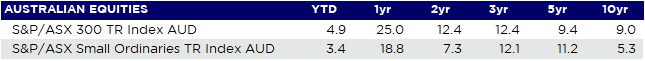

Just as some of the risks that had fuelled uncertainty in 2019 faded – notably trade tensions and Brexit uncertainties – new risks emerged across the globe.

Trade tensions broadly eased as President Donald Trump signed both the Phase 1 agreement with China and the United States-Mexico-Canada Agreement (also known as USMCA or NAFTA 2.0).

The risk of further escalation in the trade war has been averted for now, but a full resolution remains unlikely until at least 2021. Removal of existing tariffs is conditional on achieving the targeted increase in U.S. imports over 2020-21, and the trade deal is more about avoiding an escalation than a complete scaling back of tariffs.

The U.K. has officially exited the EU and begun its 11-month transition period, with Brexit in name rather than substance at this point. The continuing negotiations are expected to be difficult given the tight timeline sought by the Tories, however it is now in the interests of both sides to conclude a deal as quickly as possible.

With the passing of the Brexit bill by the U.K. parliament removing significant uncertainty, the worst appears to be over for the eurozone with possible fiscal support on the way from the German government, and the most significant increase in exports in two years helped by the weaker euro.

These positive developments were overshadowed by the outbreak of the coronavirus in Wuhan, China. News of the virus’s spread had a pronounced effect on markets, with investors concerned about the flow-on effects to the real economy. Chinese tourists are the highest-spending in the world (in 2018 they spent US$277 billion), so the impact of travel restrictions and quarantine will affect all markets, with the tourism and travel sectors directly impacted.

Oil prices in particular sharply corrected, and global equities broadly ended the month with losses – in the U.S, the S&P 500 slipped from more than a 3% gain to end the month flat. Developed market sovereign bonds, gold, and the U.S. dollar rallied in the risk-off environment, while credit spreads widened.

U.S. corporates, the large-cap tech sector in particular, represented a bright spot, with robust earnings that emphasized the resilience of U.S. companies in the face of weak global growth.

Economic fundamentals actually started the year on a better footing. In the U.S., the unemployment and labor force participation rates remained stable, non-farm payrolls increased more than expected, and 4Q GDP growth appeared solid at 2.1%, consistent with economic targets. Strong retail sales and a modest increase in consumer confidence further supported the economic environment. Globally, composite PMIs reflected expansionary conditions.

Central banks, including the Federal Reserve, Bank of Japan and European Central Bank, generally held policy rates steady. While rates were also unchanged in the U.K., the Bank of England downgraded its growth estimates, citing lingering uncertainty even after the official announcement of Britain’s departure from the EU.

Meanwhile, China’s economy grew at its slowest pace (6.1%) in nearly three decades in 2019 which, coupled with the coronavirus outbreak, spurred concern over the impact of a more fragile Chinese economy on the rest of the world.

### Australia

The Australian economy grew at 1.7% in the September quarter and most likely less than 2.0% in the December quarter, well below the growth rate required to lift wages and inflation and to keep unemployment from rising.

The RBA has indicated that it will cut rates if it drifts further away from achieving its inflation and unemployment targets. The unemployment rate currently sits at 5.1%, up slightly from 5.0% a year ago.

Leading indicators of unemployment still paint a picture of subdued jobs growth, contrary to the 43,400 jobs added in the December quarter. ANZ job ads dropped an alarming 6.7% in December and fell 18.8% year on year, although the bushfires may have impacted part of the monthly result. After strong Black Friday sales in November, retail sales pulled back more than expected in December.

Bushfires in Victoria and NSW will have an impact on growth, reflecting the direct loss of output, lost tourism, lower consumer and business confidence, and supply chain disruptions. However, insurance payouts and government support packages will likely provide an offsetting boost in the quarters ahead.

For the RBA, the bias is still towards lower cash rates. We may see a “gentle turning point” in the economy, but growth sufficient to justify tightening monetary policy is not assured.

### Equities

The MSCI World Ex-Australia Index rose 4.2% in January in Australian dollar terms, but most major indices were down when measured in local currency.

Globally, valuations across most regions remain above their long-term average from a Price/Earnings (P/E) standpoint but remain attractive, relative to bonds, in terms of yield.

After surging in the final quarter of 2019, U.S. equities were flat in January, while the coronavirus outbreak added to global uncertainty and saw markets tumble at the end of the month.

The services sector has remained relatively resilient, driven mostly by the robust U.S. consumer sector, which has enjoyed healthy balance sheets, steady employment, wage growth, and low interest rates.

In the U.K. the FTSE 100 Index finished 3.5% lower in January on the back of weaker economic data, as well as lingering uncertainty around Brexit arrangements and the form of a trade deal with the E.U.

Following a commanding performance in 2019, the Australian equity market started 2020 in the same manner, with the S&P/ASX 200 Index returning 5.0%, led by large-cap shares. Markets may be factoring in some optimism on economic growth and earnings.

However, there is scant evidence of what RBA Governor Philip Lowe described as a “gentle turning point” in the economy. The volatility caused by the outbreak of the coronavirus, which saw shares decline in late January and early February, highlighted the fragility of markets.

Source: Lonsec iRate

The 12-month forward P/E for the Australian equity market stood at 17.4 times in January, nearing its highest level since 2001, with earnings growth for FY20 coming in at a moderate 5.0%. A P/E at this level signifies a relatively expensive market, which makes it vulnerable to shocks like the coronavirus.

Still, investors need to be cognisant of the continuation of ultra-low interest rate settings providing meaningful valuation support for equities.

### Rates & Credit

Yields remain low across government and corporate debt and were down over January, with the U.S. 10-year Treasury yield falling from 1.92% to 1.51% and the Australian 10-year Treasury yield falling from 1.37% to 0.95%. The U.K. 10-year Gilt yield fell from 0.82% to 0.52% as markets contemplated the form of a future trade deal with the E.U., while the German 10-year Bund yield moved deeper into the red, falling from -0.19% to -0.44%. Japan’s 10-year Treasury yield fell from -0.02% to -0.07%, only briefly switching into positive territory over the month.\
\
Investment-grade credit spreads widened during the month with uncertainty caused by the coronavirus outbreak weighing on sentiment. However, this occurred only after spreads hit their lowest level since early 2018 on the back of strong US economic data and corporate earnings.

Non-investment grade credit spreads widened 0.39% in January, generating positive returns but underperforming like-duration Treasuries.

### FX

The Australian Dollar was the weakest performing Group of 10 (G10) currency (down 4.7% versus the dollar) as concerns grew over the potential impact of the coronavirus outbreak on growth in China – a major Australian trading partner.

The U.S. Dollar Index (DXY) ended the month 1.00% stronger than its developed-market counterparts as U.S.-Iran geopolitical tensions and the coronavirus outbreak weighed on global risk sentiment.

Reflecting U.S. Dollar strength and generally mixed economic data, the Euro weakened 1.1% versus the dollar.

The British Pound fared somewhat better, with Cable (GBP/USD) down just 0.4%, thanks to better-than-expected economic data late in the month. Due to the risk-off environment, the Japanese yen – a traditional “safe-haven” currency – strengthened 0.2% versus the U.S. Dollar.