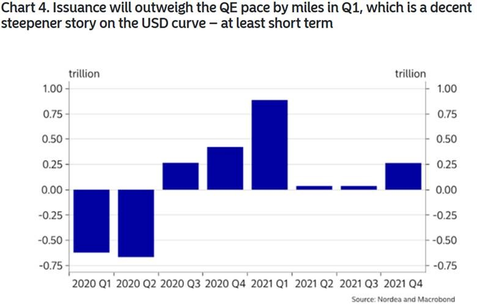
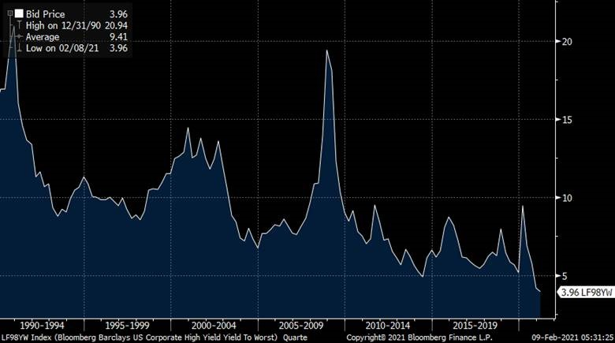
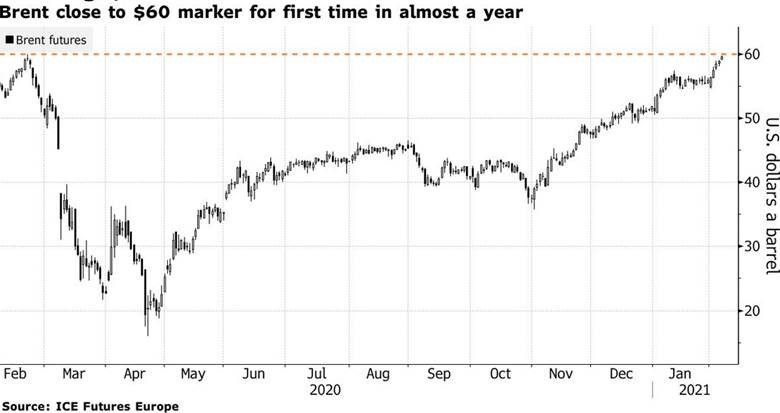
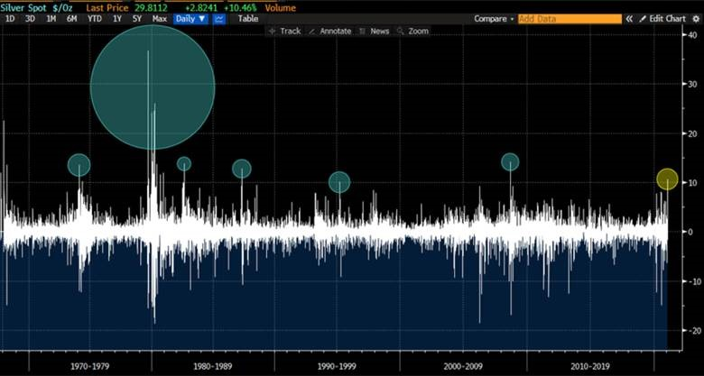
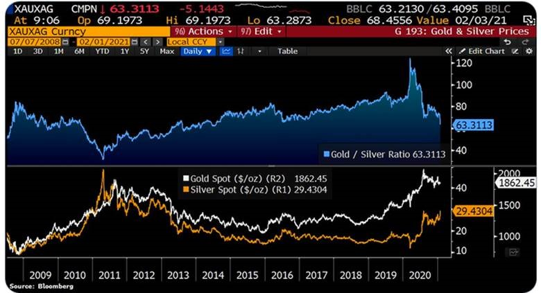

The pandemic still looms large across the global economic landscape, with over 100 million confirmed Covid-19 cases worldwide at the start of February. The gradual rollout of vaccines offers hope that the world can achieve a new normal, despite early logistical roadblocks and shortages in some regions. The Covid-19 situation in the US is improving while Europe is bringing recent outbreaks under control.

### Australia

As Australia prepares for its vaccine rollout, the recovery which has been most evident in the labour market, continues. The unemployment rate fell from 6.8% to 6.6% in December, lower than the 6.7% expected, as the labour market's recovery continued to outperform expectations. 

Retail sales fell 4.1% in December and were weaker than expectations of a 2.5% decline as shoppers pulled back in the crucial lead-up to Christmas, resulting in declines across five of the six retail industries. 

Australia's trade balance rebounded in December to a surplus of $6.8 billion but fell short of expectations, while Australia's manufacturing sector continues to expand.  The AiG Manufacturing PMI for the combined months of January and December rose and manufacturers reported stronger and more broad-based recovery over the summer holiday period. The Markit flash manufacturing PMI showed a 1.5-point rise to 57.2 in January, with goods producers enjoying the fastest expansions in both sales and production in over three years. 

Sentiment remains strong with the Westpac-MI Consumer Sentiment Index lifting to 109.1 in February from 107.0 in January. With the government phasing out the JobKeeper program at the end of March, consumers' ability to look ahead with confidence is critical. 

The 'time to buy a dwelling' index fell 3.1% and is now 8.6% below its peak in November. The decline in recent months suggests that house price increases may already be starting to weigh on the purchasing sentiment. 

### United States

In the US, President Biden issued new executive orders to accelerate the production of vaccines and protective equipment, establish a Covid-19 testing board, and mandate mask-wearing on public transport.  Vaccines have begun rolling out across the country as daily confirmed cases continue to fall, and Congress is negotiating President Biden's proposed US$1.9 trillion stimulus package.

US December quarter GDP rose 4.0%, in line with expectations, building on the significant 33.4% rebound in the September quarter. Despite pulling back in December, the ISM manufacturing PMI January result was robust and marked the eighth consecutive month of growth. 

However, the US labour market shows signs of weakness with non-farm payrolls disappointing in January, gaining only 49,000 versus expectations of 105,000. New home sales rose in December and housing starts surprised to the upside.  

At its January meeting, the Federal Reserve made no changes to its policy settings but noted that the pace of recovery has moderated in recent months.

### Europe

Eurozone December quarter GDP contracted following a revised (downwards) 12.4% growth rate in the September quarter. The contraction was due primarily to Covid-19 restrictions, with major economies Italy and France contracting 3.0% and 1.3% respectively. 

As expected, the European Central Bank kept its key rate unchanged at zero at its January meeting.

In the UK, policymakers are still forecasting the economy to recover quickly to pre-pandemic levels as the vaccination program leads to an unwinding of Covid-19 restrictions. However, the Bank of England added that banks should prepare for the possibility of negative interest rates while keeping its monetary policy settings unchanged.  The repo rate and QE purchases were unchanged at 0.10% and £875 billion respectively.

### Asia

On the data front it appears China's economic recovery has hit a rough patch, with the Caixin Manufacturing PMI falling to a seven-month low in January.  Both output and new orders rose at softer paces, while export sales fell for the first time in six months due to the resurgence of Covid-19 infections globally. 

Japan's economy, which was battling recession even before the pandemic hit, remains in precarious shape. The IMF expects Japan's GDP to grow by 2.3% in 2021, following an estimated fall of 5.3% over 2020.  

Much depends on how the pandemic plays out. Amid a spike in new Covid-19 cases, the Japanese government extended its state of emergency in 10 prefectures including Tokyo and Osaka. It urged companies to cut the number of workers in their offices by 70%.  Unemployment remained steady at 2.9% in December, lower than expected.

### Equities

Global shares were down over January as vaccine rollouts hit logistical roadblocks in the US and Europe, while the emergence of new viral strains of Covid-19 put a dampener on sentiment. 

With valuations stretched, market participants have expected some form of correction, but stocks remain buoyed by the economic recovery. 

Large-cap growth stocks have lead the rebound in global equities since the March 2020 lows, however, their beaten-down cyclical counterparts experienced a pronounced recovery in the December quarter. 

Growth stocks have been supported by persistently low-interest-rate expectations, inflating the value of future earnings. In contrast, value companies have benefitted from positive vaccine news and the reopening of economies.

Australian shares outperformed their global peers in January, starting 2021 with a modest gain of 0.3%, and remain largely influenced by macro factors surrounding the management of Covid-19.

The start of the earnings season will see a renewed focus on fundamentals. A rotation from growth into value was evident over the December quarter and into the new year, while a significant jump in the iron ore price was the principal catalyst for a re-rating of BHP, Fortescue and Rio Tinto. 

JB Hi-Fi released its 1H21 results, which showed an increase in sales of 23.7% on 1H20. The strong result was driven by the continued elevated customer demand for consumer electronics and home appliance products, as well as the exceptional growth in online sales, up 161.7% to $679 million. 

The US S&P 500 Index traded down through January before moving to fresh all-time highs in early February. Alphabet (Google) also surpassed expectations, lifting revenue by 23% on the corresponding prior period, boosted by YouTube advertising, which delivered a 46% jump in revenue.

79 companies listed on US stock exchanges — all worth more than $500m — trade at a price-to-sales ratio higher than 10, more than three times the ratio across the benchmark S&P 500 index. 79 appears high when compared with the high watermark of 13 between 2011 and the start of the sell-off in March 2020. At the height of the dotcom boom in 2000, the screen captured 120 companies.

Asian markets were a bright spot in January, with Japan's Nikkei 225 Index rising 0.8%, China's CSI 300 Index gaining 2.7% and Hong Kong's Hang Seng Index up 3.9%.

### Property

Australian listed property had a rough start to 2021, falling 4.1% in January as reports of new Covid-19 cases emerged and a drawn-out return to 'normal' appeared more likely. 

As the vaccine rollout progresses and lockdown restrictions ease, sold-off sectors such as retail may continue to strengthen and close the valuation gap with in-favour sectors such as industrial and specialised.

Non-discretionary retail centres anchored by the big supermarkets and large format stores (such as Bunnings and JB Hi-Fi) have proved resilient, but discretionary mall valuations have come under pressure as owners renegotiate rents or offer better incentives to tenants. 

With the JobKeeper scheme set to expire at the end of March, it is anticipated that the government's code of conduct for commercial tenancies may also cease at that time, presenting some uncertainty for SMEs in the short term. 

The December housing report highlighted Australia's residential market's strength, with turnover, prices, financing activity, and dwelling approvals all posting strong gains. 

However, while vaccine announcements are positive for sentiment, until there is a widespread vaccine rollout, migration numbers (and commensurate population growth) will remain subdued and significantly below the previous years' levels.

Though much will depend on the supply side.  In the US, prices are squeezing in some markets with just 389,000 single-family homes on the market in the US, while in Canada there are less than 100,000 active listings.  That is the lowest inventory on record.

### Rates and Credit

Australia's yield curve has seen a notable steepening in recent months. 

Rates at the short end of the curve are being held down by the RBA, while longer-term rates rise as optimism surrounding vaccine developments builds, and inflation expectations rise. 

At its February meeting, the RBA left the official cash rate at 0.1% but expanded its bond purchase program—due to finish in mid-April—announcing it will purchase an additional $100 billion of bonds issued by the federal and state governments. 

Other unconventional monetary policy measures, namely yield control on 3-year Treasuries and the Term Funding Facility, remain unchanged. 

As measured by the spread between the 10-year and 2-year government bond yields, the US yield curve reached its steepest level since late 2017, with Biden's win paving the way for more fiscal stimulus. 

The curve may steepen further due to supply alone unless the Fed keeps the QE programme's pace up in Q1.  There is a lot of bond issuance yet to be absorbed by the market.

In Australia, the CPI increased by just 0.9% over the year to the December quarter, and wages are rising at the slowest rate on record. In the US, the core PCE inflation rate (the Federal Reserve's preferred inflation measure) was 1.5% year-on-year to December.

While current inflation rates remain low, 10-year breakeven inflation rates at their highest levels since 2014 indicate fears that inflation could return as the pandemic subsides and large-scale stimulus washes through the economy.

The gap between five-year inflation breakevens and the core PCE price index is at the highest in almost eight years, however, which may resolve with expectations falling back in line with core inflation.

### Commodities

The oil market has come a long way since prices turned negative during the height of the pandemic.  

As the coronavirus loosens its grip on the global economy, oil demand is likely to rise, artificial supply constraints imposed by OPEC+ will provide additional support to prices. 

Brent and WTI crude prices both gained in January, ending the month at US$55.25 per barrel and US$52.16 per barrel respectively before breaching the US$60 mark in early February for the first time in almost a year.

Base metals were mostly stronger in January, with gains in Tin (+12.1%), Nickel (+6.5%), Lead (+1.5%) and Copper (+1.2%) and falls in Zinc (-6.2%) and Aluminium (-0.1%). 

Gold fell 2.5% to end the month at US$1,847.65 per ounce. 

Silver had its biggest intraday move since 2008, with the Reddit army posting about executing a short squeeze in the metal.  The gains were far away from the big swings of the late 1970s / early 1980s when the Hunt brothers attempted to corner the market, however the Gold/Silver ratio has been driven to the lowest level since 2014.

### FX

The Australian dollar was weaker in January, falling 0.7% against the US dollar to end the month at USD 0.76.  

Despite the RBA bond-buying program, which has helped keep interest rates and interest rate differentials low, the currency has been rising consistently since the pandemic's depths with higher commodity prices and general USD weakness.

**Sources**

This article contains information first published by [Lonsec](http://www.lonsec.com.au/). Voted Australia’s #1 Research House for 2019.

**General Advice Warning**

The information on this website contains general information and does not take into account your personal objectives, financial situation or needs. You should consider whether the information and any general advice provided is appropriate for your personal circumstances and where uncertain, seek further professional advice before taking any action.

**Important Information**

Walbrook Wealth Management is a trading name of Barbacane Advisors Pty Ltd (ABN 32 626 694 139; AFSL No. 512465). Barbacane Advisors Pty Ltd is authorised to provide financial services and advice. We have based this communication on information from sources believed to be reliable at the time of its preparation. Despite our best efforts, no guarantee can be given that all information is accurate, reliable and complete. Any opinions expressed in this email are subject to change without notice, and we are not under any obligation to notify you with changes or updates to these opinions. To the extent permitted by law, we accept no liability for any loss or damage as a result of any reliance on this information.