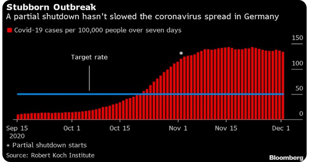
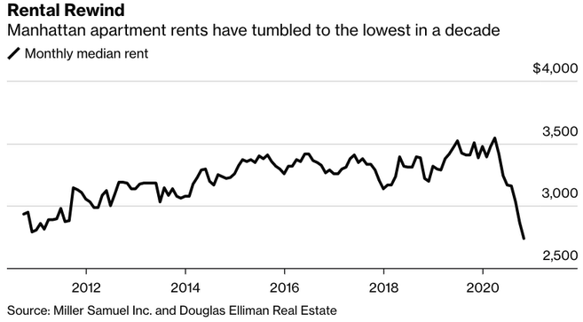
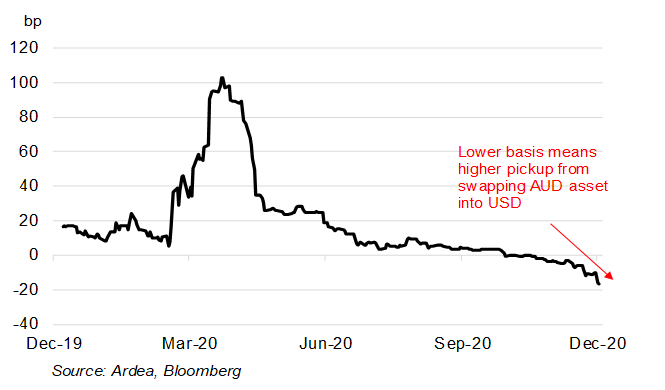

By some estimates, 2020 has seen the sharpest decline in global output in around 100 years. The IMF expects global real GDP growth to have finished 2020 down about 4.7%. For 2021, growth is forecast to rebound by 4.8%. The depth and speed of recovery in growth from the COVID recession stand in stark contrast with previous global recessions, such as in 2008.

Covid-19 cases are still rising in the US and Europe, and vaccine distribution will not bring an immediate end to social distancing. Still, confidence is improving, reflected in rising equities and longer-dated yields.

## Australia

The minutes of the Reserve Bank of Australia (RBA) board meeting in December revealed the board believes it will take some time for output in Australia to reach its pre-pandemic level. 

Members acknowledged that “the recovery in the labour market was more advanced than expected”, but noted there was still significant spare capacity that would remain a key policy challenge for some time. 

Australia’s labour market continues to recover, with 90,000 jobs added in November, including 84,200 full-time jobs. The unemployment rate decreased 0.2 points to 6.8% (1.7 points higher than a year ago) and hours worked increased by 42.8 million hours (2.5%) to 1,752 million hours. 

Retail trade rose a seasonally adjusted 7.1% in November, following a 1.4% rise in October.  Growth occurred across all states except South Australia, which was subject to a brief lock down. At the industry level, clothing, footwear and personal accessory retailing saw the most significant rise (+26.7%). 

Optimism abounds according to the latest Westpac-MI Consumer Sentiment Index. The ‘economy, next 12 months’ sub-index rose 9.9% to 111.9, a ten-year high, thanks to Australia’s relative success in combating the pandemic. The ‘economy, next five years’ sub-index rose 5.9% to 121.1, the strongest reading since December 2009.

Australia’s housing market is improving but the Reserve Bank notes that the recovery is uneven and there has been considerable variation in price changes across capital cities. 

A clear factor has been the slowdown in population growth due to border closures and the decline in net overseas migration. 

## United States

A victory in the two Georgia Senate runoff elections has handed Democrats control of Congress and the White House, raising the prospect of big spending on a third coronavirus package. 

President-elect Biden described the $900 billion stimulus passed in December as a “down payment”, and will call on Congress to pass additional measures, including more direct payments and aid to cities and states. 

Economic indicators point to a continued recovery despite record daily Covid-19 numbers. 

December’s ISM Manufacturing PMI came in at 60.7, beating estimates of 56.6 and marking the seventh straight month of rising manufacturing activity.  Housing starts rose to an annualised rate of 1.55 million in November, surpassing expectations of 1.53 million, while housing permits jumped to an annualised rate of 1.64 million, ahead of expectations of 1.55 million. 

Non-farm payrolls fell 140,000 in December, a large miss on expectations for a 71,000 lift in employment, and down from an upwardly revised 336,000 increase in November.

As widely expected, the US Federal Reserve left the target range for the funds rate unchanged at 0.00–0.25% during its December meeting. 

## Europe

A post-Brexit trade deal was approved by the British parliament, offering a moment of victory for prime minister Johnson who promised voters he would “get Brexit done”. 

The Bank of England left its policy rate unchanged at 0.1% during its December meeting. It maintained its bond-buying program at £875 billion, taking a wait-and-see approach amid potential fallout from the trade deal and the Covid-19 situation. 

The EU approved the Pfizer vaccine on 21 December however logistical issues have stymied distribution efforts. Germany has extended its national lockdown by three weeks until 31 January to regain control of rising infection rates. The eurozone manufacturing PMI improved in December, as did the Markit Composite PMI, though both lagged expectations.

## Asia

The Chinese economy continues to power ahead, with the Caixin manufacturing PMI posting its eighth consecutive month of expansion in December.

A survey conducted by Japan’s Center for Economic Research projects the world’s third-largest economy to grow 3.4% over the next fiscal year (running to March 2022). Japan’s government is hoping for a significant improvement in consumer spending once vaccines become widely available, boosted by fiscal incentives to get the retail economy moving.

## Equities

Global shares saw mixed performance over 2020, with some markets rebounding strongly in the second half and others finishing the year deep in the red. 

Overall, it was a positive year, with the MSCI World Ex-Australia Index returning 5.7% and the MSCI Emerging Markets Index returning 7.8% in Australian dollar terms. 

Australian shares ended 2020 without fanfare. The ASX 200 added a modest 1.2% in December, to end the year up only 1.4%. 

The Australian IT sector was the best performing in December, returning 9.5% over the month and 57.8% over the year. 

The US S&P 500 Index finished on a high, returning 3.8% in December and 18.4% over the year, capping an epic rally to record highs in the wake of the pandemic.

European shares fared considerably worse over 2020 compared to the US and Asia. The UK’s FTSE 100 Index was down 11.6% over the year in local currency terms, and France’s CAC finished 5.0% lower, while Germany’s DAX managed a modest gain of 3.6%. 

Hardest hit were cyclical sectors like energy and financial services and sectors directly impacted by the pandemic, such as travel and leisure.  The pan-European STOXX 600 Index rose 2.5% in December but came under pressure amid concerns of a fast-spreading Covid-19 mutation. 

## Property

It was an annus horribilis for listed property, with almost every sector under pressure due to lockdowns and social distancing. 

The S&P/ASX 200 A-REIT Index fell 4.6% over 2020, while global REITs fared even worse, down 13.6%. 

The pandemic has prompted investors to diversify into alternative assets such as childcare, healthcare, and data centres, which are less tied to the broader economy than mainstream commercial sectors and office space. 

Some diversified trusts saw impressive growth over 2020, benefitting from higher demand for access to industrial and logistics assets during the pandemic.

## Rates and Credit

Central bank bond-buying programs have helped soak up high government debt issuance levels in the fight against the pandemic. 

The Fed will continue to increase its holdings of Treasury securities by at least $80 billion per month and agency mortgage-backed securities by $40 billion until there is substantial progress towards achieving the inflation objective. 

Central bank officials have indicated they are less concerned about potential overshooting of inflation. The Fed’s Charles Evans said, “getting inflation moving up with momentum and delivering rates around 2.5% is important for achieving our inflation objective in as timely a manner as possible.” 

The end of 2020 saw a further recovery in long yields, thanks in part to positive vaccine news, which has boosted equities and narrowed spreads between corporate and government yields. 

The US 10-year Treasury yield rose from 0.84% to 0.93% in December, before lifting above 1.0% in early January on the back of Democrat victories in the Georgia runoff. 

In Australia, money market rates are still close to zero, and the yield on the 3-year government bond is in line with the RBA’s 0.10% target.  In December, the Australian Government sold debt at a negative nominal yield for the first time.

While negative-yielding bonds have still delivered investors positive returns via capital gains, as they go further negative, the outlook is asymmetric and unfavourable over the medium to long term.

## Commodities

Oil extended its rally through December and into early January as governments laid out vaccine rollout plans and further stimulus efforts expected to boost economic growth. 

In January Saudi Arabia pledged additional, voluntary oil cuts of 1 million barrels per day in February and March. The production cuts are part of a deal under which most OPEC+ producers will hold production steady in the face of new coronavirus lockdown restrictions. 

Metals were mixed in December, with gains in Tin (+9.2%), Nickel (+3.6%) and Copper (+2.5%), and falls in Lead (-3.7%), Aluminium (-3.2%) and Zinc (-1.4%). 

The Gold spot price rebounded over the month, rising 6.5% to US$1,894.36.

## FX

In December, the Australian dollar continued to strengthen, rising 4.2% against the US dollar and appreciating 3.1% in trade-weighted terms. 

The ballooning US fiscal deficit and the promise of further debt-driven stimulus have put pressure on the US dollar while rising commodity prices and a relatively healthy economic situation at home is a tailwind for the Australian currency.

