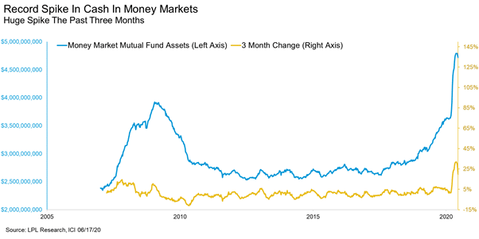

The rise in the number of COVID-19 cases globally continues to create uncertainty about the shape of economic recovery. Some countries which were initially successful in suppressing the virus are experiencing a second wave, while others are reopening amidst a resurgent first wave.

While some financial markets are back at record highs, increased pessimism around unemployment and overall activity may halt this momentum. An important factor in coming months will be the extent to which governments continue with fiscal measures to support businesses and households.

\
**Financial markets are negatively correlated to 'COVID-19' Google searches**\
**(reversed RH axis)**

While employment numbers in some countries surprised to the upside in June, it may take years for all the jobs that were lost to recover fully. Using the U.S. as a proxy, during the ten recessions since 1950 it took an average of 30 months for the economy to replace jobs that were lost. Analysis from LPL Financial shows that it took four years to recover the jobs lost during the tech bubble recession of the early 2000s and more than six years for the Global Financial Crisis.

Given the enormity of the COVID-19 job losses, it could take many years before all of them come back.

The World Health Organisation (WHO) is sending a team to China to investigate the origins of the COVID19 virus. Starting in Wuhan, the virus epicentre, the team's objective is to "advance the understanding of animal hosts of COVID-19, and ascertain how the disease jumped between animals and humans", according to the WHO.

The investigation was instigated by the E.U., with the motion receiving unanimous support at the World Health Assembly. However, Chinese President Xi Jinping said the inquiry should be delayed until after the pandemic is over.

Adding to geopolitical tension was Beijing's decision to push ahead with new anti-sedition laws in Hong Kong, which sparked protests and subsequent crackdowns. The U.S. Senate voted in July to finalise the Hong Kong Autonomy Act, which places sanctions on individuals, banks and other entities that enable China's new security laws.

Protests were held in the U.S. and around the world following the death of unarmed black man George Floyd in Minneapolis.

### **Australia**

The Australian economy contracted by a relatively mild -0.3% in the March quarter but given the full impact of shutdowns likely to be felt in the June quarter, it is almost certain that the Australian economy is in its first recession in 29 years.

Businesses and households have received significant government support from the JobKeeper and JobSeeker programs, the launch of the $25,000 Homebuilder program, and other incentives by state governments. Further easing of lending criteria by APRA in addition to loan repayment deferrals by the major banks has lent further support.

However, retailers are looking nervously ahead to September when the JobKeeper payments are scheduled to end. The scheme, which has benefitted around 3.5 million employees, is being reviewed by Treasury, which will report its findings later in July.

The Reserve Bank of Australia's outlook for the economy and interest rates was recently described by Governor Lowe as a world "where there'll be a shadow from the virus for quite a few years", causing "deflationary forces" and "large output gaps." The RBA kept rates on hold at 0.25% at its July meeting and is prepared to scale up bond purchases if needed.

The Australian labour report showed employment fell by 227,700 in May (consensus 125,000). Total employment has fallen by 835,000 since the coronavirus outbreak began in March. The unemployment rate lifted to 7.1%, with the participation rate falling from 63.6% to 62.9%. However, if the participation rate had held steady, the unemployment rate would have been 8.1%.

Retail sales rebounded sharply in May, jumping 16.9% (16.3% expected), reversing most of the 17.7% fall in April. Sales of basic food and household goods continues to strengthen with sales well above pre-COVID levels in March, April, and May. While sales in clothing and cafes and restaurants saw a mild recovery in May, they are still significantly down on pre-COVID levels, with comparisons to February sales of -35% and -17.7%, respectively.

The AIG Manufacturing PMI moved into positive territory in June, increasing by 9.9 points to 51.5. While the result is the largest ever monthly rise, it was narrowly focused on some sub-sectors and indicates an improvement from recent depths rather than a recovery to buoyant conditions. Almost all of the increase was concentrated in the large food & beverages sector, with new orders from wholesale food distributors improving with the relaxation of trading restrictions.

### **United States**

In the U.S., economic data for June saw some upside surprises as a gradual reopening of the economy clawed back job losses resulting from the lockdown. Nonfarm payrolls jumped 4.8 million in June (consensus 3 million), following a rise of 10 million in May. Jobless claims continue to fall.

The revamped trade pact between the United States, Canada and Mexico took effect during June; however cracks are already starting to show. The Trump administration threatened Canada with new aluminium tariffs, and prominent Mexican labour activist was jailed, underscoring concerns about labour forms contained in the new pact.

Unsurprisingly, the Nation Bureau of Economic Research (NBER) officially declared an end to the longest expansion ever and the start of a new U.S. recession. The record expansion lasted 128 months, twice the length of the average expansion.

While it might have been the longest expansion ever, nominal GDP grew only 50% over the 10+ years, close to growth in the average expansion despite being twice as long.

The ISM Manufacturing Index jumped from 43.1 in May to 52.6 in June, beating expectations of 49.0. Results over 50.0 indicate economic expansion. It is not yet clear what the longer-term impact on labour markets will be, or how many of the temporary job losses will become permanent if lockdown measures persist.

The risk of a second wave of infections remains, while the further deterioration in US-China trade relations and other geopolitical events are creating additional uncertainty. Some U.S. states reversed course in late June to reimpose social distancing and shelter in place warnings as a result of a rise in new confirmed cases.

The Federal Reserve's FOMC minutes discussed policy tools, including forward guidance, asset purchases, and yield curve control (YCC). At this stage, the FOMC appears to prefer to focus on forward guidance and large-scale asset purchases. However, the possible design and implementation of YCC, as well as the economic and financial effects, is being considered.

The Citigroup Economic Surprise Index, or CESI, tracks how the economic data fare compared with expectations. The index rises when economic data exceeds Bloomberg consensus estimates and falls when data is below forecasts.

The CESI has had a volatile year in 2020, as the effects of lockdowns in response to the outbreak of COVID-19 significantly impacted the global economy.

### Europe

As European Union nations began reopening their borders to other E.U. members, the debate continued regarding when to open borders to non-EU countries.

The European Commission, the E.U.'s executive body, recommended that people from outside the region be allowed in if they are arriving from approved nations where the health situation, measured by the number of COVID-19 cases per 100,000 people in the past 14 days, is equal to or lower than the E.U. average. These ‘bridges’ would include countries like Australia, Canada, Japan, and possibly China if Beijing decides to reciprocate, but will likely not include the United States.

Retail sales showed a sharp rebound, rising 17.8% in May (15.0% expected), with the year-on-year fall in sales improving from -7.5% to -5.1%.

The unemployment rate rose 0.1% to 7.4% in May, slightly below expectations of 7.7%.

In Germany, a useful indicator of industrial production is the truck toll mileage index, which fell 12.2% in April due to the lockdown, but bounced back 8.2% in May as activity resumed across the country. However, a more mixed picture was presented by electricity consumption, which has failed to pick up significantly since the lockdowns began, remaining around 8–12% below normal levels.

### China

Economic data indicates that the world's second-largest economy is gradually recovering from the pandemic.

The Caixin General Services PMI rose from 55.0 in May to 58.4 in June, helped by new orders growing the most in nearly a decade as companies reported a return to more normal business operations.

China's official Manufacturing PMI was broadly unchanged at 50.9 in June, following May's level of 50.6, while the Caixin Manufacturing PMI, which measures predominately smaller, private operators, rose modestly from 50.7 to 51.2.

### Australian Equities

The S&P/ASX 200 Index is once again in bull market territory. Stocks that are leveraged to online retail activity have been standout performers during the isolation period, including Kogan, Temple & Webster, and City Chic. The past three months of hyper-growth rates in online sales have been the equivalent of the past three years of cumulative growth.

Afterpay (+28.6%) announced an $800 million capital raising and co-founder sell down, while Qantas Airways (-5.3%) provided a post-COVID recovery plan, which focuses on rightsizing the workforce, along with a planned equity raising of up to $1.9 billion.

For many, capital raisings have been necessary to bolster solvency and near-term operational liquidity. For others, it has been an opportune time to strengthen balance sheets and provide a layer of insurance if the economic malaise continues.

Given APRA's written guidance to the banks that they should be limiting discretionary dividend payments, boards are likely to be conservative with payout ratios. For the banks, the key headwinds are the ultra-low interest rate environment and the risk of impairments.

### Global Equities

U.S. equities bounced back strongly in the June quarter on the back of better than expected economic data and re-openings across the country, with correlation higher than at any point since at least the 1980s.

The S&P 500 Index rose 20.5% over the quarter and is up 7.5% over the year in USD terms. The technology and healthcare sectors led the charge, best illustrated by the performance disparity between the 'old economy' Dow Jones Industrial Index and 'new economy' NASDAQ Composite Index, up 17.8% and 30.6% respectively for the quarter in price terms.

There are concerns about a disconnect between financial markets and the real economy, with S&P 500 earnings estimated to have declined by 43.9% in the June quarter. If realised, this would be the most significant decline since the Q4 2008 decline of -69.1%. Unemployment remains high, and some job losses may end up being permanent, hampering recovery.

Large-cap growth companies have led the rebound in global equities. While these companies are expected to continue benefiting from persistent low-interest rates, in a low growth environment, small-cap and value companies are looking more attractive on a relative valuation basis.

As noted by PM Capital's Paul Moore, in terms of valuation quality cyclical companies, e.g. industrials are two standard deviations below their mean. In comparison, momentum stocks are currently six standard deviations above their mean.

In contrast to developed markets, emerging market equities have seen less of a bounce back, rising 5.0% in the June quarter and falling - 1.5% over the year.

Investor behaviour has also been in focus, with commentators noticing the considerable amount of retail investor participation in global share markets.

According to data from Fidelity Investments, nearly 18% of all investors sold their full equity holdings between February and May, while close to one-third of those over age 65 sold. While some might have reinvested before the bounce or in its early stages, chances are quite a few investors are hating this recovery in asset prices, consistent with a lot of cash remaining on the sidelines.

### Property

As global markets steadied, Australian listed property securities also bounced back over the June quarter, but remain down -21.3% for the year to date, significantly worse than Australian equities (-7.7%).

The pandemic has exacerbated and accelerated structural shifts that have been underway in Australian property over the past few years, with different ramifications for each sector. Shopping mall and retail strip landlords have been most affected, with grocery-anchored centres the best placed to weather the storm.

Grocery and hardware sales actually increased as consumers stocked up on staples and other household items during the lockdowns. As Australian states progressively emerge from lockdown, retail rents are anticipated to come under pressure as tenants demand either significant rent reductions or incentives.

Leading the A-REIT index in June was Cromwell Property Group, which received an "unsolicited and opportunistic" takeover bid from ARA Asset Management. Meanwhile, retail property giant Vicinity Centres (-11.2%) continued to raise money, completing its non-underwritten share purchase plan in July, which fell well short of its targeted $200 million, raising just $32.6 million.

### Rates and Credit

Global investment grade and high yield spreads tightened over the June quarter as central bank monetary intervention had a positive impact on credit spreads. The U.S. 10- year Treasury Note, which had ended calendar year 2019 at 1.92%, finished the June quarter at 0.66% but experienced significant volatility.

As a result of excess liquidity in the system, Australia's unofficial cash rate fell to 0.14% at the end of June, compared to the official cash rate of 0.25%.

This ultra-low interest rate caused the 90-day bank bill rate to fall from 0.36% at the end of March, following the RBA's emergency rate cut, to 0.10% at the end of June. The 10-year Commonwealth Government bond yield rose from 0.77% to 0.87% over the same period.

The newly targeted three-year bond has been mostly steady around the target rate of 0.25%.

### Commodities

Oil prices pushed higher in June despite record-high inventory levels and concerns of the impact of a potential second wave of coronavirus infections on economic activity. The Brent crude oil spot price rose 21.9% to US$41.64 per barrel, and the WTI price rose 10.4% to US$39.27 per barrel.

Metals continued their gains over the month, with an increase in the price of Copper (+11.9%), Tin (+.6%), Lead (+6.0%), Aluminium (+4.6%), Nickel (+3.9%) and Zinc (+3.0%).

Gold rose 3.1% in June to US$1783.68 per ounce, with holdings in ETFs increasing along with direct purchases of gold bars.

### FX

AUDUSD is expected to continue to strengthen as the global recovery continues, having risen from 0.67 to 0.69 in June as positive economic data sustained the market's hopes for a swift recovery from the COVID-19 lockdowns.

It has been a volatile year for the USD, which has given back nearly all of its gains in 2020 after providing safe haven during the market volatility in March. While a variety of factors and headlines have short-term effects on the USD, a substantial long term driver is the 'twin deficit', consisting of the budget deficit and the trade deficit.

Historically a net importer, the resulting trade deficit is twinned with a ballooning budget deficit following the passage of the record setting CARES Act, the first trillion-dollar stimulus package. Changes in the twin deficits have usually been an accurate predictor of the long-term trends in the value of the USD.

