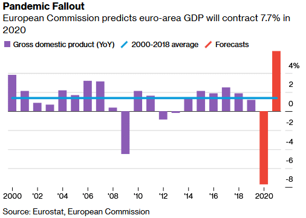

Major economies avoided a resurgence in COVID-19 cases in May, though it continues to spread rapidly in some regions and health authorities warn of a possible second wave.

While tentative steps are being taken to re-open non-essential services, overall activity remains far below pre-pandemic levels. Apple’s mobility trends data suggests that public transport use in Melbourne is still 60% down on January’s levels, while car traffic is down 10%.

More broadly, Oxford Economics expects global GDP to shrink by 4.7% in 2020, factoring in a strong rebound of 7.4% in the last two quarters of 2020. To put this in context, in 2009, the worst year for GDP growth during the global financial crisis, global GDP fell by ‘just’ 1.1%.

Despite forecasting GDP growth of 7% in 2021, which would be the most vigorous expansion since the post-war period, Oxford Economics expects the level of global GDP by the end of 2021 to still be 2% below the level they had anticipated in January before the pandemic emerged. This shortfall will continue beyond 2022, reflecting a permanent scar on the economy.

Disturbingly, the New York Federal Reserve published a [paper](https://www.newyorkfed.org/medialibrary/media/research/staff_reports/sr921.pdf) linking the 1918 flu pandemic with the rise of the Nazi Party in Germany. The study showed that cities with the highest fatalities saw a reduction in social expenditure and that ‘influenza deaths of 1918 are correlated with an increase in the share of votes won by right-wing extremists’. The paper argues that the 1918 pandemic may have especially changed ‘societal preferences’ in younger people, as well as spurring resentment of foreigners.

Amid rising diplomatic tensions, China warned its citizens not to travel to Australia, citing a “significant increase” in racist attacks, which the Australian government described as an “unhelpful statement”.

US-China tensions also re-emerged, this time over Beijing’s introduction of national security laws in Hong Kong. President Trump responded by saying he would remove some policy agreements with Hong Kong, including an extradition treaty, commercial relations and export controls.

Despite all of this, sharemarkets are in the midst of one of the best bull runs ever, even though the economy remains extremely weak, thanks to record stimulus and hopes over a vaccine.

### Australian Economy

Australia GDP data for the March quarter showed the economy contracted for the first time since 2011, falling by 0.3%. The result captured the beginning of the effects of the coronavirus restrictions, with household consumption falling for the first time in 32 years (-1.1%), while both private and public investment also declined.

The cash rate remains at a record low of 0.25%, in line with the RBA rhetoric that rates will remain unchanged until the economy shows progress towards full employment. The RBA noted that an earlier than expected reopening of the economy might result in the economic downturn being less pronounced than initially thought. Elsewhere though, JP Morgan Asset Management estimated that the Australian economy would not return to full employment for a decade.

At face value, the one percentage point rise in the unemployment rate to 6.2% was better than expected. However, the sharp fall in the participation rate played a part in keeping the unemployment rate low. If an unemployed worker is not actively looking for a job (participating), even when the economy is in lockdown, then they are not counted in the unemployment rate.

Hours worked is also becoming a focus as staff on the JobKeeper scheme are counted as employed but work zero hours. Hours worked declined by 8% year-over-year in April, a much more significant drop than in the number of employed.

The unemployment rate will continue to rise in the coming months as its likely that workers return to the labour force faster than the economy can create new jobs or old jobs again become available.

The current account surplus widened sharply from an upwardly revised $1.7 billion in the December quarter to $8.4 billion in the March quarter. It was the fourth straight quarter of surplus and the largest since records started in 1959.

Retail sales declined 17.9% in April, falling sharply from 8.5% growth in March. The monthly movement primarily reflected the impact of stockpiling purchases, with food sales up 24.1% in March before falling 17.1% in April. Additionally, online retail surged, accounting for 10% of retail sales during the month.

April’s retail trade release revealed the extent of the damage caused by lockdown and social distancing. Total retail turnover fell 17.7%, with the most significant falls in the clothing, footwear and personal accessory retailing group (-53.6%) and cafes, restaurants and takeaway food services (-35.4%). At the same time, department stores were also walloped, with sales down 14.9%.

Manufacturing couldn’t stage a comeback in May, but it did slow by less than the previous month, reflected in a rise in the AIG Manufacturing Index of 5.8 points to 41.6. Key sub-indices saw some improvement, with Production rising 7.1 points to 42.4, employment rising 6.4 points to 40.7, and New Orders rising 2.4 to 35.1. However, the Exports sub-index dropped 11.5 points to 31.1, hitting a new record low. Along with signs of a nascent economic recovery was the beginnings of a psychological recovery for consumers.

The Westpac-Melbourne Institute Index of Consumer Sentiment rose 12.5 points to 88.1 in May from the extremely weak 75.6 read in April. While not a complete turnaround, sentiment was buoyed by Australia’s success in containing the coronavirus, which has led the way to reopening and an easing in restrictions. Importantly, long-term views of the economy are far better compared to previous downturns, indicating that consumers see a way through the current pain.

### The U.S. Economy

With US markets in ‘V-shaped’ recover mode, there are early signs that the real economy is bouncing back. Easing of some restrictions led to a pick-up in those sectors hit hardest by the virus, including leisure and hospitality, construction, and retail.

While 2.5 million jobs were added in May – far better than the expected loss of 7.7 million – this only begins to make up for the 20.7 million jobs lost in April when lockdown measures were in full effect.

The second estimate for U.S. March quarter GDP showed the U.S. economy contracted at an annualised 5.0% pace in the first quarter, the biggest quarterly fall since the December quarter of 2008.

Incoming data for April showed some surprises on the upside. The ISM Manufacturing Index came in slightly better than expected at 43.1 versus an expected 42.7, up from 41.5 in April. Construction spending fell 2.9% in April, well ahead of the expected 5.5% fall. April’s durable goods orders fell 17.2%, slightly better than the -19.0% expected, while ex-transportation orders showed surprising strength to only fall 7.4% against expectations for a 14.0% fall.

Personal income rose 10.5% in April, well ahead of the expected 6.5% fall, held up by federal stimulus payments, while personal spending fell 13.6%.

### The European Economy

In the U.K., Prime Minister Johnson announced that up to six people could meet outside, while secondary schools in England will reopen from 15th June, although with only a quarter of students allowed at school at any one time.

Across Europe, COVID-19 restrictions are slowly being lifted as governments attempt to strike the right balance to avert the worst of the economic effects. Schools, restaurants, hospitals and hotels are gradually reopening in many countries, and Germany is set to remove its travel restrictions for 31 countries on 15th June.

Eurozone unemployment rose 0.2% to 7.3%, less than expected, and the eurozone Markit Manufacturing PMI final reading came in as expected at 39.4, an increase from 33.4 in April.

Recession in Germany was confirmed, with German GDP fell 2.2% in the March quarter, following a fall of 0.1% in the December quarter. It was the steepest contraction since the March quarter of 2009, with household consumption slumping 3.2% and fixed investment in machinery plunging 6.9%.

The Ifo Business Climate Index rebounded from an all-time low of 74.2 in April to 79.5 in May, ahead of expectations of 78.3.

### The Chinese Economy

In contrast to the U.S., which saw the largest rise in unemployment in the post-war period, the COVID-19 pandemic has made only a dent in China’s official jobless rate, which has risen from 5.2% in January to just 6.0% in May.

Factories have quickly restarted, but many workers may still be on reduced hours, and official figures do not reliably reflect the number of migrant workers.

The Caixin Manufacturing PMI for May came in at 50.7, up from 49.4 in April. As expected, industrial profits fell 27.4% year-on-year, and improved from -36.7% in March, with industrial activity regaining momentum as lockdown measures eased throughout the country.

Exports and imports both fell in May, with exports down 3.3% and imports down 16.7% on the previous year, resulting in a rise in the trade surplus of USD 62.9 billion.

## Equities

Amid heightened volatility and ongoing uncertainty around how governments will manage the reopening of the economy, Australian shares were able to maintain momentum through May, posting a return of 4.4%.

In the first week of May, the ASX 200 Index briefly reclaimed the 6,000 mark but wasn’t able to hold it. While confidence returned, investors were still coming to grips with the disruption caused to many sectors, with consumer-facing and export-reliant businesses the hardest hit by the pandemic.

Despite the remarkable comeback, many are warning against complacency given the threat of a second wave of COVID-19 infections. A second wave would be highly disruptive to markets and remove the very optimistic ‘V-shaped recovery’ scenario.

Positive economic news and unprecedented easing measures from central banks and governments have helped boost confidence, but further negative news from companies could see some bearish sentiment return. Another complicating factor is the rise in US-China tensions and the political climate in the U.S., which remains uncertain leading up to the presidential race in November.

U.S. shares were boosted by mega-cap names like Apple (+9.8%) and Facebook (+10.0%), despite increased chatter about the introduction of yield curve control in the U.S. This would involve the Fed targeting their purchases to cap interest rates at a specific maturity. If targeting maturities of 2-3 years, this strategy may lead to steeper yield curves, which is great for financials but less so for growth stocks, which typically love a flat yield curve.

## Rates & Credit

After reaching record lows in April, unprecedented action from central banks has helped restore order to credit markets, while positive economic news saw an uplift in yields.

The U.S. 10-year yield rose slightly over May from 0.64% to 0.65% before moving higher early in June to just under 0.90% on the back of positive jobs figures and service sector activity. The U.S. Fed remains committed to buying Treasury securities and agency mortgage-backed securities in whatever amounts needed to support smooth market functioning. These purchases totalled more than $2 trillion at the end of May and are continuing, although at a reduced pace as the economy shows signs of improvement and liquidity returns to credit markets.

U.S. corporate bond issuance from investment-grade companies — which sit in the top half of the credit-rating table — has crossed $1tn this year, according to data from Refinitiv. That total, which includes debt raised by financial institutions, outpaces the $540bn issued over the same period in 2019, and is closing in on the $1.3tn full-year average over the past five years.

Since March, the Fed has announced the establishment of no fewer than nine new facilities to support the flow of credit to households and businesses, which has helped to restore confidence to financial markets. While the Fed has no explicit yield curve control measure in place, markets are banking on the Fed keeping yields low.

In Australia, the RBA paused its bond-buying as order returned to markets, having made around $50 billion in purchases. The Australian 10-year yield was flat over May, ending the month at 0.89% before rising to 1.09% early in June, while the 3-year bond yield held around the RBA’s 0.25% target.

## Property

The A-REIT sector came back strongly in May, extending April’s gains but still down nearly 40% on February’s high in price terms.

Global developed market REITs were flat in May in Australian dollar hedged terms, and the MSCI US REIT Index moved sideways in U.S. dollar terms following April’s rise of 8.1%.

## FX

The Australian dollar continued its rally through May, ending the month at USD 0.67, underpinned by rising confidence domestically and upbeat news globally, including trade data from China.

The Australian dollar has rallied more than 20% from its March low of around USD 0.57 but may find some upward resistance at current levels.

Over the three months to May, the Australian dollar fell 2.1% against the U.S. dollar, 0.3% against the Japanese yen, 1.1% against the euro, and 6.5% against the British pound.

## Commodities

Despite an OPEC+ agreement to cut supply by a record 9.7 million barrels per day to support prices, Saudi Arabia and other Gulf producers said they would not maintain supplemental reductions, saying the cuts had “served their purpose”. Demand-side pressures have begun to return to the market, helped by government support in major economies.

The Brent crude oil spot price rose 88.6% in May to USD 34.15 per barrel, and the WTI spot price rose 85.0% to USD 35.57 per barrel.

Metals gained over the month, with rises in the price of Copper (+3.6%), Aluminium (+3.6%), Lead (+2.3%), Zinc (+2.5%), Tin (+1.4%) and Nickel (+1.1%).

Gold rose 2.5% to USD 1,730.27 per ounce, with some of the world’s most prominent investors raising alarm bells over the looming threat of inflation, and turning to gold for protection.

Fears of inflation are not referencing the prices of soft commodities. With plentiful harvests looming in many nations, global wheat stockpiles are expected to hit a record this year and climb even higher in 2021.\
To protect domestic supplies, significant exporters like Russia and Romania limited exports during the public health crisis. While some measures remain in place, there hasn’t been a significant impact on trade and supplies should keep rising.

### **Important Information**

This article contains information first published by [Lonsec](http://www.lonsec.com.au/). Voted Australia’s #1 Research House for 2019.

Walbrook Wealth Management is a trading name of Barbacane Advisors Pty Ltd (ABN 32 626 694 139; AFSL No. 512465). Barbacane Advisors Pty Ltd is authorised to provide financial services and advice. This post is general information only and is not intended to provide you with financial advice as it does not consider your investment objectives, financial situation or needs. You should consider whether the information is suitable for your circumstances and where uncertain, seek further professional advice. We have based this communication on information from sources believed to be reliable at the time of its preparation. Despite our best efforts, no guarantee can be given that all information is accurate, reliable and complete. Any opinions expressed in this email are subject to change without notice, and we are not under any obligation to notify you with changes or updates to these opinions. To the extent permitted by law, we accept no liability for any loss or damage as a result of any reliance on this information.