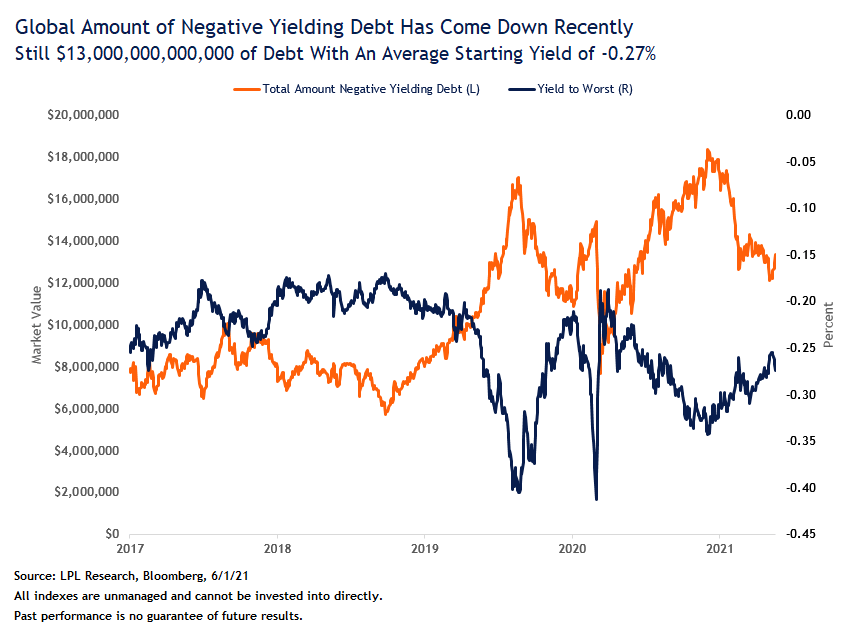

Manufacturing is making a comeback in most industries after languishing during the pandemic and supplies of chips - used to operate most devices in the home, office and car - are in short supply. The shortage is being felt acutely in the automotive industry, and analysts estimate it could last as long as two years.

Key economic indicators continue to improve, with several leading economies beginning to report modest increases in inflation, though anecdotal evidence points to inflation running higher than reported levels. 

Investors positioning suggests that expectations are for inflation to climb steeply in the coming months, driven by pent-up spending, supply bottlenecks and a leap in commodity prices.  Central bank officials have repeatedly said that they expect any jump in inflation to be transitory, but some investors aren't convinced.

A sharp and sustained jump in inflation would erode returns on fixed-income assets and shares whose valuations rely heavily on discounted future earnings rather than current, tangible, net assets. Some money managers are concerned that it may also prompt central banks to pare back their accommodative monetary policies sooner than anticipated.

May saw almost 20 million new cases of COVID-19 recorded, with cumulative case numbers now surpassing 170 million since the pandemic began. 

However, the global vaccine rollout continues apace, and Germany now reports over 40% of the population having received at least one dose. The EU has also recommended relaxed travel restrictions for those fully vaccinated with an EU approved vaccine. 

## Australia

Speaking of accommodative monetary policies, the RBA left the cash rate unchanged at a record low of 0.1% during its June meeting, as widely expected. 

The RBA board reaffirmed their commitment to maintaining highly supportive monetary conditions until at least 2024, when they expect actual inflation to be within the 2-3% target. 

The first-quarter GDP came in at 1.8% QoQ, beating market expectations of 1.5%.  This result represents the third consecutive quarter of economic growth driven by continued growth in household consumption and private investment. 

The RBA board outlined it expects GDP to grow by 4.75% this year and 3.50% in 2022, supported by fiscal measures and accommodative financial conditions. They expect jobs, inflation, and wage pressures remain subdued. 

The Westpac-Melbourne Index of Consumer Sentiment fell 4.8% to 113.1 in May, down from the 10-year high of 118.8 in April. The Federal Government announced the Federal Budget during the midpoint of the survey, with the dip in sentiment potentially reflecting slight disappointment in the budget. 

The NAB Monthly Business Survey reset record highs for the second month running in May, despite some softness in the sub-component Business Confidence measure. 

April's labour force survey showed employment fell 30,600 during the month, missing expectations for a 15,000 increase. The softer outcome for April was partly a function of the Easter holiday, which occurred during the survey reference period. Despite employment falling, a reduction in the participation rate saw the unemployment rate edge down 0.1ppt to 5.5%. 

The Markit manufacturing PMI index rose 0.7pts to 60.4 in May, exceeding expectations of 59.9 as demand continued to improve and supported the expansion of business activity for a twelfth consecutive month, with new orders rising at a record rate.

## United States

The United States re-opening continued in May, ending the month with 40% of residents fully vaccinated and 50% having received at least one dose. US President Joe Biden announced a 'month of action', setting a goal of vaccinating 70% of US residents by the July 4th holiday. 

US Non-farm payrolls disappointed in May, coming in at 559,000 against expectations of 650,000. Despite employment remaining well below February 2020 levels, the unemployment rate fell to 5.8%, helped by a drop in the participation rate. 

The second estimate for Q1 GDP was unchanged at a 6.4% annual growth rate, whilst personal consumption expenditures increased, and durable goods orders unexpectedly fell. 

In the USA, Factory wait times for production materials grew to 79 days in April, the longest in history back to 1987 as per ISM.

The PMI Composite Index posted a strong result in May, lifting from 63.5 to 68.1, bolstered by the services PMI jumping to 70.1, the sharpest expansion rate since the series began in October 2009. 

Existing home sales contracted 2.7% month-on-month in April, missing expectations of a 2.0% rise and taking the annualised rate down to 5.85 million. 

## Europe

The measure of economic sentiment in the Eurozone increased 4.0pts to 114.5 in May, beating expectations of 112.1 and marking its highest reading since January of 2018, remaining considerably above its long-term average of 100.0 and pre-pandemic levels. 

Both the Markit manufacturing PMI and Markit Composite PMI surprised to the upside in May, while the unemployment rate fell 0.1% to 8.0% (8.1% expected). 

CPI rose 0.3% as widely expected, with the yearly rate rising 0.4% to 2.0% (1.9% expected). PPI grew 1.0% in April, beating expectations of 0.9%, with the yearly rate rising 3.3% to 7.6% (7.3% expected), recording the highest producer inflation since September 2008 as energy costs soared 20%. 

The United Kingdom's Covid-19 vaccine rollout continued in May, with 38% of residents fully vaccinated and 59% having received at least one dose at the end of May.

The Markit/CIPS Composite PMI lifted to 62.9 in May, beating expectations.  The PMI Composite Index also posted a strong read, lifting from 60.9 to 66.1 and ahead of expectations of 60.5. 

April Retail sales surged 9.2% month-on-month lifting the yearly rate to 42.4%. The solid monthly rise reflected the easing of restrictions, including re-opening all non-essential retail from mid-April. 

## Asia

Despite progress in the vaccine rollout and declining Covid-19 case numbers across much of the developed world, case numbers are spiking in Asia, where vaccines have been slower to roll out. Restrictions on mobility have re-emerged, renewing concerns about the pace of global re-opening.

In China, CPI fell 0.3% in April, while the yearly rate lifted 0.5% to 0.9% (1.0% expected). 

The unemployment rate also fell in April to 5.1%, coming in below expectations of 5.3%, while Industrial production printed in line with expectations at 9.8%. 

Retail sales posted a 17.7% year on year rise in April. However, they missed expectations for a 24.9% increase and pulled back from March's 34.2% lift. 

The Caixin Composite PMI fell 0.9pts to 53.8 in May, below expectations of 54.3. 

 Late in May, Japan again extended ahead of the Olympic Games despite declining case numbers. 

The Japan consumer confidence index declined by 0.6pts to 34.1 in May (34.0 expected), marking the weakest reading since February, as most sub-indices deteriorated. 

## Equities

The ASX 200 rose 2.3% in April, outperforming most global equity markets, except Europe (2.5%). 

Emerging market equities gained 1.4%, developed market equities by 1.1%.

Growth names generally have come under pressure in recent months as upbeat indications of normalising economic activity lead investors into the cyclical value pockets of the market.   

The cyclical/value rotation was even stronger in May as financials gained 4.4%, consumer discretionary 3.4% and materials 1.6%. The growth sectors of IT (-9.9%) and utilities (-7.0%) suffered significant pullbacks. Meanwhile, large-cap outperformed small-cap stocks in Australia.

US 1Q corporate earnings were much more robust than expected. S&P 500 companies reported earnings growth of 47% y/y relative to consensus expectations of 20%. However, despite the strong earnings performance, the S&P 500 rose 0.7% in May, as the more expensive technology and consumer discretionary sector, which accounts for 40% of the index, came under pressure.

Similar to the sentiment we have seen domestically, more expensive sectors have come under pressure amid continued inflation concerns, highlighted again by the divergence between the 'old economy' Dow Jones Industrial Average and the 'new economy' Nasdaq 100, returning 2.2% and -1.7% respectively in May. 

Despite seeing a brief elevated period during May, the CBOE VIX ended the month, reaching a low of 16.7, the lowest level we have witnessed post-Covid, reflecting the ongoing downward trend in implied market volatility. 

Valuations, however, remain at elevated levels in a historical context, particularly in the United States. Emerging Markets gained in May and outperformed Developed market peers, benefitting from weakness in the US Dollar. Despite elevated Covid-19 infections, among the worst hit by the pandemic, India was one of May's best-performing markets.

## **Property**

Australian listed property added another month of positive performance, although underperformed the broader Australian equity market. 

In the May Reserve Bank meeting, members noted the continued strength of the Australian residential housing market, with prices continuing to increase across all major markets. Housing credit growth had also strengthened, with solid demand from owner-occupiers, especially first-home buyers. 

## Rates and Credit

The amount of negative yield debt is shrinking and that's a good sign that the global economic recovery is well underway.

Since the significant movements in bond yields we experienced late in 2020 and early 2021, global nominal yields have generally traded sideways since March due to ongoing inflationary uncertainty and central bankers monetary response. 

The nominal yield on US 10-year government bond fell 5bps to 1.58% by the end of May, and the Australian 10-year yield fell by a similar amount to 1.63%. However, real yields have fallen as inflation expectations have continued to rise, a dynamic reminiscent of the 2013 taper tantrum.

Credit spreads widened slightly over the month but spreads on higher-quality investment-grade bonds remain near their narrowest points. 

Non-investment grade companies are taking advantage of ultra-low borrowing costs and less restrictive terms by selling high-yield, or "junk bonds", at a record pace.  

RBA Governor Phillip Lowe noted the recent stability of sovereign bond yields after increasing earlier in the year, citing positive news on vaccines and additional fiscal stimulus in the United States. 

Governor Lowe also reflected on the pick-up in medium-term inflation expectations from near-record lows, now sitting closer to central bank target levels. 

The outlook for strong growth in the global economy continues amid the recovery from the Covid-19 pandemic, supported by fiscal measures and accommodative financial conditions.  

## Commodities

The price of Brent crude headed towards USD 70 per barrel over the month. Increasing demand and supply that producers are holding back is helping the oil price stabilise around its current level, along with falling inventory levels.  

The potential for the US to lift sanctions against Iran could see more oil flow into the global supply, which may create downward price pressure. Still, Organization of the Petroleum Exporting Countries nations and their allies may adjust their own supply to compensate.

Gold rose by 7.8% over the month, suggesting that the persistent negative real yields have finally gotten markets' attention in sensitive assets like gold and silver.

## FX

For all the talk of a stronger Australian dollar this year, the currency has been flat over the first five months of the year, gaining only 0.2% against the US dollar.  

The US dollar was down for a second consecutive month, and the DXY Dollar Index fell 1.3%. The economic re-opening in Europe is fueling sentiment towards the region, and the euro gained 1.6% against the greenback.

**Sources**

This article contains information first published by [Lonsec](http://www.lonsec.com.au/). Voted Australia’s #1 Research House for 2019.

**General Advice Warning**

The information on this website contains general information and does not take into account your personal objectives, financial situation or needs. You should consider whether the information and any general advice provided is appropriate for your personal circumstances and where uncertain, seek further professional advice before taking any action.

**Important Information**

Walbrook Wealth Management is a trading name of Barbacane Advisors Pty Ltd (ABN 32 626 694 139; AFSL No. 512465). Barbacane Advisors Pty Ltd is authorised to provide financial services and advice. We have based this communication on information from sources believed to be reliable at the time of its preparation. Despite our best efforts, no guarantee can be given that all information is accurate, reliable and complete. Any opinions expressed in this email are subject to change without notice, and we are not under any obligation to notify you with changes or updates to these opinions. To the extent permitted by law, we accept no liability for any loss or damage as a result of any reliance on this information.