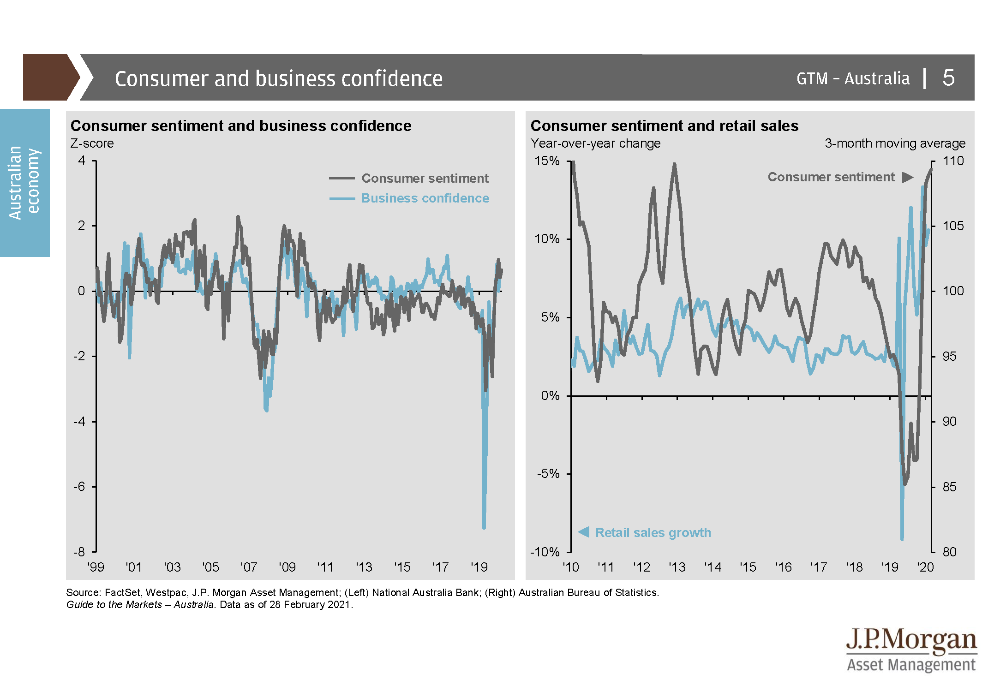
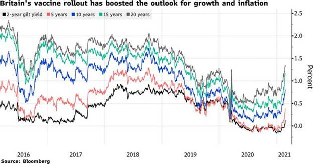
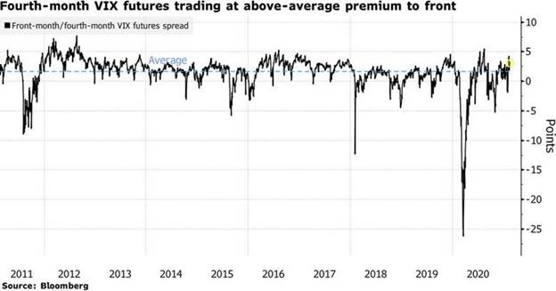
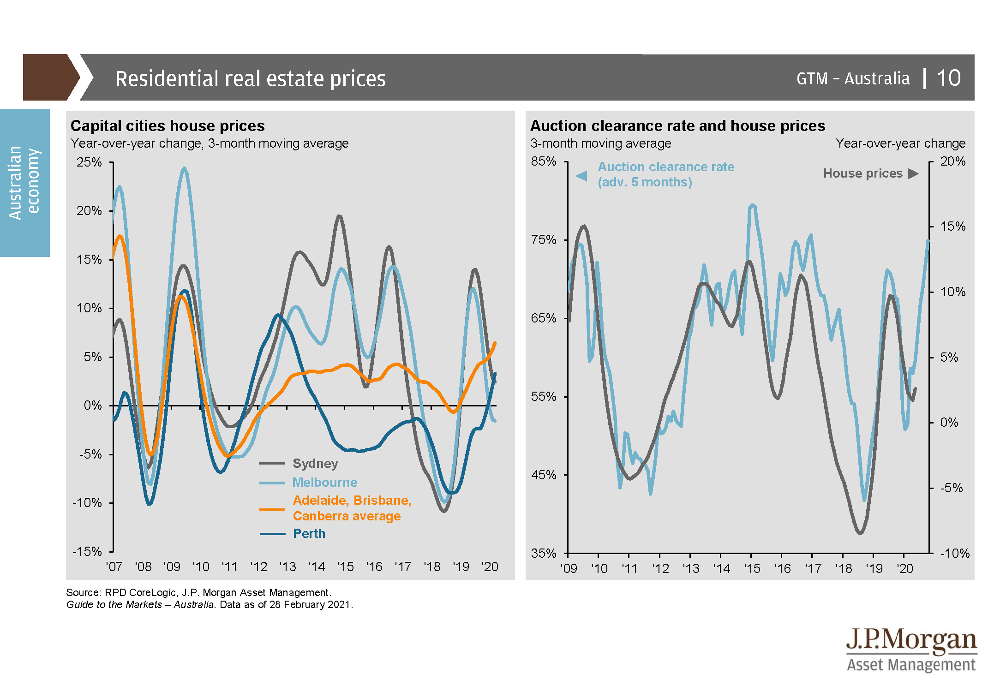
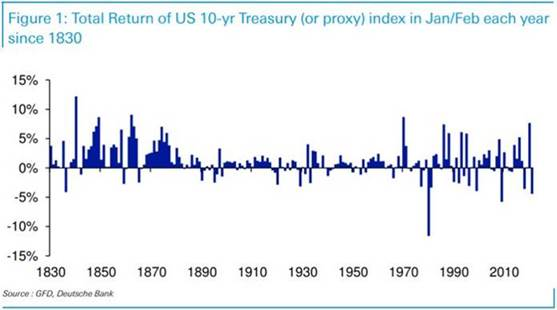
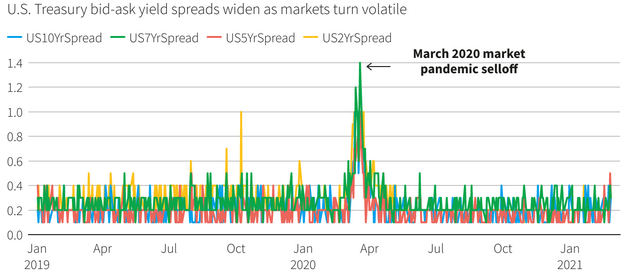
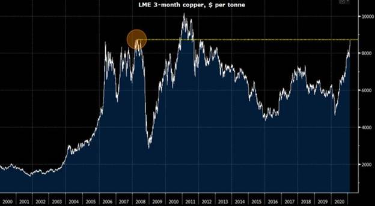
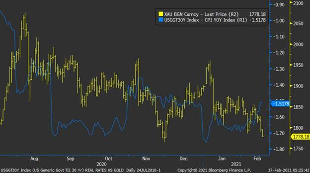

The vaccine narrative is propelling the economic recovery forward, even as some regions face logistical headwinds. Fiscal and monetary policy remain extraordinarily accommodative and are helping households and businesses through what we hope are the final stages.

## Australia

The AstraZeneca vaccine rollout has begun, though Australia will keep its international borders shut for at least another three months, with over 40,000 Australians still stuck overseas. 

GDP grew 3.1% in the December quarter, taking the yearly rate from -3.8% to -1.1%. The result marked the second straight strong quarter of growth, though the economy remains well below pre-covid levels. 

Employment rose 29,100 in January, and the unemployment rate fell to 6.4%, the lowest rate since April 2020.  Retail sales expanded 0.6% in January, an improvement on the 4.0% decline recorded in December.

The AiG Manufacturing PMI rose 3.5 points in February to 58.8.  According to AiG, Australia’s manufacturers lifted production and employment in February as sales recovered a large share of the ground lost in 2020. The new orders index rose 5.3 points to 59.9, indicating further strong production in the coming months. 

Sentiment remains strong, with the Westpac-MI Consumer Sentiment Index lifting to 109.1 in February from 107.0 in January.  The ‘time to buy a dwelling’ index fell 3.1% and is now 8.6% below its peak in November. The decline in recent months suggests that house price increases may already be starting to weigh on the purchasing sentiment. 

## United States

A stellar jobs report for February showed the labour market recovery has been more robust than expected in the US. 

US nonfarm payrolls rose by 379,000, well ahead of the consensus 182,000, while January’s reading was revised upwards from 49,000 to 166,000. 

December quarter GDP was revised up to an annualised 4.1%, while durable goods orders in January surged 3.4% month-on-month, surpassing expectations of 1.1%.

The PMI composite index came in well above expectations in February at 59.5 (58.8 expected), up from 58.7 in January, while the services index also surprised to the upside at 59.8 (58.9 expected). 

Retail sales jumped 5.3% in January, beating expectations of 1.1%, marking the largest increase since June 2020 as new stimulus checks helped to boost consumer spending. 

President Biden marked the distribution of 50 million coronavirus vaccine doses, the halfway mark towards reaching 100 million inoculations within the first 100 days. 

An independent advisory panel voted to recommend Johnson & Johnson’s Covid-19 vaccine for emergency use, which would make a third vaccine available to Americans.  The decision came after the US reached the milestone of 50 million coronavirus vaccine doses administered, halfway towards achieving the Biden administration’s goal of 100 million vaccinations in their first 100 days.

## Europe

Europe’s economy contracted 0.4% in the December quarter as the pandemic tightened its grip on the continent, forcing the EU to also cut its growth forecast for 2021 from 4.1% to 3.7%. 

The race to inoculate has been derailed by logistical challenges and shortages. In Germany, only 6% of the population has received the first dose. Across the channel, over 20 million people in the UK have received their first doses of the vaccine, coinciding with daily case numbers at their lowest since September 2020. 

Prime minister Johnson announced a four-stage plan to lift restrictions in England, expecting to lift all restrictions on social conduct by June. 

Overall, the recovery story remains intact, albeit dilated. The eurozone’s economic sentiment index improved in February as the outlook for vaccine rollouts and easing of restrictions bolstered confidence. The IHS Markit Eurozone Manufacturing PMI also surprised to the upside, while January’s retail sales came in well below expectations and the unemployment rate held steady at 8.1%. 

## Asia

After managing economic growth of only 2.3% in 2020, its weakest in decades, the Chinese government is aiming for a significant rebound in 2021. 

At the opening of this year’s National People’s Congress, Premier Li Keqiang announced a growth target of over 6.0%, which appears almost modest compared to the IMF’s estimate of 8.1% growth for 2021. 

The Chinese authorities appear focused on the quality of growth, including reform and innovation, rather than pure numbers. 

China relies on two domestically developed vaccines and competes with Russia to conduct ‘vaccine diplomacy’ throughout central Asia. 

However, based on data from Brazil, China’s Sinovac jab showed an efficacy rate of just over 50%, which is well below Pfizer’s 95% efficacy rate. 

Japan’s vaccine campaign has stalled due to shortages, with only limited doses of the Pfizer vaccine available until increased supplies reach Japan from Europe in May this year.

## Equities

Global equity markets had a positive month in February despite rising yields spooking investors and raising the prospect of inflation.

In Australia, earnings season revealed a corporate environment still impacted by Covid-19, with earnings down in aggregate and companies opting to hold more cash. However, the lift in dividends has been a positive development for Australian investors. 

Cyclical shares have benefitted from greater confidence, spurred on by the vaccine rollout and the return to more normal economic conditions. 

After falling out of favour during the pandemic, major banks have reported dividend increases and rising payout ratios. The recent rise in yields and steeper yield curves have been positive for financials but negatively impacted growth sectors such as Information Technology.

The S&P 500 Index rose 2.8% over the month and has gained a remarkable 31.3% over the past 12 months since the end of February 2020. 

Reaching the end of reporting season, S&P 500 companies reported positive earnings growth in aggregate for the first time since Q4 2019. However, only five out of eleven sectors delivered positive growth, with earnings from technology, materials and financials doing the heavy lifting. 

The VIX remains at elevated levels, with the futures curve in steep contango, implying expectations of volatility over the medium term that are higher than pre-COVID.

Value shares continued their rally through the start of 2021. Still, performance has not been uniform, with cyclical stocks benefitting enormously from renewed confidence while value with a quality bias has struggled. 

European shares joined in the global rally in February as vaccine progress, and stimulus measures pushed the Stoxx 600 Index higher and just shy of its February 2020 all-time high. Value and cyclical sectors such as banks, commodities producers and travel companies have led the reflation trade-driven advance. 

In Asian markets, Japan’s Nikkei 225 Index rose 4.8%, Hong Kong’s Hang Seng Index rose 2.5%, and China’s CSI 300 Index fell 0.3% during February.

## Property

Australian listed property continued to trend down through February as Covid-related uncertainty was exacerbated by the rise in yields. 

CoreLogic data showed Australian house prices rose 2.1% in February—their fastest rate in 17 years— with growth in every capital city thanks to improving economic conditions and reduced supply.

According to the ABS, the value of new housing loans rose 10.5% in January and 76% since its May 2020 low. 

In the US Real Estate Investment Trust (REIT) sector, the post-covid rotation has been the prevailing theme as investors favour reopening-sensitive sectors such as retail, hotels and offices over ‘essential’ sectors like housing, industrial and technology. 

## Rates and Credit

The continued rise in longer-dated yields and a steepening of the yield curve has significant implications for investment valuations and central bank policy. 

For context, the spread between the Australian 10-year and 2-year yields was 177 basis points at the end of February 2021 versus 28 basis points at the same time in 2020. 

While QE and lower cash rates have done the job of flattening the short end of the yield curve, the long end has proved more stubborn. 

The February RBA minutes noted the risk of ceasing the bond purchase program when the market widely anticipated an extension, stating it could lead to “unwelcome significant upward pressure on the exchange rate”. 

With inflation expectations and yield rising, the RBA took decisive steps at the beginning of March, buying AUD 4bn of longer-dated bonds, double the program amount.  

This purchase is the first departure from the program since it commenced in November and an indication that the RBA is not going to remain passive in the face of the global reflation trade.

In the US, Treasury yields rose from 1.11% to 1.44% over February and continued to push higher in early March.   Deutsche Bank noted that it had been the worst start to a year for the benchmark US 10 Year Treasury since 1830.

Spreads on riskier fixed-income investments like high yield credit and corporate loans have narrowed notably as fund managers sell assets that trade more in line with government debt.  

Issuers have raced to meet this demand with sales of new Collateralised Loan Obligations (CLOs) hitting USD 58bn in the first two months of 2021, the biggest start to a year since 2013, according to the Wall Street Journal.

Indicators of stress in bond markets have also been observed, with bid/ask spreads in US Treasuries widening across the curve to their highest levels since the March 2020 sell-off.

## Commodities

Oil prices jumped over February as the economic recovery solidified, and oilfield crews in Texas reported that they might need several weeks to resume normal operations after the record freeze. The spot price of WTI crude rose 18.0% to US $61.55 per barrel, and Brent rose 19.2% to US $65.86 per barrel. 

Base metals were stronger in February, Tin (+12.7%), Aluminium (+9.0%), Zinc (+8.3%), Nickel (+5.0%) and Lead (+1.4%). 

Copper gained 15.5%, reaching levels reached in 2007-08 during the first phase of the commodities super-cycle.

The gold price fell 6.1% to US $1,734.04 per ounce.  Higher inflation expectations were exceeded by higher nominal yields, resulting in higher real yields.  As an asset that pays no income, higher real yields are a Gold headwind.

## FX

The Australian dollar gained 2.4% against the US dollar in February to end the month at USD 0.78, boosted by record trade figures. 

Rising global yields, led by US Treasuries, could represent an obstacle for the Australian dollar moving higher with the RBA committed to keeping monetary policy as accommodative as possible.

**Sources**

This article contains information first published by [Lonsec](http://www.lonsec.com.au/). Voted Australia’s #1 Research House for 2019.

**General Advice Warning**

The information on this website contains general information and does not take into account your personal objectives, financial situation or needs. You should consider whether the information and any general advice provided is appropriate for your personal circumstances and where uncertain, seek further professional advice before taking any action.

**Important Information**

Walbrook Wealth Management is a trading name of Barbacane Advisors Pty Ltd (ABN 32 626 694 139; AFSL No. 512465). Barbacane Advisors Pty Ltd is authorised to provide financial services and advice. We have based this communication on information from sources believed to be reliable at the time of its preparation. Despite our best efforts, no guarantee can be given that all information is accurate, reliable and complete. Any opinions expressed in this email are subject to change without notice, and we are not under any obligation to notify you with changes or updates to these opinions. To the extent permitted by law, we accept no liability for any loss or damage as a result of any reliance on this information.