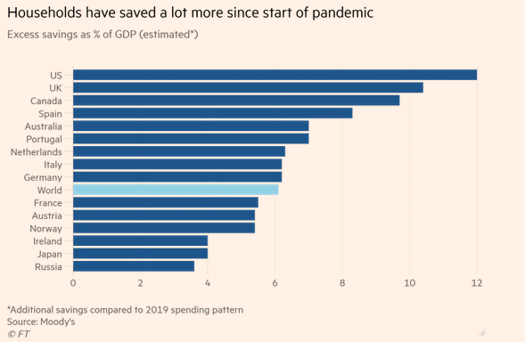
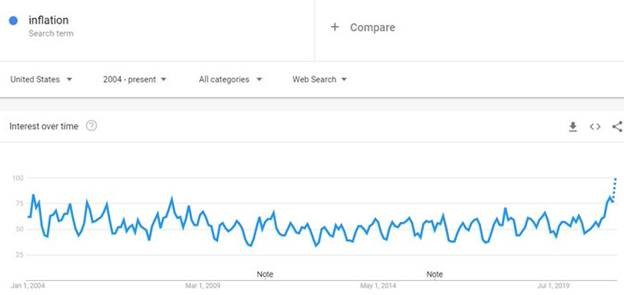
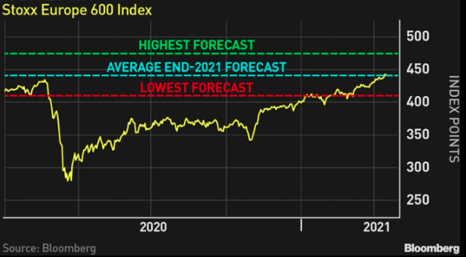
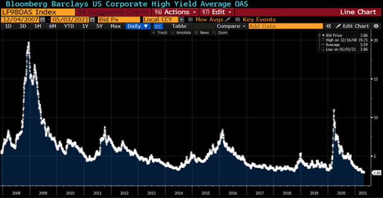

According to credit rating agency Moody's, consumers worldwide have stockpiled an extra USD 5.4 trillion of savings since the coronavirus pandemic began.

Households worldwide accumulated the excess — defined as the additional savings compared with the 2019 spending pattern and equating to more than 6 per cent of global gross domestic product — by the end of the first quarter of this year, paving the way for a strong rebound in spending as businesses re-open.

The International Monetary Fund has revised its projections for GDP growth upwards, with the US expected to grow by 6.4% in 2021 and China by 8.4% over the same period.

As confidence in the economic outlook increases, this is tempered by increasing inflation concerns, with near-term supply chain bottlenecks and google searches for "inflation" at the highest level since 2004.

## Australia

Australia awaits one of the most important federal budgets in history. The government is set to take advantage of record-low interest rates to plug the deficit following the mass stimulus deployed during the pandemic.

Treasury projects that nominal economic growth will exceed the nominal interest rate for at least the next decade. Treasurer Frydenberg said Australia could grow its economy while maintaining "a steady and declining ratio of debt to GDP over the medium term as we continue to move towards balancing the budget."

The Reserve Bank of Australia left the cash rate on hold at 0.10% ahead of the May budget, noting that the recovery has been stronger than expected and is forecast to continue.

The Markit Composite PMI surprised in April, improving 3.3 points to 58.8 (55.0 expected), driven by sustained increases in manufacturing output and services activity.

Retail sales rose 1.3% in March, reversing from a 0.8% drop in February and beating expectations of a 1.0% increase amid a re-opening of state borders and an improvement in consumer confidence.

Australia's manufacturing sector continued to expand in April, with the AIG Manufacturing PMI rising 1.8 points from 59.9 to 61.7, hitting its third-highest ever reading as the sector bounced back from the depths of the pandemic. All six manufacturing sectors and all seven activity indicators were in expansion.

At the same time, the capacity utilisation index hit a record high, indicating that employment and investment may need to step up to facilitate further growth from here.

The Westpac-Melbourne Institute Index of Consumer Sentiment rose 7.0 points in April to 118.8, reaching its highest level since August 2010 when the post-GFC rebound and mining boom were in full swing.

Given the survey was conducted in the week following the unwinding of the JobKeeper program, the result suggests that consumers see the economic recovery as sustainable, thanks in large part to growth in employment.

## United States

The United States has fully vaccinated more than 100 million people—including two-thirds of all seniors— against the Covid-19 virus, according to the Centre for Disease Control and Prevention, providing further reassurance to markets that the worst of the pandemic is over.

However, while confidence measures point to greater optimism, other economic data suggests a less emphatic recovery. April's payroll report came in vastly below expectations (266,000 versus the Dow Jones estimate of 1 million), although the response from markets was relatively muted.

The ISM Manufacturing Index came in surprisingly weak in April, down from 64.7 to 60.7 (65.0 expected) as shortages in inputs constrained production. Durable goods orders were also disappointing in March, growing at just 0.5% month-on-month, below expectations of 2.5%.

Q1 GDP growth of 6.4% came in above expectations of 6.1% and lifted on the 4.3% expansion in the previous three-month period. Personal consumption was the key driver of the result, lifting 10.7%, while a fall in inventories held back growth.

## Europe

The Covid-19 situation in Europe is improving as reported cases decline and countries push ahead with vaccine rollouts.

Economic data has generally been better than expected in recent months. Still, the eurozone as a whole suffered a decline in GDP (-0.6%, slightly better than the -0.8% expected) in Q1 2021 as the pandemic continued to bite in some regions.

The Markit Composite PMI came in above expectations in April, rising from 53.2 in March to 53.7, with both the manufacturing and services PMIs printing ahead of expectations at 63.3 and 50.3, respectively.

April's consumer confidence printed in line with expectations at -8.1, while economic sentiment surged to 110.3 ahead of expectations of 102.2, where surveyors saw improvement across all sectors.

The European Central Bank left its policy rate unchanged at 0.00% during its April meeting, as officials took a patient approach following last month's decision to conduct emergency bond purchases at a significantly higher pace over 2Q21.

The eurozone's year-on-year inflation rate rose from 1.3% to 1.6% in April, as expected, while core inflation fell from 0.9% to 0.8%.

## Asia

India has been devastated by a surge in Covid-19 infections, with over 20 million confirmed cases in early May.

Several states have been forced into lockdown as hospitals struggle to provide beds and oxygen, while Prime Minister Modi urged all citizens to get vaccinated to help control the wave.

The Covid-19 impact will likely set back India's economic recovery. However, it is still possible that the country could see double-digit GDP growth over 2021 once the vaccine drive intensifies and infections come under control.

China has made deep inroads with its own vaccination program, which has so far inoculated over 240 million people, predominately with the Chinese-developed Sinopharm and Sinovac vaccines.

The World Health Organisation is considering the Chinese vaccines for emergency use, which could mean wider distribution through the Covid-19 Vaccines Global Access (COVAX) initiative.

China's Q1 GDP increased 0.6%, less than the expected 1.5% growth. However, the yearly growth rate increased to 18.3%, marking the highest annual growth rate since the first data release in 1992.

March industrial production rose less than expected, with the year-on-year rate coming in at 14.1% (17.2% expected), and retail sales grew to a 34.2% yearly rate in March (28.0% expected).

April's NBS Manufacturing PMI slipped to 51.1, down from 51.9 in March and missing expectations of 51.7.

## Equities

The broadening of the recovery in equities globally would suggest that the market anticipates a successful global inoculation drive and a potential re-opening of borders.

Valuations have moderated through the start of 2021 but remain at elevated levels, while sources of yield across both equities and fixed income remain constrained.

Developed market shares rose 3.2% in April while emerging markets were softer, rising 1.1% in Australian dollar terms, but are still outperforming developed markets over 12 months.

In Australia, the rotation out of growth into value sectors has been the key theme through 2021 as the economic recovery materialises, underpinned by a lower unemployment rate.

Unless some unforeseen tail risk event occurs, we expect business and consumer confidence to rise, providing a clear indication of 'normal' conditions returning in the not-too-distant future.

The US S&P 500 rose 3.5% over April as optimism about corporate earnings offset concerns regarding rising Covid-19 infections.

After a market-beating rally, European equities have already raced past strategists' predictions for the year-end, with much of the support coming from consumer cyclical and industrial companies.

The rise in European equities and optimistic economic data came despite a sluggish vaccine rollout and fears of a third wave of the virus across much of the eurozone, sparking tighter restrictions.

## **Property**

Australian listed property had a positive month but struggled compared to other sectors as major retail REITs dragged on the index.

Australia's residential housing market was in focus again given the pace of house price rises, especially in Sydney and Melbourne. March house prices rose 2.8% month-over-month across Australia's eight capital cities, and February building approvals were up a dramatic 21.6% month-on-month, supported by the HomeBuilder scheme.

In the US, homes are selling at a blistering pace unseen since before the financial crisis, pushing up home values in nearly every U.S. ZIP Code.

February's S&P/Case-Shiller Home Price Index posted a 1.2% rise, with year-on-year growth in the index coming in ahead of expectations at 11.9%.

Yet lenders are preparing for mortgage demand to cool in the coming months, resulting from rising interest rates that make refinancing less attractive for a large proportion of borrowers.

## Rates and Credit

Sovereign bond yields steadied in April after pushing higher earlier in the year due to the positive news on vaccines and the additional fiscal stimulus announced in the US.

The Australian sovereign yield curve has steepened since the end of 2020, reflected in the spread between the 10-year and 2-year government bond yields, which has risen from 90 basis points at the end of December to 158 basis points at the end of April.

While a rise in yields is potentially a welcome sign for economic conditions ahead, the inverse is that they also represent higher borrowing costs for market participants such as corporations and governments.

While the RBA has noted the rise in the 'long end' of the yield curve, their announcements have indicated a firm stance concerning the official cash rate remaining at its current level until a sustained rise in inflation.

Since last June, the U.S. Federal Reserve has been buying at least $120 billion a month of Treasury debt and mortgage-backed securities to hold down long-term borrowing costs.

Federal Reserve Chairman Jerome Powell said in April that the central bank would begin to slow the pace of its bond purchases "well before" raising interest rates.

Since December, the central bank has said the economy must make "substantial further progress" toward its goals of maximum employment and 2% inflation before it scales back bond purchases.

Reflecting higher risk appetites and preference for yield and low duration spreads on high yield, or junk, bonds tightened to new post-2007 lows.

## Commodities

Oil prices moved higher through April, supported by bullish positioning and driven by the economic recovery, robust economic data from China, and successful vaccine rollouts in the US and Europe.

The Brent spot price rose 6.6% to US$67.7 per barrel in April, and the WTI spot price rose 7.8% to US$63.5 per barrel.

Base metals rallied over April, with gains in Tin (+13.0%), Copper (+11.8%), Nickel (+10.0%), Lead (+9.0%), Aluminium (+8.4%) and Zinc (+3.8%).

Iron ore prices hit US$200 per tonne in early May as Chinese steel mills rushed to lock in supply in case Chinese authorities impose trade restrictions.

The gold price rose 3.3% to US$1,769 per ounce.

## FX

Helped by an easing in US Treasury yields, the Australian Dollar continued to strengthen in April, rising 2.3% against the US dollar and lifting 0.8% in trade-weighted terms.

The weaker-than-expected US jobs report has raised expectations that the US Fed will keep holding rates low for longer. However, the RBA has also indicated that it will remain highly accommodative until 2024.