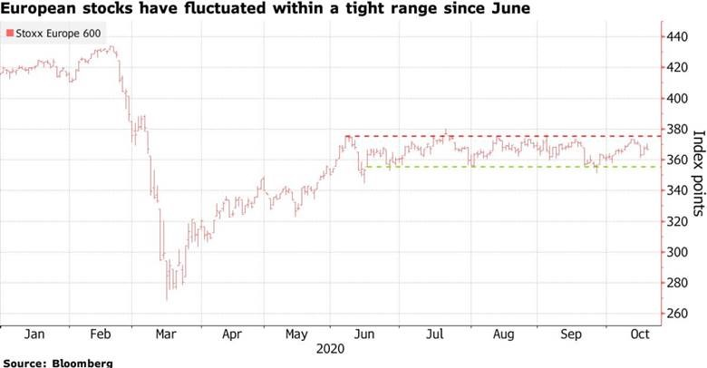
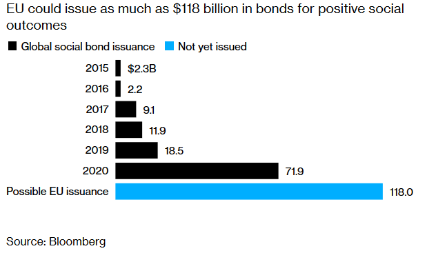
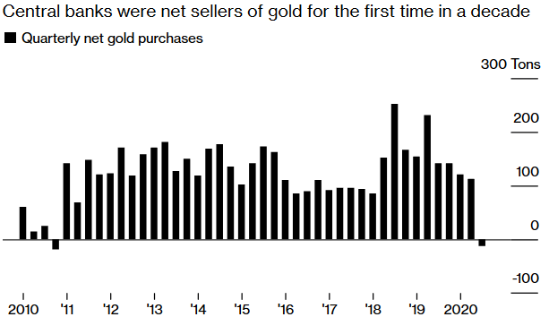
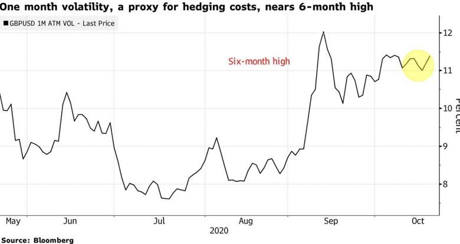

After a tense presidential election race, Senator Biden is the president-elect of the United States. Markets rallied as it became clear that a Biden presidency with a Republican-controlled Senate was likely, which was swiftly followed by the announcement of positive results from Pfizer on their COVID-19 vaccine.

The vaccine announcement came as COVID-19 cases in the US and Europe continued to spike, adding to uncertainty about the year ahead.

According to the IMF, the global growth rate is forecast to be a significantly negative figure of -4.4% for 2020, bouncing back to 5.2% in 2021. They expect the recovery to be “uneven and uncertain”.

## Australia

The soured relationship between Canberra and Beijing continued to have real implications for trade, with China suspending purchases of Australian coal and advising power stations and steel mills to stop using Australian coal immediately. The strained relationship has also impacted copper ore and concentrate, sugar, timber, wine and lobster. Beijing has already imposed tariffs on Australian barley.

On Melbourne Cup Day the RBA lowered interest rates to an all-time low of 0.10% and committed to further quantitative easing (QE) with the purchase of $100 million worth of 5-year and 10-year government bonds over the next six months.

Economists expect the Australian economy to contract by 4.0% in 2020 before increasing by around 5.0% in 2021 and 4.0% in 2022. Retail sales fell 1.1% in September, following a 4.0% fall in August, while headline inflation jumped 1.6% in the September quarter, mostly in line with expectations of a 1.5% rise.

The key driver of the inflation increase was the ending of free childcare in all states except Victoria. However, childcare is still 26% below pre-COVID levels, meaning we can expect further inflation pressure from this source in the coming quarters.

Labour force data showcased a resilient jobs market, despite the stage four restrictions imposed in Victoria. Employment rose 111,000 against expectations of a fall of 45,000; however, both full-time and part-time employment fell. The unemployment rate fell from 7.5% to 6.8%, despite the participation rate lifting from 64.7% to 64.8%.

The AiG Performance of Manufacturing Index rose 9.6 points to 56.3, hitting the first expansion reading since July. The Production, New Orders and Employment components all rose.

The Westpac-Melbourne Institute Index of Consumer Sentiment surged 11.9% in October. Credit must be given to the federal budget, with its singular focus on maintaining employment and supporting businesses, while Australia’s relative success in containing COVID-19 was also undoubtedly a factor.

Retail sales fell 1.1% in September, following a 4.0% fall in August, with weakness led by household goods retailing (-3.6%), food retailing (-1.5%), and clothing, footwear, and personal accessories retailing (-1.1%).

## United States

Economic data continues to point to ongoing strength in the US recovery but record daily cases of COVID-19 are dragging on sentiment.

US GDP growth was 33.1% in the September quarter, the largest expansion on record, beating expectations of 30.9% and rebounding strongly from the 31.4% contraction in the previous quarter. Household demand led the recovery with personal consumption expenditures growing by 40.7%, ahead of the 38.9% expected increase.

At 638,000, non-farm payrolls exceeded expectations of 600,000 but were below the revised 672,000 September result. The unemployment rate dropped to 6.9%, below expectations of 7.7%.

October’s ISM Manufacturing Purchasing Managers Index (PMI) came in well ahead of expectations, rising from 55.4 in September to 59.3 (55.8 expected). Construction spending rose 0.3% in September while durable goods orders in reported a 1.9% increase, marking the fifth straight month of growth. Orders rebounded for transportation equipment, led by motor vehicles, which lifted 1.5%, while orders for capital goods and computers and electronics continued to rise.

## Europe

New coronavirus cases continued to rise across Europe, prompting countries to implement new restrictions.

The UK broadened the number of cities under the highest tier restrictions, while Germany and France announced heightened limits to prevent an uncontrolled outbreak.

Eurozone GDP for the September quarter came in stronger than expected at 12.7% (9.4% expected), the steepest pace of expansion on record as activity rebounded following the easing of lockdown restrictions. The unemployment rate across the eurozone was unchanged at 8.3% in September, unchanged from the upwardly revised 8.3% in August, while the year-on-year core inflation rate held steady at 0.2%.

The European Central Bank kept interest rates on hold at 0.0% as expected, with policymakers waiting on a fresh round of economic projections in December. The economic sentiment index was flat in October at 90.9, beating expectations of a fall to 89.6.

As the UK rebuffed the European Union’s effort to restart their deadlocked trade negotiations, Prime Minister Boris Johnson still held out room for more talks this year, spurring investors to prepare for fresh political fireworks.

UK GDP growth missed expectations in August, with monthly growth of 2.1% undershooting expectations for a 4.6% rise and below July’s 6.4% increase. October’s final PMI Composite Index came in at 52.1, down from 56.5 last month and below expectations of 52.9.

The Bank of England increased its quantitative easing program by £150 billion as it grapples with an economy expected to fall by 11% in 2020.

## China

China unveiled its 14th five-year plan, outlining its economic and social priorities for 2021-25.

The plan is centred around maintaining economic growth, with technology and innovation again a key focus, especially strategic emerging sectors like biotechnology, semiconductors and new energy vehicles. China aims to be a “moderately developed” country by 2035, which would mean a GDP per capita of around US$30,000 (nearly three times its current level).

The Chinese economy continues to bounce back from the pandemic-induced slump. Compared to the same quarter last year, GDP rose 4.9% in Q3 2020, lagging the 5.2% growth expected, but still leading the world in terms of the strength of the recovery. Annual industrial production growth rose 1.3% to 6.9% in September, while annual growth in retail sales improved to 3.3% over the same period.

## Equities

Global markets were down in October due to resurgent COVID-19 cases in Europe and the US, while an uncertain presidential election added to volatility in US shares.

The CBOE Volatility Index (VIX) jumped to 40.28 at the end of October before easing below 25 points in the first week of November as media organisations projected Joe Biden to win the presidency and Republicans looked to hold their majority in the Senate. Markets also responded favourably to the news in November of the Pfizer/BioNtech vaccine, which saw a rotation back into cyclical and value.

In October, the MSCI World Ex-Australia Index fell 1.1% in Australian dollar terms, and the MSCI Emerging Markets Index rose 4.2%.

In Europe, the STOXX Europe 600 Index fell 5.7% in euro terms in October, with the largest losses coming from the Technology and Health Care sectors. In Asia, Hong Kong’s Hang Seng Index rose 2.8% and China’s CSI 300 Index rose 2.4%, while Japan’s Nikkei 225 Index fell 0.9%.

Australian shares bucked the global trend to post a 1.9% return in October as easing restrictions, low case numbers, and a highly supportive federal budget bolstered confidence. Information Technology (+9.0%) was the top-performing sector, followed by Financials (+6.3%).

Although politics largely overshadowed earnings reports, company earnings are on track to soundly beat expectations. As at 6 November, 89% of S&P 500 companies had reported for 3Q20, of which 86% reported actual EPS above estimates. Apple reported its 4Q20 results, with revenue of US$64.7 billion and EPS of US$0.73, beating expectations.

Technology companies are poised to end 2020 with their greatest share of the stock market ever, topping a dot-com era peak. Companies that do everything from manufacturing phones to operating social-media platforms now account for nearly 40% of the S&P 500, on pace to eclipse a record of 37% from 1999.

However, a lurch higher in 10-year yields would hit the valuations of technology companies and other growth stocks that have led the stock market rally since March, given the negative effect of a higher discount rate on future earnings.

## Property

Australian listed property slid 0.4% in October as the effects of the pandemic threw up mixed results from the A-REIT index.

The office sector has continued to collect a high level of rents. Valuations have seen limited reductions given the level of local investor interest in high-quality Australian property and despite more subdued interest from international interest investors.

Medical and tech-related space is also well sought after by smaller investors. However, rental incentives are rising, and sub-lease space in Sydney and Melbourne is increasing.

According to CBRE, in Sydney alone, the amount of sublease space jumped 56% in the September quarter to 164,950 square metres, its highest level since 1992.

The industrial sector has been led by Goodman Group (+2.8% in October), which reported strong FY20 earnings and reaffirmed its positive outlook based on its global development pipeline and recurring funds management fees. Logistics developments are expanding to cater for the ongoing shift to online networks with some vacancy increase on the east coast.

In the US, REITs fell 2.8% in US dollar terms, with the most significant losses coming from shopping centres (-12.4%), office property (-10.1%) and regional malls (-10.0%).

## Rates and Credit

In November the RBA reduced the cash rate to 0.10% and introduced additional policy measures, including $100 billion in additional outright bond purchases in the 5-10-year maturity buckets.

The target for the three-year bond yield remains in place, meaning the RBA will be combining yield curve control at the short end with quantitative easing at the middle to the long end of the yield curve.

While the US Fed has ruled out yield curve control, it will be watching the Australian experience with some interest. Traders expect Australian credit spreads to remain well bid as issuance by financial institutions remains subdued thanks to strong growth in bank deposits with negligible interest rates and the low-cost option of the RBA’s TFF funding facility.

In the US, the yield on 10-year Treasuries pushed higher through October from 0.69% to 0.88% and reached a four-month high of 0.90% on 3 November, with an unclear election result and additional COVID-19 cases weighing on markets.

Yields have been under pressure due to large-scale fiscal programs driving a substantial sovereign bond issuance. This issuance has been soaked up by massive central bank bond-buying, which has reduced the cost of funding for governments and their banking systems.

The European Union’s first offering of social bonds, aimed at providing funding for a job support program, was said to receive orders of more than 233 billion euros ($275 billion), a record in the euro area. The sale marks the arrival of a significant new benchmark, with investors drawn to a AAA credit rating and the fastest-growing part of sustainable finance. The offering is also the EU’s first joint debt since the bloc agreed on a landmark pandemic recovery deal.

## Commodities

Oil markets moved lower through October on the back of surging coronavirus cases globally, and the impact on demand as many nations moved to impose tighter restrictions once again. Producers continued to shutter refineries in the US.

The Brent crude price fell 9.9% to US$36.33 per barrel, and the WTI crude price fell 11.0% to US$35.64 per barrel. However, oil prices reacted favourably to vaccine developments in November, with Brent and WTI both gaining early in the month.

Metals moved higher in October, with gains in Zine (+5.0%), Aluminium (+4.6%), Nickel (+4.4%), Tin (+1.3%) and Copper (+0.7%) while Lead (-0.3%) was down.

The Gold spot price was down over the month by 1.0%, finishing October at US$1,878.81 per ounce. Some gold producing nations have been taking advantage of near-record prices to soften the blow from the pandemic. Sales in October were driven by Uzbekistan and Turkey, while Russia was a net seller for the first time in 13 years.

## FX

The Australian dollar weakened slightly against the US dollar in October, falling 0.9% to US$0.70 as the RBA hinted strongly at more easing. If additional US fiscal spending occurs in coming months, this will likely see the US dollar depreciate due to the widening fiscal deficit.

The Australian dollar was down against other major currencies in October, including GBP (-1.5%), EUR (-0.5%), and JPY (-2.0%).

Brexit is sending GBP hedging costs soaring again, with traders and investors now looking for less crowded ways to trade the never-ending political drama.

**Sources**

This article contains information first published by [Lonsec](http://www.lonsec.com.au/). Voted Australia’s #1 Research House for 2019.

**General Advice Warning**

The information on this website contains general information and does not take into account your personal objectives, financial situation or needs. You should consider whether the information and any general advice provided is appropriate for your personal circumstances and where uncertain, seek further professional advice before taking any action.

**Important Information**

Walbrook Wealth Management is a trading name of Barbacane Advisors Pty Ltd (ABN 32 626 694 139; AFSL No. 512465). Barbacane Advisors Pty Ltd is authorised to provide financial services and advice. We have based this communication on information from sources believed to be reliable at the time of its preparation. Despite our best efforts, no guarantee can be given that all information is accurate, reliable and complete. Any opinions expressed in this email are subject to change without notice, and we are not under any obligation to notify you with changes or updates to these opinions. To the extent permitted by law, we accept no liability for any loss or damage as a result of any reliance on this information.