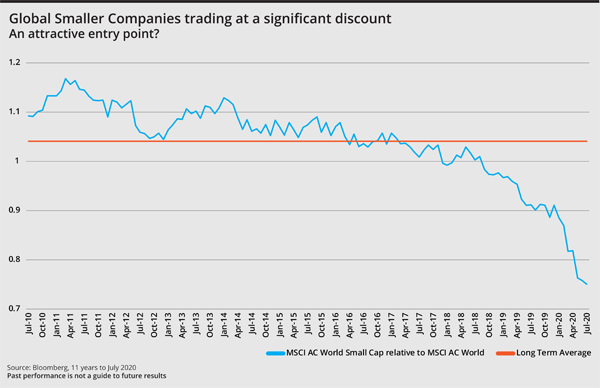
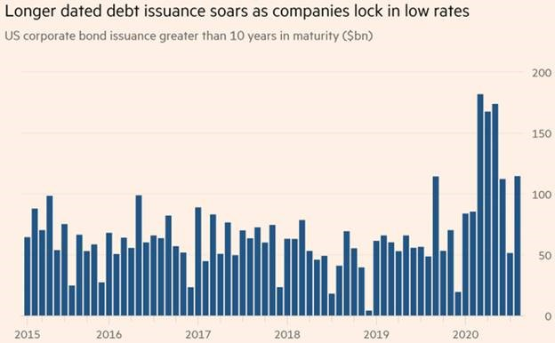
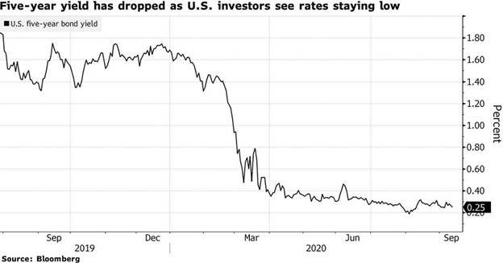
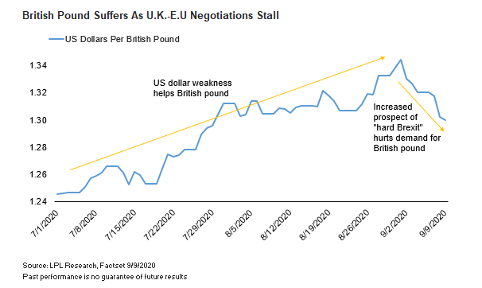

Data from the World Health Organisation confirmed that COVID-19 cases worldwide were above 33 million and rising at the end of September. The global recovery is taking hold as economies gradually emerge from lockdown; however, significant uncertainty remains about the possible path the pandemic could take and the timeline for vaccines to be made available to the public.

The presidential race is also fuelling uncertainty, with polls still pointing to a Biden victory. Many investors are likely wondering how November’s election results will shape markets and the economy in the months and years ahead. 

Just days after a fiery debate with former Vice President Biden, Trump tested positive to COVID-19 and was rushed to Walter Reed hospital, only adding to the sense of drama.

## Australia

In Australia, the federal budget has gone some way to meeting calls for fiscal policy to do some heavy lifting, with a singular focus on supporting incomes and employment in the face of the pandemic. 

Treasury forecasts economic activity to pick up from late 2020 and into early 2021, driven by a further easing of restrictions and improvements in business and consumer confidence. 

The RBA has also hinted at further easing, with another rate cut or announcement of further QE widely expected at its November meeting. 

On the data front, retail sales slumped 4.0% in August, led by a sharp 12.6% drop in Victoria. Labour force data showcased a resilient jobs market, despite the stage four restrictions continuing in Victoria.

Sydney Airport’s traffic performance for August showed total passenger numbers for the month down 96.5% on the corresponding prior period. Domestic passengers totalled 91,000 for the month, down 96.1%, and year to date total domestic passengers of 3.63 million, down 67.5%.

The Australian labour market saw further improvement in August, with the seasonally-adjusted unemployment rate falling from 7.5% to 6.8%, with increased participation. Employment rose 111,000 against expectations of a fall of 45,000, supporting the ‘better-than-expected’ recovery narrative. Full-time employment increase by 36,200 while part-time employment increased by 74,800.

The AiG Performance of Manufacturing Index fell 2.6 points to 46.7 in September. Victoria reported the weakest result, down 6.4 points to 37.6 due to stage four restrictions. The production sub-index slipped 3.3 points to 50.1, while employment fell 2.5 to 47.7, new orders dropped 1.5 to 45.1, and exports fell 5.7 to 46.5. The federal budget unveiled a $1.5 billion initiative to boost the manufacturing sector, providing priority funding for six select industries.

The Westpac-Melbourne Institute Index of Consumer Sentiment jumped by 18% from 79.5 in August to 93.8 in September. While the mood is still somewhat negative, the improvement comes despite news that Australia officially entered a recession, meaning consumers may be looking ahead rather than back at the previous quarter. 

## United States

Recent data suggests the US recovery lost some steam in September with key releases falling short of expectations. Nonfarm payrolls disappointed, with 661,000 jobs added, well short of the consensus 859,000, and the unemployment rate fell from 8.4% to 7.9%, although this was partially due to the fall in the participation rate from 61.7% to 61.4%. 

Another concerning figure came from durable goods orders, which rose a meagre 0.4% in August, missing expectations of 1.5%, a significant reversal from the previous month’s result of 11.7%.  

New home sales rose unexpectedly in August from a revised annual rate of 965,000 units to 1,011,000 units, the highest since September 2006. 

June quarter GDP shrank by an annualised 31.4%, slightly better than the preliminary reading, which indicated a 31.7% decline. The US Federal Reserve held the funds rate unchanged within the 0.00–0.25% range, a level that markets expect to be targeted for the next few years at least as the Fed attempts to reach its average inflation target.  

The White House and Congress are negotiating standalone legislation to support the airline industry, which could involve as much as US$25 billion for carriers, which have announced plans to furlough thousands of workers in the absence of federal aid. 

## Europe

Most EU member economies remain under pressure from COVID-19 containment measures as governments fear a new wave of infections could forestall the recovery. 

Across the euro area, GDP fell 11.8% in the June quarter, a larger drop than the 9.1% quarter-on-quarter fall experienced in the US. Economic sentiment improved 3.6 points to 91.1 in September, coming in ahead of expectations of 89.5.

Europe’s PMI Composite Flash Index surprisingly fell in September, falling from 51.6 to 50.1 (versus the expected rise to 51.7). The manufacturing index beat the consensus; however, the services index fell from 50.1 to 47.6, a stark contrast to the 50.5 expected. 

The recovery in GDP continued into July, lifting 6.6% for the month and broadly in line with expectations of 6.7%, underpinned by the reopening of schools, pubs, and hairdressers, while car sales saw a noticeable improvement, lifting above pre-crisis levels.

In the UK, final June quarter GDP came in at -19.8%, an improvement on the -20.4% expected. As expected, the Bank of England left its policy settings unchanged, with the bank rate at 0.10% and the QE ceiling at £745 billion. The Bank noted that it does not intend to tighten monetary policy until there is significant progress towards eliminating spare capacity in the labour market and achieving the 2% inflation target.

## China

Chinese industrial production and infrastructure spending are supporting the recovery, along with liquidity measures funded by a record bond issuance. However, the scale and speed of infrastructure spending are not on par with previous years as the authorities struggle to find projects with an adequate return. 

Meanwhile, China is hoping its consumers will make up for lost time, especially over the ‘Golden Week’ national holiday period. China’s ministry of culture and tourism expects around 550 million people will shop, travel, and gather with families during the eight-day public holiday, helping to jump-start China’s retail economy.

In other data news, China’s manufacturing PMI rose 0.5 points to 51.5 in September, beating expectations of 51.2. The unemployment rate fell to 5.6% in August as expected, while retail sales year-on-year growth came in at a surprisingly strong 0.5%, up from -1.1% in July. Industrial production yearly growth also came in ahead of expectations, rising to 5.6% versus the expected 5.1% rise.

The Australian government forecasts China’s growth to be 1.75% in 2020 and to reach 8.0% in 2021.

## Equities

Global shares were down in September as rising infections in Europe and uncertainty around further fiscal support in the US dampened the outlook.  The MSCI World Ex-Australia Index fell 0.3% in Australian dollar terms, and the MSCI Emerging Markets Index rose 1.5%, while global small indices traded at the most significant discount to large caps in 17 years.

Australian shares followed global markets down as the focus shifted to the uncertain path of recovery and the ongoing public health risks due to the pandemic. 
In early October, President Trump walked back his pledge of no additional stimulus cash before the presidential election, giving the market hope for further support.

The S&P 500 Index fell 3.8% in US dollar terms, and the Nasdaq Composite Index dropped 5.1% following an incredible rally, with markets now in a range-trading pattern. 

In Europe, the STOXX Europe 600 Index fell 3.3% in euro terms in September, with banks and insurance sectors down, while retail and health care were positive. The German DAX Index fell 1.4%, with online food delivery services the big winners as fears of a second wave of infections intensified. 

In Asia, Hong Kong’s Hang Seng Index fell 6.4%, and China’s CSI 300 Index fell 4.7%, while Japan’s Nikkei 225 Index rose 0.8%.

## Property

The Australian property securities market saw most prices continue to recover in the September quarter with a better than expected reporting season. 

Several A-REITs have embarked on capital raisings during 2020, so balance sheets are well-positioned with average gearing around 27% and interest rates on new debt issuance falling from 3.0-3.5% to 2.0-2.5% over the last 12 months. 

Industrial and logistics, specialist, large format, and non-discretionary retail sectors have outperformed in calendar 2020, while discretionary retail and office sectors have underperformed.

The retail sector has been subjected to forced store closures (excluding supermarkets and essential provisions), with prolonged lockdowns in Victoria adding to the pressure. The government-mandated Leasing Code of Conduct has shared the pain of reduced revenues for eligible SMEs. However, some larger retailers have been attempting to withhold rents and renegotiate based on a revenue-linked model. In the US, REITs fell 3.2%, with the most significant losses coming from office property (-6.9%) and manufactured homes (-6.5%).

## Rates and Credit

The market volatility throughout the pandemic has seen global sovereign bond yields rally, meaning lower yields.

Governments have embarked on a series of large-scale fiscal programs that have resulted in substantial sovereign bond issuance, while capital markets have also seen strong investment grade corporate issuance.  Yet all this issuance has been soaked up by massive central bank bond-buying, which has reduced the cost of funding for governments and their banking systems.

In Australia, the RBA flagged that the high rate of unemployment was now a national priority and would keep interest rates at the record low of 0.25% and continue to buy government bonds and provide banks with cheap credit for quite some time to stimulate the economy out of recession. 

Financial markets continue to speculate that the RBA may have to consider a further interest rate cut to 0.10% alongside additional quantitative measures to help lower the unemployment rate and support the economic recovery. 

In the US, minutes from the September FOMC meeting revealed members were pricing in additional fiscal stimulus from Congress. The staff projections “assumed the enactment of some additional fiscal policy support this year,” adding “without that additional policy action, the pace of the economic recovery would likely be slower.”

## Commodities

Oil markets were under pressure through September with the Brent crude spot price falling 10.9% to USD 40.30 per barrel and the WTI crude spot price falling 6.0% to USD 42.61 amid concerns about the outlook for fuel demand as Europe and the US contend with a surge in new coronavirus cases.

Metals were down over the month, with falls in Lead (-7.5%), Nickel (-5.5%), Zinc (-4.5%), Tin (-2.0%) and Aluminium (-1.9%) while Copper (+0.1%) was flat. 

The spot price of Gold eased, falling 3.4% from USD 1,964.83 to USD 1,897.90 per ounce.

## FX

The Australian dollar fell 3.4% in September to USD 0.71 as risk aversion returned to markets. Both the US and Australian central banks have emphasised a “lower for longer” approach to interest rates. Still, there is speculation that the RBA could cut to 0.10% at its November meeting, pushing up against the self-imposed ‘zero’ lower bound. 

The Australian dollar was also down against the Japanese yen (-3.4%) and euro (-1.9%), while the British pound suffered as fears of an eventual hard Brexit increased.

### **Important Information**

This article contains information first published by [Lonsec](http://www.lonsec.com.au/). Voted Australia’s #1 Research House for 2019.

Walbrook Wealth Management is a trading name of Barbacane Advisors Pty Ltd (ABN 32 626 694 139; AFSL No. 512465). Barbacane Advisors Pty Ltd is authorised to provide financial services and advice. This post is general information only and is not intended to provide you with financial advice as it does not consider your investment objectives, financial situation or needs. You should consider whether the information is suitable for your circumstances and where uncertain, seek further professional advice. We have based this communication on information from sources believed to be reliable at the time of its preparation. Despite our best efforts, no guarantee can be given that all information is accurate, reliable and complete. Any opinions expressed in this email are subject to change without notice, and we are not under any obligation to notify you with changes or updates to these opinions. To the extent permitted by law, we accept no liability for any loss or damage as a result of any reliance on this information.