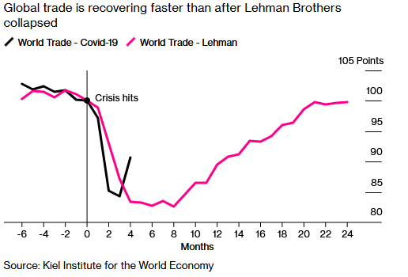
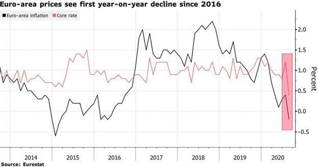
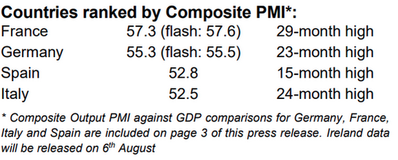
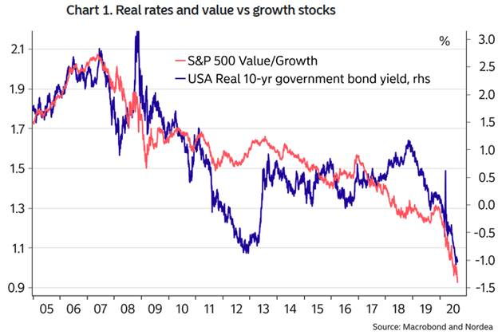
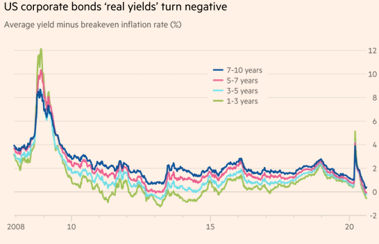
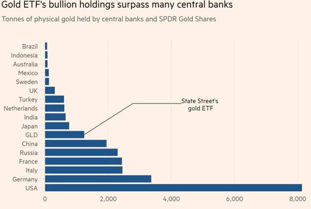

The COVID-19 pandemic continues to spread, with data from the World Health Organisation showing confirmed cases were above 27 million at the end of August and rising. 

Globally, the economic recovery continues following severe contractions in the first half of 2020. Shipping volumes are already back at levels that took more than a year to reach following the collapse of Lehman Brothers. Still, growth is uneven across countries and regions, with fears of a second wave dampening hopes of a sustained rebound. 

## Australia

The Westpac-Melbourne Institute Index of Consumer Sentiment jumped by 18% from 79.5 in August to 93.8 in September, despite the national accounts showing the Australian economy entered a recession for the first time since 1991. June quarter GDP fell 7.0%, following a 0.3% fall in the March quarter.

Consumer spending, which accounts for 56% of the economy, contracted 12.1% over the quarter, while business investment was weaker than expected at -3.5%. Retail sales rose 3.2% in July.

While the downturn has not been as severe as initially expected, the recovery will likely be uneven across the country, and extended lockdowns in Victoria will take a significant toll on the state’s economy.

Unemployment nationally is improving, but underemployment remains high, while wage and price pressures remain subdued. The unemployment rate rose 0.1 points to 7.5% in July, while the participation rate lifted from 64.0% to 64.7%.

The Reserve Bank of Australia announced that they expect inflation to average between 1.0% and 1.5% over the next two years.

Australia’s trade surplus narrowed from $8.1 billion to $4.6 billion in July. Exports declined by 4.4%, led by a 12.0% drop in service exports, while imports rose by 6.9%.

The AIG Performance of Manufacturing Index fell 4.2 points to 49.3, slipping back into contraction as extended lockdown measures, especially in Victoria, took their toll. There was considerable divergence between larger manufacturing states, with Victoria’s PMI back into contraction at 44.0, while NSW dropped 5.2 points but remained in expansion at 51.0.

## United States

In the United States, key indicators point to a strong rebound in economic activity. Still, the outlook remains uncertain with additional aid packages tied up with Congress, which is impacting on consumer sentiment.

The unemployment rate fell from 10.2% in July to 8.4% in August, well below the expected 9.8% and marking the fourth consecutive monthly decline since the 14.7% all-time high recorded in April. Average weekly hours worked came in broadly as expected at 34.6, and average hourly earnings increased 0.4%.

Initial jobless claims for the week of 29th of August showed a drop in claims, coming in at 881,000 (950,000 expected), down from 1,011,000 in the previous week.

The ISM Manufacturing PMI rose to 56.0 in August, beating expectations for 54.5, pointing to the most significant expansion in the manufacturing sector since November 2018. August’s ISM service PMI came in largely as expected at 55.0, up from 50.0 in July.

GDP improved by 1.2% to -31.7% in Q2, exceeding expectations of -32.9%.

The US trade deficit with China remains stubbornly high, with the latest figures showing an increase of US $1.6 billion to $28.3 billion in July.

## Europe

Key economic indicators suggest that Europe’s recovery is losing momentum this quarter.

Fears of resurgent COVID-19 infection rates, most notably in Spain and Italy, is leading to greater caution from consumers, while the spectre of deflation is reemerging for the first time since the euro crisis. Inflation in the eurozone is estimated to be -0.2% year-on-year in August, missing against the expected positive 0.2% rate and down from 0.4% in the previous month.

The Markit Composite PMI for the eurozone slipped from 54.9 to 51.9 in August, with the services PMI falling to 50.5. Both measures are still in expansion territory but slowing on the previous month.

Germany’s unemployment rate was unchanged at 6.4% in August. However, employment fell by 9,000 against expectations for a gain of 1,000.

In the UK, while August’s Markit Composite PMI came in at a healthy 59.1, it missed expectations of 60.3, mainly due to the services PMI which came in at 58.8, below expectations of 60.1.

## China

China has been successful in implementing targeted lockdowns and compulsory smartphone tracking to avoid escalating outbreaks. With only sporadic outbreaks across the country, China is on track to be the first country to emerge from the COVID-19 crisis, and the only G20 country to post a positive GDP result in the June quarter.

Economic data shows inflation is lifting while trade figures came in strongly, with exports rising 9.5%. The NBS Manufacturing PMI was 51.0 in August, down from 51.1 in the previous month but still showing the sixth straight month of expansionary factory activity since February.

## Equities

Australian shares rose 2.8% in August, with IT and Consumer Discretionary the top performers, and earnings season was dominated by the dire effects of COVID-19, as companies cut dividends and increased cash holdings.

The S&P 500 Index rose 7.2% in US dollar terms, ending August at record highs and fully recovered from its March low.

The rebound in global equities has been led by large-cap growth companies, which have benefited from the persistent low rate, low growth environment.

One of the heroes of remote work, Zoom Communications, released its June quarter results at the end of August, which included a 355% rise in revenue on the prior corresponding period, soundly beating expectations. Zoom’s share price rose 28.0% in August but fell 19.2% in the first week of September.

The MSCI World Ex-Australia Index gained 3.5% in Australian dollar terms in August, while the MSCI Emerging Markets Index fell 0.9%.

European shares pushed higher, with the STOXX Europe 600 Index posting a 4.2% gain. In Asia, Japan’s Nikkei 225 Index rose 6.6%, Hong Kong’s Hang Seng Index rose 2.5%, and China’s CSI 300 Index rose 2.8%.

## Property

Australian listed property gained 7.9% in August but is down 17.7% over the past 12 months. Globally, developed market REITs returned 1.8% in Australian dollar hedged terms.

While not in a position to provide guidance, Scentre outlined trading activity is showing signs of recovery, with 93% of stores trading and customer visits up to 84% on the corresponding prior period (both figures excluding Victoria).

Despite near-perfect rent collection through the pandemic, office property (- 3.1%) is battling the ‘work from home’ paradigm, which is putting pressure on the long-term outlook.

## Rates and Credit

Yields rebounded from fresh record lows in August as risk-on sentiment prevailed over the month.

The US 10- year Treasury yield hit a low of 0.51% before rising to end the month at 0.71%, while Australia’s 10-year yield rose from its low of 0.82% at the start of August to 0.98% at month-end.

As widely expected, the Reserve Bank of Australia left the cash rate and yield curve control target unchanged at 0.25% at its September meeting, but increased its Term Funding Facility (TFF) to $200 billion and extended its availability until the end of June 2021.

The RBA noted the government has balance sheet scope for continued fiscal support while also stating it is considering further monetary policy measures to support the economy.

The US Federal Reserve issued a revised Statement on Longer-Run Goals and Monetary Policy Strategy, which introduces flexible average inflation targeting (coined FAIT by some) to compensate for periods where inflation runs below the 2 per cent target (such as following an economic downturn). 

This change represents a relaxation of the inflation target in the short to medium term, and real yields on some high-quality US corporate bonds slipped below zero in August. The real yield on a bond is the basic nominal yield adjusted for inflation expectations.  Maturities of 1-3 years printed negative real yields for the first time since 2017, when expectations of massive tax cuts boosted inflation expectations, while for 5-7 year maturities the last time we saw negative real yields was 2013.  

## Commodities

Oil prices rose through August with the Brent crude spot price increasing 4.9% to US $45.22 per barrel and the WTI crude sport price rising 6.3% to US $42.61.

Metals were positive over the month, with increases in Nickel (+11.5%), Zinc (+8.5%), Aluminium (+5.0%), Lead (+4.9%) and Copper (+4.0%), while Tin (-0.3%) was flat.

Gold softened over August, falling from US $1,975.86 per ounce to $1,971.90 after pushing above $2,000 earlier in the month.

## FX

The Australian dollar rose 2.0% in August to US$0.74. Geopolitical risks aside, it may move higher thanks to the US Federal Reserve’s pivot to a more flexible inflation target and robust demand for Australian iron ore.

### **Important Information**

Walbrook Wealth Management is a trading name of Barbacane Advisors Pty Ltd (ABN 32 626 694 139; AFSL No. 512465). Barbacane Advisors Pty Ltd is authorised to provide financial services and advice. This post is general information only and is not intended to provide you with financial advice as it does not consider your investment objectives, financial situation or needs. You should consider whether the information is suitable for your circumstances and where uncertain, seek further professional advice. We have based this communication on information from sources believed to be reliable at the time of its preparation. Despite our best efforts, no guarantee can be given that all information is accurate, reliable and complete. Any opinions expressed in this email are subject to change without notice, and we are not under any obligation to notify you with changes or updates to these opinions. To the extent permitted by law, we accept no liability for any loss or damage as a result of any reliance on this information.