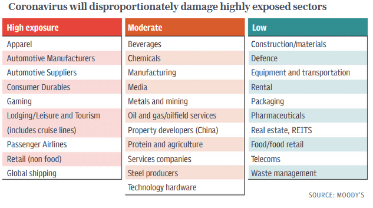

The coronavirus situation moved quickly in the past six weeks from something many people felt was an exaggerated response to a nasty version of the flu to a global pandemic that has killed tens of thousands and shut down large swathes of the world economy.

Governments around the world have implemented extreme measures, including social distancing, partial shutdowns, and full lockdowns to reduce the spread of the coronavirus. The coronavirus has virtually shut down consumer-facing sectors. Global supply chains are in disarray, and economic activity is rapidly falling. We are already in a recession of unknown depth and duration. And REM’s “It’s the End of the World as We Know It (And I Feel Fine)” has briefly re-entered the Top 100 on the iTunes music chart.

The outbreak and containment efforts caused extremely volatile conditions in financial markets, along with unprecedented responses from governments and central banks in terms of size and breadth of support.

The Australian government had to quickly come to terms with the severity of the health crisis and the inevitability of an economic recession. A series of economic measures were announced in March to mitigate the impact on the local economy and people’s lives.

As part of the fiscal stimulus package, the government is providing up to AUD 100,000 to eligible small- and medium-sized businesses and not-for-profits (including charities) that employ people, with a minimum payment of AUD 20,000. Employers with turnover less than $1 billion who have experienced a 30% reduction in revenue will receive payments of AUD 1500 per fortnight per eligible employees for up to six months.

The monetary policy response saw the RBA cut rates to 0.25% in March and announce a policy of yield curve control, targeting 3-year bond yields at 0.25%. The three-year bond rate is used as a reference when pricing and valuing bonds and loans throughout the economy. This guidance indicates that the RBA will purchase government bonds and semi-government securities across the yield curve to achieve this 0.25% target and address market dislocations.

In the United States, the Federal Reserve cut the Fed Funds rate by a full percentage point from 1.25% to 0.25%. It also announced that it would embark on unlimited bond purchases in an unprecedented move aimed at keeping Treasury yields, and loans and mortgages that reference them, low. The US 10-year Treasury yield had earlier spiked to 1.2% from 0.5%, while mortgage rates had crept up to 4.0%, undermining efforts to support housing and financial markets.

US 10 Year Treasury Yield\
Source: Macrotrends

The U.S. also passed a USD 2 trillion fiscal stimulus package in response to the coronavirus. The package amounts to around 10% of GDP, while the current fiscal deficit is about 5%. Together with the intervention from the Federal Reserve, the monetary and fiscal stimulus amounted to a $6 trillion stimulus, according to White House economic adviser Larry Kudlow, or about 30% of annual U.S. GDP.

The UK announced a £350 billion package of loans and grants to help British businesses pay the bills, while businesses in the retail and hospitality sectors will receive a year-long holiday from paying business rates.

In Europe, EU leaders continue to disagree on a fiscal response to the coronavirus. While there were signs of some early support for so-called ‘corona-bonds’, which would take the form of jointly-issued debt by members of the Eurozone, Germany and the Netherlands ultimately rejected the proposal. However, all agree that swift action is required from the EU to forestall the worst effects of the virus.

The most likely solution will involve providing credit via the European Stability Mechanism (ESM) bailout fund, in amounts up to 2% of the requesting country’s GDP with a maturity of 5-10 years.

At a national level, Germany announced a fiscal stimulus package worth €756 billion, or 10% of annual GDP. At its core, this involves the creation of a €600 billion bailout fund to take stakes in stricken companies. The government will also add €156 billion in additional debt and extend borrowing above the Eurozone Stability and Growth Pact limit of 0.35% of GDP.

As China continues to emerge from lockdown, the market is expecting some form of stimulus to be forthcoming. Still, few expect the measures to be of the same magnitude as previous packages. This time around, China has less room to move given high levels of debt and the diminishing returns on large-scale infrastructure projects. However, Chinese authorities are still considering spending up to RMB 2.8 trillion (USD 394 billion) in local government special bonds to boost infrastructure. While smaller than previous programs, this would still be significant.

In talks aimed at co-ordinating responses to the economic impacts, G20 trade ministers pledged to keep their markets open and ensure a continued flow of vital medical supplies, equipment and other essential goods. They stopped short, however, of explicitly calling for an end to export bans that many countries, including France, Germany and India, have enacted on drugs and medical supplies.

There have also been [reports](http://virus%20epidemic%20leads%20some%20countries%20to%20restrict%20food%20....%20https//www.startribune.com/virus-epidemic-leads-some-countries-to-restrict-food-exports/569159842/) of export bans being placed on food supplies. Kazakhstan, one of the world’s biggest shippers of wheat flour, banned exports of that product along with others, including carrots, sugar and potatoes. Vietnam temporarily suspended new rice export contracts. Serbia has stopped the flow of its sunflower oil and other goods, while Russia is leaving the door open to shipment bans and said it’s assessing the situation weekly.

#### Economic Impact

There is still considerable uncertainty over the extent and duration of the damage to GDP, most economic data thus far pertains to February, before containment measures were introduced by governments, making the full impact on jobs and economic activity challenging to determine.

To date, the extent of the economic damage has been most clearly evident in unemployment data. In the U.S, non-farm payrolls showed a reduction of 701,000 jobs in March, while initial jobless claims made an extraordinary leap to 6.6 million according to the 2 April release, up from 281,000 in the 19 March release.

In Australia, the number of job advertisements dropped by 10.3% in March on the previous month, falling by an even steeper 18.2% when compared to the same period last year.

According to an Australian Bureau of Statistics (ABS) survey on the effects of the coronavirus, two thirds (66%) of Australian businesses reported that their turnover or cash flow had reduced as a result. The outbreak had forced nearly half (47%) of businesses to make changes to work arrangements, and for some businesses, this included temporarily reducing or increasing staff working hours.

Contrary to expectations, the AIG Manufacturing Index, which measures manufacturing activity in Australia, saw a rebound in March from 44.3 to 53.7, re-entering expansion territory since the previous month’s shock decline. The increase was due almost entirely to the short-term need for food, groceries and personal care products due to quarantine measures, which has resulted in considerable lifts in new orders and sales.

Less surprising was March’s decline in consumer sentiment, with the Westpac Melbourne Institute Index of Consumer Sentiment falling from 95.5 to 91.9, a five-year low. Promisingly, consumers still see the virus as a short-term phenomenon, reflected in the ‘finances, next 12 months’ sub-index, which was down only 1.7%. Overall, consumers appear less troubled by the outbreak than during the Global Financial Crisis.

Meanwhile, the situation in China appears to be stabilising, with the rate of infection slowing in recent weeks while the rest of the world takes action to prevent the spread. China has begun easing restrictions in Hubei with some travel permitted and some industries restarting approximately two months since the region was locked down.

Post-CNY coal consumption close to normal levels.\
Source: [The Market Ear](https://themarketear.com/)

The Purchasing Managers Index (PMI), which gauges economic activity, provide insight into the broader impact on the Chinese economy. February’s result saw a drop from 50.0 to 35.7, indicating a very significant contraction, but recovered to 52 in March. The 50 point mark separates monthly growth from contraction; however, a reading of 52 is still significantly below pre-virus levels. After recording GDP growth of 6.1% in 2019, the World Bank now estimates that growth in China will fall to 2.3% in 2020.

## Equities

While the extent of the fall was not unprecedented, the speed at which some markets fell in March certainly was.

The Dow Jones Industrial Average took just 19 days to move from a new all-time high to a bear market, the quickest move in the 124-year history of the index. Not to be outdone, the S&P 500 Index also set a new record, doing it in only 16 days and eventually hitting its low on 23rd March.

Source: LPL Financial Research, March 12, 2020

Australian shares also faced a very tough March as measures to combat the spread of the coronavirus, along with the economic dislocation globally, hit businesses hard. The ASX 200 and ASX 300 were down 20.7% and 20.8% respectively, while the ASX Small Ordinaries Index was down 22.4%.

While no sectors were immune, measures such as travel bans and social distancing took a particularly hefty toll on airlines, travel, leisure, entertainment, retail and hospitality businesses. Flight Centre (-69.6%) entered a trading halt in March while Qantas (-41.6%) has significantly reduced capacity and stood down two-thirds of its workforce (around 20,000 people).

Source: Lonsec, Walbrook Wealth Management

Meanwhile, Amazon announced plans to hire 100,000 warehouse and delivery workers and closer to home Coles and Woolworths were also adding staff to cope with heightened demand.

It was not a month to be a value investor, with the MSCI World ex Australia Value index down 12% for the month compared with 4.9% for Growth and 3.5% for Quality.

Source: Lonsec, Walbrook Wealth Management

Emerging markets were also caught up in a flight to quality as trade plummeted and the USD ripped higher. However, they have generally performed in line with developed markets in the current crisis, due in part to the relatively fast and organised response in Asia. Key Asian markets are flat year to date.

The tightening of liquidity conditions across a range of markets was symptomatic of severe stresses in the financial system, raising the risk of a more disorderly and precipitous decline in economic activity.

The US share market tripped [circuit breakers](https://walbrook.com.au/monthly-update-march-2020/#CircuitBreakers) three times in two weeks, while volatility, measured by the CBOE Volatility Index, hit 82.7 points in mid-March. Commercial paper spreads soared to levels not seen since the Global Financial Crisis in 2008. They caused companies to draw down on their revolving credit facilities as they scrambled to ensure liquidity. Though well capitalised compared with 2008, there was renewed concern for the banking sector, given exposure to warehoused commercial loans and economic activity generally.

Source: DWS, March 23, 2020

Market moves are not only dependent on the rate at which the virus spreads, but the fiscal, monetary and liquidity support that is provided by governments and central banks. The behaviour of financial markets in the period ahead and the ultimate depth of the economic downturn is highly uncertain.

## Rates & Credit

Government and corporate bond markets came under intense stress in March, with high yield (-14.3%) and emerging markets (-15.0%) faring worst but all sectors trading in a disorderly fashion.

Source: Lonsec, Walbrook Wealth Management

A combination of corporates drawing down credit lines to build cash reserves, banks becoming more cautious in lending, and investors seeking to redeem investments across all asset classes led to acute liquidity concerns.

It was notable for not being confined to high yield credit, notorious for low levels of liquidity during crises. There were dislocations in (normally) highly liquid Government bond markets, with bid/ask spreads for US Treasuries stretched to 5–10 basis points, from normal levels of c.0.25 basis points, as arbitrage strategies were unwound and investors raised cash to meet margin calls. Australian government bond markets also saw a 10–20 basis point bid/ask spread, which has not been experienced in over 30 years.

In the USD 1.13 trillion commercial paper markets, key to working capital management, yields over risk-free rates surged to levels last seen during the 2008 financial crisis, causing companies to draw down on backup credit lines.

Short term interbank rates also rose, while investment-grade credit spreads spiked higher due to liquidity and concerns over a rise in downgrades and defaults due to the coronavirus shutdown.

A particular focus has been on the amount of issuance at the lower end of investment-grade credit, often to buy back shares. While banks have de-levered since the Global Financial Crisis, that debt largely has moved to governments and other corporates, both of which are far more heavily levered than they were in 2008.

By the end of the month, the US Federal Reserve had committed to buying investment-grade debt issued by U.S. companies, which helped to stabilise the market.

## Property

Listed property has been dealt a severe blow by social distancing measures and the need for people only to venture out of their homes for essential shopping. The effects have been particularly acute for Australia’s retail Real Estate Investment Trusts (REITs), which have experienced a fall in foot traffic and will need to negotiate with distressed tenants who will be asking for rent relief.

Now that listed market values have plummeted, pressure has mounted on investment managers and super funds to update values on their unlisted assets more regularly than the usual quarterly cycle. In Australia, AMP Capital is leading the way with valuers now being asked to revalue property assets in their flagship AMP Capital Shopping Centre Fund and AMP Capital Wholesale Office Fund.

Globally, investors are cognisant that for sectors like Hotels, Offices and Shopping Centres, the impact of the virus could last six months or more due to physical distancing and working from home.

## FX

The Australian dollar fell from USD 0.6515 to USD 0.6102 in March, also losing 2.8% against the British Pound and 6.3% against the safe-haven Japanese Yen, as coronavirus fears took hold in markets.

A weaker Australian dollar may act as a shock absorber and hold off the very worst of the economic impact. However, exports, especially travel and education-related, will still be highly constrained due to the global travel lockdown.

## Commodities

Oil markets have compounded the drama of the coronavirus, moving lower in February and then falling dramatically through March following a spectacular falling out between Saudi Arabia and Russia over how to manage global supply. Both are now engaged in a price war that is threatening US shale producers, some of which are highly leveraged.

The Brent oil spot price fell 63% over March from USD 51.31 per barrel to USD 19.19 while the WTI crude oil price finished March at USD 20.1 per barrel – the lowest price since February 2002.

Japanese bank Mizuho noted that the oil price could turn negative, based on the “physical reality” of the market. When the oil is pumped out of the ground, it has to be consumed or stored. When the cost of storage goes high enough — or space runs out — companies might pay customers to take it.

Base metals were also down in March, with falls in Copper (-12.1%), Tin (-10.4%), Aluminium (-9.9%), Nickel (-6.3%), Lead (-5.8%) and Zinc (-5.7%).

Gold moved from USD 1,585.7 per ounce to USD 1,597.9 over the month, but it was a bumpy ride. As global equities were melting down, many investors were forced to sell the metal to raise cash and cover losses in other markets. As a result, spot bullion posted its biggest weekly drop since 1983 — perhaps not the safe bet buyers might have expected.

Prices of essential agricultural commodities rose as consumers loaded up on pasta, rice and bread at the same time as farm supply lines experienced disruption and countries began restricting agricultural exports.

Difficulties moving grain within countries and across borders, coupled with frenzied buying, could exacerbate the impact of the pandemic on the global food market.