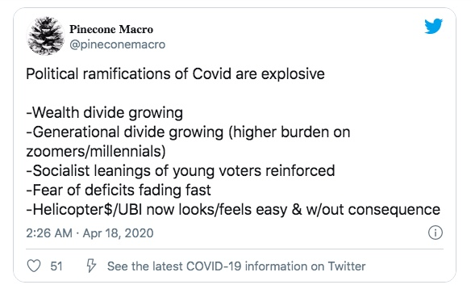
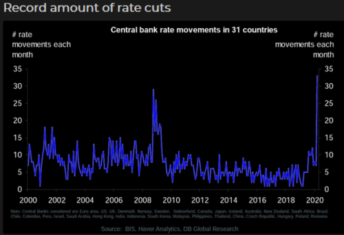
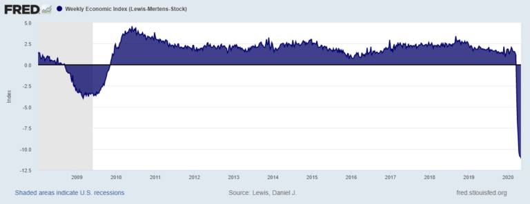
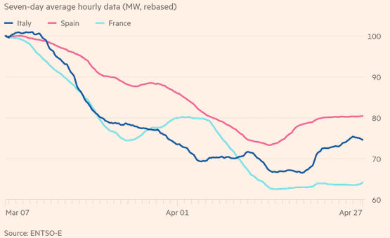
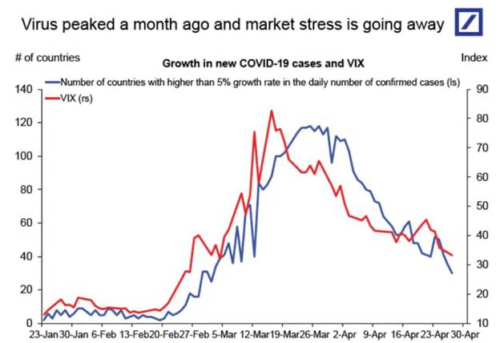
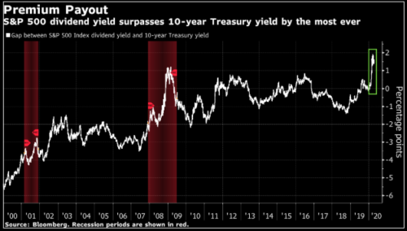
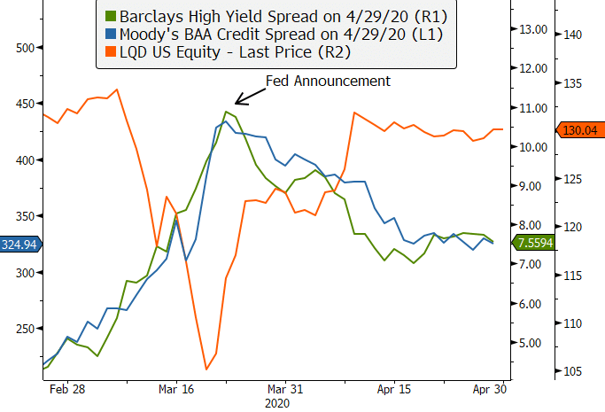
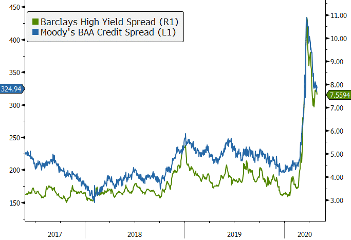
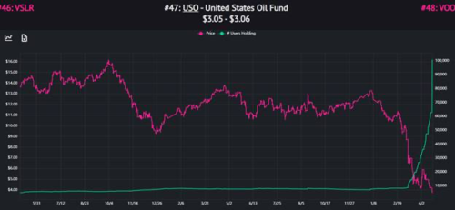

Uncertainty about the economic and social damage caused by the COVID-19 pandemic persisted in April. To limit damage, governments began planning to ease restrictions under the shadow of growing social unease and the threat of a second wave of infections.

Global markets staged a strong comeback, with some equity markets technically moving back into bull market territory, however there remains a great deal of pessimism with some market participants dismissing it as a ‘bear market bounce’.

Given the unprecedented conditions, many large corporates have removed forward earnings guidance, making it more difficult to gauge the effect of the pandemic on global economic demand.

Economic growth data for the March quarter pointed to a sharp downturn globally, with the contraction likely to be more pronounced in the June quarter given lockdown measures were in full force in most regions by April.

The effect on demand was most visible in the oil markets, with near-month West Texas Intermediate (WTI) futures dropping to negative USD 37.63 a barrel on April 20, shortly before contract expiry.

Technical factors aside, the root cause was a shock to the demand for oil, caused by COVID-19. It was then exacerbated by oversupply, as OPEC+ failed to come to an agreement on a supply cut.

> “*While the full implications of today’s policy actions are still vague, the effect of massive fiscal and monetary stimulus, and the associated jump in government borrowing, could eventually lead to steeper curves, a shift in equity market leadership and a tilt in how economic rewards are shared in the years to come.*“
>
> ‘LTCMA Mark-to-Market: COVID-19 – New cycle, new starting point’ – JP Morgan Asset Management, 30/04/2020

Governments continue to support their economies by deploying fiscal stimulus measures, including extensive employment subsidies to retain worker-firm relationships, with the consensus being that further support will be required.

Central banks also continued to provided support to the financial system, with rate cuts and more focused programs, such as the purchase of corporate bonds.

Since mid-March, the U.S. Federal Reserve has increased its balance sheet by over USD 2 trillion. Markets expect the U.S. budget deficit to expand to around US$4 trillion in 2020, prompting the U.S. Treasury to boost the size of bond auctions to record amounts.

> *“I think a lot about what money is worth and believe that it has no intrinsic value…I believe that increasingly there will be questions by bondholders who are receiving negative and nominal rates while there is a lot of printing money about whether the debt assets they are holding are good stores of value.”*
>
> Ray Dalio, Bridgewater Associates.

Actions taken by the U.S. Federal Reserve to lower credit spreads, including those of high-yield or junk bonds, provided further flow-on support to equity markets. However, Morgan Stanley noted that this might be the most hated rally on record, given investor positioning:

1. US money market balances stand at US 4.7 trillion. Bank deposits have surged.
2. Short interest in equity futures is high.
3. Implied volatility relative to credit and equity risk premiums is high.
4. Hedge fund net leverage is very low.
5. Most survey and sentiment indicators are still just off record pessimism

This positioning suggests that investors are approaching the current market with caution. However, data in both the U.S. and Australia suggests that accounts of Retail investors have been highly active. The Australian Securities & Investment Commission warned in a note that retail investor activity, particularly in complex levered and inverse products, was a concern.

### Australian Economy

The Australian economy is expected to contract by at least 5% in the June quarter after a smaller contraction in the March quarter, thereby meeting the technical definition of a recession.

However, no data is needed to confirm what has already been observed: shutdowns, isolation, and social distancing measures in the fight against the spread of COVID-19 have virtually closed large sections of the economy, causing a surge in unemployment not seen since the Great Depression.

Lockdown measures appear to have been effective, and in early May attention turned to re-starting the economy and putting in place the measures and safeguards required to avoid a second wave of cases.

The Reserve Bank of Australia kept the cash rate on hold at its May meeting at 0.25% and maintained its yield target for 3-year government bonds at the same rate. The Bank reported that its bond purchases have so far totalled around $50 billion and that, in light of improving conditions in bond markets, has begun scaling it back with a view to increasing it again if the situation requires.

Payroll data showed a fall in employee jobs of 7.5% nation-wide (around 975,000 employees) between mid-March and mid-April, and a drop in total wages paid of 8.2%. Retail turnover rose 8.5% in March as consumers stockpiled ahead of lockdown measures, but cafés and restaurants didn’t fare so well, experiencing a 22.9% fall in sales.

Hopes of a swift recovery in the manufacturing economy were dashed in April as the AIG Manufacturing Index recorded a drop of 17.9 points to 35.8, which was the worst month-to-month fall the index has seen. With the temporary spike in demand for manufactured food and groceries now subsided, widespread disruption to supply chains and freight movements were reported by respondents. New orders fell 25.2 points to 32.7 and production fell 16.5 points to 35.3, while input prices rose 7.6 points to 71.6.

Consumer confidence plunged in April to its lowest level in the 47-year history of the survey. The Westpac Melbourne Institute Index of Consumer Sentiment dropped 16.3 points to 75.6 as negative economic news saturated the news cycle and workers faced an uncertain job environment. The ‘economy, next 12 months’ sub-index recorded a spectacular 31% drop. However many respondents feel the effects will be temporary, with the ‘economy next 5yrs’ sub-index down just 3.8% in the month.

### The U.S. Economy

In the U.S., March quarter GDP plummeted to an annualised 4.8% contraction, below expectations of a 3.7% fall, as the initial impact of COVID-19 filtered through the economy. Within the GDP report, consumer spending showed a sharp decline, falling 7.6% versus an expected 1.5% contraction.

Estimates of the impact of the shutdowns and isolation initiatives on the June quarter GDP range from 7–10%. The 2008 recession saw a 4% contraction in US GDP over six quarters, while the 1929-30 depression saw a 26% contraction.

We may glean some insight into Q2-Q4 data from the Weekly Economic Index (WEI). The WEI collates ten daily and weekly indicators of real economic activity, covering consumer behaviour, the labour market and production. The WEI has fallen to levels far below those seen in the 2008 financial crisis.

Source: St Louis Federal Reserve

After lowering the funds rate by a full percentage point in March, the U.S. Fed confirmed the policy rate would stay unchanged at the target range of 0.00–0.25%, reiterating its commitment to use the full range of tools to support the economy for as long it takes to ensure the economy is “well on the road to recovery.”

The ISM Manufacturing PMI was revised lower from a preliminary estimate of 36.9 to 36.1, down from March’s 48.5. The reading was the lowest since early 2009, with employment declining the most since March 2009 amid greater spare capacity.

April’s ADP Employment Report showed the economy lost 20.2 million jobs over the month – the largest decline ever in employment. The services sector was the hardest hit, shedding 16.0 million jobs, mostly in leisure and hospitality.

### The European Economy

While the movement of people and goods across Europe remains depressed, there has been a tentative uptick in economic activity in countries which have eased their lockdowns. It is too soon for official numbers to reflect this recovery, but in Italy and Spain, electricity consumption has been rising since mid-April.

Source: Financial Times

Official data suggests that the damage has been extensive. Before the pandemic hit, the story in Europe was one of mediocre economic growth, with a modest expansion in the services sector offset by a contraction in manufacturing.

The pandemic has undercut even this lacklustre narrative by hitting services extremely hard. The preliminary estimate shows eurozone GDP down 3.8% year-on-year for the March quarter – the sharpest decline observed since the series started in 1995 and sharper than the 3.0% fall forecast by the European Central Bank (ECB).

Economic sentiment fell sharply to 67.0 in April, missing expectations of 74.0 and down from March’s downwardly revised level of 94.2, which doesn’t bode well for June quarter economic growth.

Since the end of March, the ECB has been buying assets as part of the new Pandemic Emergency Purchase Programme (PEPP), which allows the ECB to make up to €750 billion of purchases across all asset classes. This will be augmented by additional long-term refinancing operations to support liquidity across the eurozone.

### The Chinese Economy

The Chinese economy contracted by 9.8% in the March quarter.

According to the IMF, growth will recover to just 1.2% for the whole of 2020. China was the first economy to be hit by the coronavirus, and after a lockdown lasting more than two months, the economy is beginning to open up, although neighbourhood-level monitoring and testing remain in place.

The economy is estimated to be running at around 80% capacity, and while many restrictions have been eased, others have been tightened, including restrictions on international flights, in a bid to prevent a second wave of imported infections.

Chinese policymakers have pledged to combat the economic damage caused by the pandemic. There were RMB 2.85 trillion in new loans in March – far exceeding market expectations of RMB 1.8 trillion, and three times more than February’s RMB 905.7 billion – lifting bank lending in the first quarter to a record RMB 7.1 trillion.

The Chinese central bank has stressed its intention to avoid the size and scope of stimulus packages adopted in previous downturns, due to high debt levels. However, there will likely be growth in lending over coming months as key government-backed projects restart and pent-up consumer and real estate demand picks up.

## Equities

Markets have stabilised significantly since March, with the CBOE Volatility Index falling from its March peak of 82.7 to 34.2 at the end of April, though the magnitude and duration of the disruption to the real economy remains uncertain

Source: Deutsche Bank

Near-term expectations remain heavily discounted as a result. Over half of ASX 200 companies have downgraded or withdrawn earnings guidance due to the lack of visibility in assessing the extent and severity of the COVID-19 outbreak.

Dividends for banks, property and infrastructure shares are expected to decline as companies attempt to counter demand shocks through rapid cash conservation measures, while capital raisings have intensified as businesses move to strengthen balance sheets.

Based on technical definitions, the U.S. equity market has endured a bear market and a bull market in the space of two months. In price terms, the S&P 500 declined 34% from February’s record high to its trough on 23 March, before rallying 32% to the end of April.

Source: Bloomberg

The two-month bear market in US stocks, and falling US Treasury yields, led to the biggest dividend yield advantage for US equities over US Treasuries in a decade. This spread is not expected to persist at these levels given dividend cancellations and cuts.

U.S. oil producers bounced back in April but remain beaten down, with many now struggling to manage high levels of debt.

In the U.K., the FTSE 100 Index rose 3.9% in April, and Germany’s DAX 30 Index rose 9.3%.

## Rates & Credit

The dislocation in the credit markets was pronounced through March and April, with sovereign bonds also not immune from indiscriminate selling. At the peak of the distress, even investment-grade bond ETFs had fallen by as much as 20% (despite yields on US Treasuries collapsing). This meant that credit spreads were exploding.

Source: Bloomberg.

Action from central banks helped to restore order and bring credit spreads lower. the U.S. Federal Reserve committed to purchasing not only government bonds and agency mortgage-backed securities but also corporate bond ETFs, including sub-investment grade bonds (‘junk bonds’).

U.S. junk bonds subsequently rallied the most since 1998, with credit spreads falling over 300 basis points.

Source: Bloomberg

Given the recent improvement in markets in late April and early May, the Fed began slowing the pace of government bond purchases.

In Australia, the RBA has embarked on its own bond buying program, which totalled around $50 billion at the time of its May meeting. The Australian 10-year government bond yield rose in April from 0.76% to 0.89%, while the 3-year bond yield was steady at 0.25% in line with the RBA’s target.

## Property

In April, global developed market Real Estate Investment Trusts (REITs) rose 5.9% in AUD hedged terms, and the MSCI US REIT Index rose 8.1% in USD terms.

Australian listed property was able to enjoy a recovery in April, with the S&P/ASX 200 A-REIT Index returning 13.7%. However the price index remains down 33% on its February high, and social distancing and other measures implemented to curb the spread of the coronavirus have hit the A-REIT market hard.

Retail assets have been particularly impacted by the mandated closure of non-essential businesses, while some large national retail groups have been forced to temporarily reduce their bricks and mortar footprints.

As the economic fallout from COVID-19 widens, other key sectors – including office and industrial – may increasingly feel the impact of falling business confidence and GDP.

## FX

The Australian dollar rallied into May, helped by stronger than expected Chinese trade data and news that Chinese factories are re-opening.

The AUDUSD rally began in mid-March after hitting intraday levels of USD 0.55, finding resistance at around USD 0.65. This is still c.7% below its level at the start of January.

Over the three months to April, the Australian dollar also fell 4.7% against the Japanese yen and 0.9% against the euro. It rose 2.5% against the British pound.

## Commodities

With useable capacity at storage facilities dwindling, and the cost of onshore and offshore storage rising, the price of near month oil futures traded erratically during April, even turning negative prior to expiry.

Oil markets began looking more stable in the latter part of April as supply cuts meant that crude inventory built up slightly less than estimated and markets anticipated a lift in demand as economies reopen. This brought the WTI crude spot price to just above USD 18 per barrel at the end of April, versus USD 61 at the start of 2020.

Amidst the low prices and volatility, retail investors rushed into exchange-traded funds that track oil futures. Even if timed correctly, investors buying and holding these sorts of investments long term to profit on oil price expectations should be aware that roll costs mean that the tracking error is high. A $1 move in the spot price of oil does not necessarily translate to a $1 move in the price of an Oil ETF.

Source: Jones Trading

Metals were mixed, with gains from Copper (+4.8%), Nickel (+6.2%), Tin (+4.1%) and Zinc (+1.8%), and falls in Lead (-6.1%) and Aluminium (-2.1%). Gold rose 5.6% to US$1,687.67 per ounce.