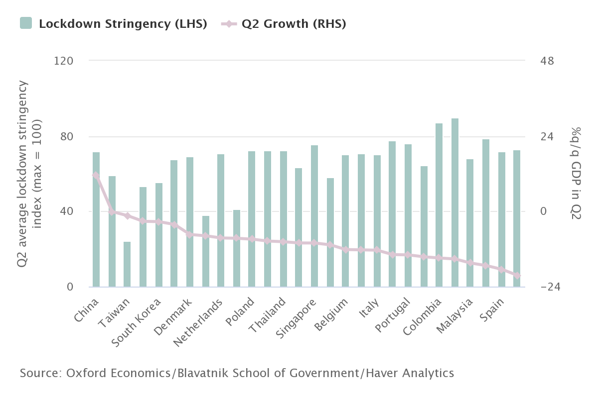

This report was produced on 24 August 2020 with ICAEW's partner Oxford Economics, one of the world’s foremost advisory firms. Their analytical tools provide an unparalleled ability to forecast economic trends.

The global economy is experiencing a once-in-a-generation shock. The recovery from the low point earlier this year has been strong so far, with China leading the way; although the rest of the world has a long way to go in containing the virus for activity to return to normal levels.

## Overview

* A strong Q3 bounce in economic activity following Q2 collapse will mask underlying issues for the recovery
* Trade war remains a key risk for trade recovery in China, while tourist restrictions will weigh on Middle East and South East Asia.
* Trade in goods well placed to recover but there are grave concerns for global tourism
* Global trade however has been in decline long before the pandemic
* Pandemic could intensify already fragmented trading relationships

> *A strong bounce in economic activity following the crisis will mask underlying issues for the recovery*

* Real-time data confirm that the recovery is already underway
* Economic recovery will lose pace after a strong initial rebound
* Governments are unlikely to rein in public spending despite a surge in government debt

## Real-time data confirm that the recovery is already underway

During the first half of this year the global economy shrank at a pace unprecedented since World War II, as national governments implemented social distancing measures to battle the spread of Covid-19. Oxford Economics estimates that on average advanced economies contracted by about 10% q/q in the second quarter of 2020 – the peak lockdown quarter, after a near 2% fall in Q1.

How governments have handled the health crisis has had a direct impact on how sharp the hit to economic activity has been. The economies that entered lockdown swiftly or in a less strict, but more efficient, manner have been able to ease restrictions much earlier and therefore mitigating the economic damage.

## Lockdown strictness & Q2 growth

Among the world’s richest nations, the UK and Spain struggled to contain the virus and have consequently recorded particularly steep declines in GDP of over 20% in the first half of the year. Meanwhile, Germany and some of the Nordic economies have so far managed to contain the virus better so lockdowns have been less stringent and therefore experienced smaller declines in GDP; closer to 10% in H1.

Some economies such as South Korea and Taiwan, which avoided national lockdowns completely, recorded much smaller falls in activity. Nonetheless, the size of falls in GDP are still large from a historical perspective. In emerging markets, China recorded a strong post lockdown bounce in activity of over 12% in Q2, but across all other emerging markets GDP is estimated to have fallen by over 13%.

The biggest overall declines are expected to be in economies that have struggled to contain the virus as effectively, such as the Philippines, South Africa, and Mexico.

## GDP in the first half of 2020*

What makes this global recession extraordinary is both its severity as well as its brevity. The collapse in global activity mostly took place between March-May so using quarterly data does not fully capture the speed at which the global economy initially collapsed and is now subsequently rebounding. Monthly data, such as industrial production and retail sales, from around the world confirm that global growth began to rebound as early as May as economies ended lockdown and started to re-open.

Looking at the United States: in the two-month period of March and April industrial production fell by 17% before starting to recover. Comparing the impact to the four global recessions since World War II, the next most severe decline was in 1974 where industrial output fell by 11% over a six-month period. Indeed, all four previous recessions saw at least six months of continuous falls in production in the US, with the fallout from the global financial crisis (GFC) seeing 18 months of consecutive monthly declines.

The scale of the global GDP expansion in Q3 is set to be impressive by any normal standards. Whilst we expect most of the sharp fall seen in Q2 to be offset, looking at individual economies shows quite a varied picture with respect to the scale of the recovery, however. Trends have been especially encouraging in Europe, with solid V-shape rebounds in retail sales for Germany, Switzerland, the Netherlands, and some of the Nordic countries have even taken sales above their pre-outbreak levels (even though in June German and Swiss shoppers eased back a little after big spending sprees in May). South Korean sales have also shown a robust trend.

Elsewhere, recoveries for the retail sector are less complete – US and UK retail sales in June just about regained pre-virus levels, with the US expanding further in July. In Spain and Portugal retail sales are still well down relative to pre-crisis peaks, as they are in both China (where the retail sector has lagged behind the rest of the economy as government support has targeted business more than consumers) and Japan. In Thailand – hard-hit by tourism restrictions – retail sales were 25% down on February levels in May

## Economic recovery will lose pace in late 2020 following a strong initial rebound in Q3

While the rebound in activity in response to the easing of lockdown restrictions has been strong, the pace of growth will slow markedly as we move into the latter stages of 2020. By the end of Q3, the sharp initial burst of activity from re-opening will have waned and this slowing will be exacerbated by factors such as government emergency support measures being phased out and many firms restructuring their workforces.

Importantly, the easing of restrictions offers no guarantee to the end of social distancing. Fear of infection could heavily constrain activity until medical advances reduce the threat from COVID-19. As such, the extent to which individuals choose to return to more normal forms of behaviour will be crucial in determining the strength of the recovery beyond the near-term bounce in activity. Inexplicably linked to consumer confidence is business confidence, and therefore investment and hiring decisions will remain subdued until significant progress on containing the health crisis is made.

The quicker the risk of infection is removed, the faster consumer and business confidence will recover. We know from past pandemics that the perception of risk tends to decline with the number of disease cases. So medical advancements, such as the development of a vaccine, plus the implementation of test and trace procedures will also be crucial in determining this second phase of the recovery. Overall, Oxford Economics’ baseline forecast projects that world GDP has contracted by around 9% in H1 and despite a very strong rebound in Q3 of 6.4%, global growth will contract overall by -4.4% in 2020.

The scale of the contraction in global GDP through the first half of 2020 is at least 3 times the size of the 2007-2009 global financial crisis. There are some green shoots with the strong momentum from H2 driving growth to 5.8% in 2021. This will see the size of the global economy recover to its pre-crisis peak by the midpoint of next year, a similar time frame as the post-financial crisis recovery.

## World GDP quarterly growth

## Governments are unlikely to rein in public spending despite a surge in government debt

The global coronavirus pandemic has presented an unparalleled challenge for policy makers. Domestic lockdowns have constricted consumer spending and business investment, while restrictions on international movement have choked off world trade. Therefore, the onus has fallen on governments to provide support to businesses and households, and on central banks to keep financial conditions supportive. Unlike the global financial crisis, central banks across the globe have reacted very fast in loosening monetary policy and most importantly, national governments have been decisive and spent big.

We have seen advanced economy central banks act decisively, with the US Federal Reserve slashing interest rates, while the Bank of England cut rates to record low levels. In addition, central banks in advanced economies massively expanded or relaunched quantitative easing programs to pump liquidity into the financial system, in order to keep borrowing costs low and lending flowing. The impact of the crisis means we expect inflation pressures to remain subdued, ensuring little need for central banks to raise interest rates in advanced economies for the foreseeable future. In the second quarter of 2020, the budget deficits of the UK and US governments ballooned to 25% or more of GDP – a scale not seen since World War II.

Budgets face a squeeze from both sides as revenues plummet from weaker activity and expenses surge due to the high cost of policies to keep firms afloat and people in jobs. In financing these deficits, Oxford Economics forecast that in most advanced economies government debt levels will rise by 10%-30% of GDP by 2021.

Governments, however, are less concerned about soaring debt because real public borrowing costs are ultra-low relative to past downturns. With interest rates set to remain historically low for the foreseeable future, governments know that debt levels relative to the size of the economy will gradually fall, even at moderate levels of GDP growth. Therefore, governments do not need to resort to harsh austerity programmes this time around.

## G7: Borrowing costs and potential growth

The pandemic’s economic fallout is reinforcing the medium-term forces that have been exerting downward pressure on long-term interest rates and government borrowing costs over the last decade, such as disinflation and slower medium-term growth. The likelihood is that central bank rates will keep interest rates low for a considerable period.

In addition, quantitative easing, regulations encouraging banks and insurers to hold government bonds, a rise in precautionary savings of households and firms and a further increase in global demand for ‘safe assets’ will further keep government bond yields and borrowing costs contained for the next four to five years.

### **Important Information**

Source:[Global Economic Outlook Report: Trade outlook weaker in post-virus global economy](https://www.icaew.com/technical/economy/economic-insight/global-economic-outlook-report?utm_campaign=Members%20-%20ICAEW&utm_medium=email&utm_source=1539175_Brand_Economic_insight_outlook_News_Sep_SL&utm_content=Global%20economic%20outlook%20Q3&dm_i=47WY,WZMV,51Z66O,432PE,1), ICAEW, 28 September 2020.

Walbrook Wealth Management is a trading name of Barbacane Advisors Pty Ltd (ABN 32 626 694 139; AFSL No. 512465). Barbacane Advisors Pty Ltd is authorised to provide financial services and advice. This post is general information only and is not intended to provide you with financial advice as it does not consider your investment objectives, financial situation or needs. You should consider whether the information is suitable for your circumstances and where uncertain, seek further professional advice. We have based this communication on information from sources believed to be reliable at the time of its preparation. Despite our best efforts, no guarantee can be given that all information is accurate, reliable and complete. Any opinions expressed in this email are subject to change without notice, and we are not under any obligation to notify you with changes or updates to these opinions. To the extent permitted by law, we accept no liability for any loss or damage as a result of any reliance on this information.