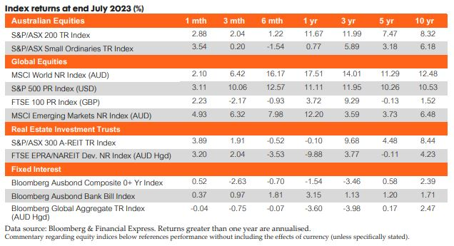

## Bonds v Equities – what are the capital markets trying to tell us? 

Bond markets across a number of developed countries including the US, UK and Germany are currently pricing in a recession. Global stock indices are close to, if not at, all-time highs. What exactly are the capital markets trying to tell us about the state of the economy? 

Stock prices are a well-known leading indicator of the business cycle and future economic growth. They are among a handful of leading economic indicators (LEI) that analysts typically follow when trying to take an overall reading on economic activity. Stock prices have been on a winning streak this year, with Global equities as measured by the MSCI World TR Index AUD up 16% over the 6 months to 31 July 2023. The rally has been led by the US where the launch of artificial intelligence technologies such as ChatGPT, has created enormous buzz and excitement around potential productivity gains and outsized future earnings of companies across the tech value chain. 

Bond markets, on the other hand, are taking a much dourer view. Taking the 10-year to two-year Treasury spread, yield curves in the US, UK and Germany are currently inverted. In Australia, the yield curve, while not yet inverted, is flat by historical standards. Inverted yield curves are typically good indicators that recession looms. Inverted yield curves reflect the expectation from bond investors that longer-term interests will fall; a situation typically associated with recessions. 

So are bond or equity investors right? Inverted yield curves, while pretty reliable indicators, can and do give false signals from time to time. Equity markets too, can be prone to over-optimism, often overshooting fundamentals based on sentiment. Weighing the conflicting signals, our view is that we are headed for a period of weaker growth. The equity market rally to date has been narrow and centred around US mega tech stocks. Should we see greater breadth and participation in this rally, we may have cause to reconsider. Putting stock prices aside, most other leading indicators are pointing to a further slowdown in the business cycle. Consumer sentiment is extremely low, housing starts are weak, money supply is tightening and Purchasing Manager Indices remain in contractionary territory. To us, these data points lead us to believe that the second half of 2023 continues to present some headwinds for the economy and risk assets in general.

## Markets in July 2023

### Australian Equities

The S&P/ASX 200 Accumulation Index finished July up 2.9%, the second-best monthly performance for the index this year. Commodity price rises aided the gains, while consumer sentiment has improved with positive inflation and employment data releases. Energy (+8.8%), Financials ex-Property (+4.9%), Information Technology (I.T.) (+4.5%) and Utilities (+4.0%) led Sectors. In all, 9 of the 11 Sectors in the Index finished positively, with Health Care (-1.5%) and Consumer Staples (-1.0%) the only laggards. 

The driving factor in Energy names was rising commodity prices, particularly oil. This was particularly evident in the gains Woodside (ASX: WDS), whose stock also benefitted from a quarterly update that was received positively by investors. Meanwhile, the other monthly leader, Financials ex-Property, saw investors pile into the “Big 4” banks all having strong months in July. While the RBA has left rates on hold, the banks have continued to increase their rates for home loan borrowers. Investors expect the rate rises from the lenders to ease competition and lead to higher net interest margins. 

The month saw all Factors perform positively, led by Enhanced Value (+6.3%), Shareholder Yield (+5.5%) and Quality (+4.1%). 

### Global Equities 

Global equities ended with a predominantly positive month with stabilising economic data. Emerging markets outperformed developed market counterparts returning 4.9% (MSCI Emerging Markets Index (AUD)) versus a 2.1% gain according to the MSCI World Ex Australia Index (AUD). 

The U.S. markets had mixed results again, with inflation data falling in line with another expected rate hike. Most sectors were positive with standouts in Technology and Energy rising largely due to increased strength in suppliers. The S&P500 Index posted a gain of 3.2% (in local currency terms). 

Emerging markets rallied strongest for the month, as China’s economic growth recovery plan continues, with new stimulus having positive effects across sectors; specifically manufacturing and real estate as indicated by development data. The CSI 300 Index returned 5.3% for the month (in local currency terms).

### Fixed Interest 

The RBA has left the cash rate on hold at its July meeting at 4.1%, pausing what has been an aggressive rate hiking cycle. The market responded with Australian 2-Year and 10-Year bond yields remaining elevated and rising by 4bps and 5bps respectively. Fixed income markets started to see some gains, with the Bloomberg AusBond Composite 0+ Yr Index returning 0.5% over the month. In the US, bond markets continue to price the possibility of a recession and the US yield curve is inverted. The Federal Reserve raised rates in July by 25bps, lifting the benchmark rate to 5.25-5.5%, which is the highest this range has been in 22 years. The market responded with US 10-Year and 2-Year Treasury yields rising by 15bps and 9bps, respectively. US annual inflation for the year to June 2023 lowered to 3%. Globally, higher yields led to losses in fixed income markets, with the Bloomberg Barclays Global Aggregate Index (AUD) returning -0.5% over July.

### Listed Property

The S&P/ASX 200 A-REIT Accumulation index advanced during July, with the index finishing the month 3.8% higher. Global real estate equities (represented by the FTSE EPRA/NAREIT Developed Ex Australia Index (AUD Hedged)) also finished strongly, advancing 3.2% for the month. Australian infrastructure performed well during July, with the S&P/ASX Infrastructure Index TR advancing 4.1% for the month and up 13.2% YTD.

### Direct Property

The Australian residential property market experienced an increase of +0.9% Month on Month (as represented by CoreLogic’s five capital city aggregate). Brisbane and Adelaide were the biggest movers (both +1.4%) with Perth (+1%) also performing strongly. All five capital cities performed positively for the third consecutive month.

### Alternatives 

Preliminary estimates for July indicate that the index decreased by 3.1 per cent (on a monthly average basis) in SDR terms, after decreasing by 2.1 per cent in June (revised). The non-rural, rural and base metals subindices decreased in the past month. In Australian dollar terms, the index decreased by 2.9 per cent in July. Over the past year, the index has decreased by 23.5 per cent in SDR terms, led by lower thermal coal, coking coal, and liquified natural gas prices. The index has decreased by 20.6 per cent in Australian dollar terms.