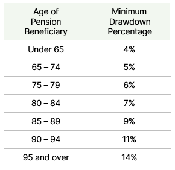

This document provides some additional information to help you understand the investment, tax and other financial planning concepts discussed in your Statement of Advice.

We recommend that you read this document to help you understand the benefits of the strategies recommended to you and the associated costs and risks.

Please contact your adviser if you do not understand anything, or need further information or clarification.

## What is an account-based pension?

An account-based pension is a tax-effective retirement income stream that can provide flexible income payments and a broad range of investment options.

The value of the pension account depends upon investment returns, fees and the amount of income withdrawn each year. As a result, there are no guarantees of how long your account-based pension will last.

## Commencing an account-based pension

Upon meeting a condition of release, you can use the superannuation monies that have accumulated to purchase an account-based pension.

Commencing an account-based pension involves rolling your superannuation assets from your accumulation account into an account-based pension account.

Depending on the superannuation fund, this may involve selling the current underlying assets and transferring cash. Alternatively, moving the underlying holdings to the account-based pension may be beneficial, from the perspective of both capital gains tax and transaction fees.

Once the assets have moved to the account-based pension, the pension provider will make the necessary adjustments to have the account invested in line with your chosen investment strategy. The income and net capital gains generated on this strategy over time are the primary drivers of your account-based pension balance and its longevity.

The income that you draw can vary from year to year, but you must draw a minimum percentage of your account, based on your age.

The table below shows the minimum pension factors for account-based pensions.

While there is no maximum amount that you can draw once you have retired or reached age 65, if you draw an income that exceeds the amount of income or capital gains the account is generating, you will erode the capital in your account.

If permitted by the pension provider, you may also make lump sum withdrawals, which can be beneficial in some circumstances.

If you have met a condition of release and are over the age of 60, the earnings and capital gains generated in your account-based pension account will no longer incur earnings tax.

## Tax Components

An account-based pension has a taxable component and a tax-free component, based on the proportionate split of the superannuation balance transferred to the pension.

All subsequent pension payments, lump sums and death benefits are split in the same proportion, which has tax implications on death and before age 60.

For example, if your account balance at commencement consisted of an $80,000 taxable component and a $20,000 tax-free component, then 80% of all pension payments, lump-sum withdrawals and your final death benefit would be considered to be from the taxable component.

## Taxation of Account-Based Pension Payments

For persons aged 60 or older, income from an account-based pension is free of personal tax.

For persons under age 60, the tax-free amount is the percentage of the income payment from the account-based pension that is not subject to tax.

If you are between 55 and 60, a 15% rebate applies to the taxable income drawn from your account-based pension. The taxable income is the total pension drawn less the tax-free amount.

The tax-free amount is the tax-free percentage multiplied by the total pension income drawn, and the tax-free percentage is equal to the proportion of your balance represented by tax-free components at pension commencement.

## Transfer Balance Cap

The Transfer Balance Cap limits the amount of superannuation transferred into the pension phase. The general cap is currently $1.6 million per person and transferred balances above the cap, plus notional associated earnings, are subject to an excess transfer balance tax.

Rather than transfer excess amounts into the pension phase, superannuation balances can remain in the accumulation phase, where earnings will incur tax at 15%.

The ATO tracks the transfer of superannuation monies into and out of your pension in your Transfer Balance Account (TBA). Investment earnings do not impact on the balance of your TBA, nor do pension payments. Monies transferred to the pension environment increase your TBA while making lump sum withdrawals decreases it.

## Superannuation death benefits

You can elect to have your account-based pension balance paid as an income stream or lump-sum on your death, depending on the type of intended beneficiary:

* Lump-sum to a dependant or non-dependant;
* Lump-sum to your estate; or
* Pension to a dependant (a dependent child must be under 18, 18-25 and financially dependent, or disabled).

Alternatively, you can select (at commencement) to have reversionary pension payments continue to a dependant (generally your spouse).

The most important thing to note is that while superannuation law allows for all of these options, some superannuation funds only allow for a lump sum to be paid under their trust deed.

## Risks of account-based pensions

### Taxation and Legislative Risk

Decisions on pension commencement rely on interpretations of current regulations and legislative practices of the Australian Taxation Office (ATO) and other relevant government bodies, which is subject to regular change.

### Market Risk

An account-based pension may contain a mix of cash, capital stable, diversified and specialist fund. The value of units in each fund may rise and fall, in line with the value of underlying assets as determined by market conditions.

### Longevity Risk

Account-based pensions do not provide a guaranteed lifetime income. Your starting balance, investment earnings, how much income you withdraw and any lump sum withdrawals you may make determine the longevity of your account-based pension account. Payments will only continue while there is a balance in the account.

**Important Information**

Walbrook Wealth Management is a trading name of Barbacane Advisors Pty Ltd (ABN 32 626 694 139; AFSL No. 512465). Barbacane Advisors Pty Ltd is authorised to provide financial services and advice. This post is general information only and is not intended to provide you with financial advice as it does not consider your investment objectives, financial situation or needs, unless expressly indicated otherwise. You should consider whether the information is suitable for your circumstances and where uncertain, seek further professional advice. The author has based this communication on information from sources believed to be reliable at the time of its preparation. Despite our best efforts, no guarantee can be given that all information is accurate, reliable and complete. Any opinions expressed in this email are subject to change without notice, and we are not under any obligation to notify you with changes or updates to these opinions. To the extent permitted by law, we accept no liability for any loss or damage as a result of any reliance on this information.