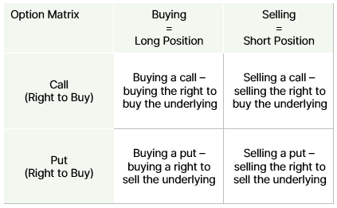

This document provides some additional information to help you understand the investment, tax and other financial planning concepts discussed in your Statement of Advice.

We recommend that you read this document to help you understand the benefits of the strategies recommended to you and the associated costs and risks.

Please contact your adviser if you do not understand anything, or need further information or clarification.

## What are Options?

An option represents a right (if “long”) or an obligation (if “short”) to sell or buy an asset (underlying) at a specific price (strike price) on a specific date (maturity date).

The price of an option (the right) is called the option premium, and the owner exercises the right (option) if it is in their favour.

There are two basic types of options:

* Call option – the owner has the right to buy the underlying (or the obligation to sell if option is short)
* Put option – the owner has the right to sell the underlying (or obligation to buy if option is short)

Both types of options can be bought or sold, resulting in four different vanilla option positions.

## **Key Features of Options**

The underlying assets of an option can be any single asset or multiple assets. The most common underlying assets include stocks, bonds, commodities, currencies, interest rates and market indices.

The price of an option is composed of two components: intrinsic value and time value.

* The intrinsic value of the option – is the difference between the strike price and the spot price of the underlying asset. As the option holder is not forced to exercise the option, the intrinsic value is never negative. An option with intrinsic value is ‘in the money’, an option with no intrinsic value is ‘at the money’ if strike = exercise price, or ‘out of the money ‘ if strike less than exercise for calls or vice versa for puts.
* The time value of the option – is the difference between the actual value of the option minus the intrinsic value. Time value compensates the seller for price movements of the underlying (volatility) as well as foregoing interest. The time value decreases with remaining time to the exercise date and is zero at the maturity date itself.

The value of an option, therefore, depends in a non-linear way on the price of its underlying. The market also reflects expected dividend payments on the underlying in the option price.

The buyer pays the option premium at inception and has the right to exercise the option at specified dates. The most common date schemes are:

* At maturity only (European options)
* At any time up to option expiry (American option)

In the case of a European option, the option holder decides at maturity:

* If it is profitable to the buyer, the option holder exercises the right
* If it is a potential loss, the option holder does not exercise the right

In the case of a call option, if the underlying is above the strike, the option is executed. If not, no execution will take place, and the owner of the option incurs a loss equal to the option premium paid.

While the holder of an American option may exercise at any time up to expiry, due to time value it is generally more beneficial to close the position by mirroring the existing position on the market, rather than exercise and lose the time value of the option.

An option may be traded over the counter (unlisted) or be standardised and traded on public exchanges. Over the counter (OTC) options can be tailored to meet the specific needs of the option buyer or writer.

For example, to reduce the cost of an option, it may be structured to only ‘knock-in’ at a certain level, or it may ‘knock out’ at a certain price level. In both cases, there is a reduced probability of option exercise, reducing the cost.

### Investment Horizon

Short Term

### Income Expectation

Capital Gain

### Market Expectation

Option strategies cater to investors for all market conditions, in high and low volatility environments, whether the expectation is for the market to trade up, down or sideways.

## Time Value 

The time value of an option is higher the longer the time remaining to exercise date, due to two factors:

* The volatility of the market value of the underlying asset: the higher the remaining time to maturity, the higher the probability the market price will change in favour of the option buyer. The implied volatility expresses the expectation of the future volatility of the underlying asset’s market value.
* Holding the underlying results in capital costs for the call seller/put buyer, approximated by the interest they could have earned when investing the same amount in a money market instrument over the lifetime of the option. The rate applied is the‘risk-free’ rate, and the counterparty has to compensate for these costs and the lost opportunity.

## What about warrants?

Warrants are securitised options. They are most similar to long options (buy a call or buy a put) and have a very similar trade-off between risk and return.

Due to the differences in maturity, liquidity and issuer risk, warrants have general and specific risks that are characteristic to structured products.

## Advantages and Disadvantages

### Advantages

* Leverage - using options a holder can gain a larger exposure to movements in the underlying asset.
* Income generation - writers of options receive option premiums, which can boost the income yield of a portfolio.

### Disadvantages

* Time decay - known as Theta, options have a time decay. The time value of the option decreases over time, with the pace of the decrease increasing the closer the option gets to expiry.
* Trading costs per dollar invested - options can have higher spreads and commissions per dollar invested
* Speculative strategies such as leverage and short selling bear the risk of outsized and possibly unlimited losses
* Volatility - as options provide leveraged exposure to the underlying, any price movements in the underlying are amplified.

## Risks of Options

### Price Risk

The value of an option depends on various factors, most important being the price of the underlying, the volatility of that price and the time to expiration of the option.

### Market Risks

The price of the underlying of an option is subject to market risks. The price of the underlying in turn is a significant factor for the price and payoff of the option.

### Leverage

The price of the underlying of an option is subject to market risks. The price of the underlying in turn is a significant factor for the price and payoff of the option.

### Counterparty Risks

Over the counter options not centrally cleared may carry additional risks such as counterparty risk and higher liquidity risks than exchange-traded options, which are standardised.

#### Important Information

Walbrook Wealth Management is a trading name of Barbacane Advisors Pty Ltd (ABN 32 626 694 139; AFSL No. 512465). Barbacane Advisors Pty Ltd is authorised to provide financial services and advice. This post is general information only and is not intended to provide you with financial advice as it does not consider your investment objectives, financial situation or needs, unless expressly indicated otherwise. You should consider whether the information is suitable for your circumstances and where uncertain, seek further professional advice. The author has based this communication on information from sources believed to be reliable at the time of its preparation. Despite our best efforts, no guarantee can be given that all information is accurate, reliable and complete. Any opinions expressed in this email are subject to change without notice, and we are not under any obligation to notify you with changes or updates to these opinions. To the extent permitted by law, we accept no liability for any loss or damage as a result of any reliance on this information.