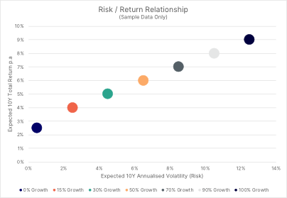

This fact sheet provides further information to help you understand some of the investment, tax and financial planning concepts discussed in your Statement of Advice.

Please contact your adviser if there is any aspect on which you need further information or clarification.

## The Risk and Return Relationship

The trade-off between risk and return is central to investing: the possibility of realising higher returns compensates investors for taking risks.

Optimal investment configurations, with the maximum expected return for each given level of risk, lie on a theoretical line called the 'efficient frontier'.

Risks are to be managed, rather than avoided entirely. The key is to under­stand what risks to bear and to what degree. Identifying your investment objectives is an essential precursor to determining how much risk you should take, and the investments you should make.

Your investment objectives are generally closely tied to your risk tolerance and your capacity to bear loss. Your time horizon, financial responsibil­ities, and investment experience are also impor­tant factors to consider.

The key is to decide what risks to bear and to what degree. Risks must correspond to the objectives and the risk tolerance and ability of the investor.

Investors can use four techniques to mitigate risk in their portfolios - avoidance, diversification, hedging and insurance.

1. **Avoidance -** Not investing at all is equivalent to ruling out most risks. It does, however, leave you exposed to other risks, such as inflation risk.
2. **Diversification -** Investing in a variety of assets to average out unsystematic risks.
3. **Hedging -** Making an additional investment that offsets the potential losses of related or similar assets. A hedge may be complete or partial, depending on the degree of intended coverage.
4. **Insurance -** Buying protection against possible losses. The investor accepts a small loss to retain potentially more significant gains.

A more cautious investor may find that one of the most effective means of managing risk is through diversification, as not all investments behave the same at any given time.

Combining asset classes and securities which have low or negative correlations with each other may help to mitigate or reduce many associated risks, resulting in smoother returns and lower-risk portfolios.

If you are an investor seeking higher returns, you generally have to take on more risk. Howev­er, it is crucial to consider that when you take on more risk, this also increases the likelihood that you may lose some or all of your assets.

In general, risks can be split between systematic and unsystematic risks.

**Systematic Risks** are risks that affect the whole market. Often unpredictable, an investor may mitigate these risks by avoiding investments in that particular market.

**Unsystematic Risks** are risks that affect only one security, company or minor industry sector, e.g. the employees of one specific airline who are on strike. An investor can mitigate unsystematic risks to an extent by diversifying their asset allocation.

There is also a distinction between products with limited risks and those where the risks are unlimit­ed. Fully paid ordinary shares, for instance, carry a limited risk: in the worst case, an investor could lose the capital invested - but not more.

By contrast, more complex products may incur liabilities above the original invested capital, with potentially unlimited losses. In the case of products with unlimited loss potential, banks typically require coverage as compensation in the case of losses. Such so-called 'margins' may take the form of collateral or a credit line.

## Key Investment Risks

Most of the investment techniques, asset classes, and financial instruments mentioned in this document involve the following common risk types:

* **Portfolio Risks**
* **Market Risks**
* **Other Common Risks**

Investors should consider the impact and likelihood of these risks occurring before making any investment.

### Portfolio Risks

Some risks threaten the rationales, objectives, or viability of your assets within your portfolio. These portfolio related risks may vary significantly in scope and features, depending on how you manage your portfolio and the investments you hold.

#### Capital Loss Risk

All investments carry different levels of risk. Capital loss risk is universal and affects all sectors, geographies, and product types. There is a varying probability that an investor might lose some or all of their original investment.

#### Concentration Risk

The risk of not having sufficient diversification in an investment portfolio is called concentration risk. It can refer to a lack of diversification across sectors, geographic regions, or types of securities. A portfolio invested in too few counterparties or products, exposing it to their unsystematic risks, is also considered a concentration risk.

#### Correlation Risk

Understanding the correlation between different assets in a portfolio is essential in managing risk.

Correlation is a term used to compare how an asset might behave in comparison to another investment or asset class. Combining assets with low (or negative) correla­tion means that the fluctuations of individual holdings have a partial offsetting effect as they react differently to market conditions, resulting in less volatile overall returns and lower overall portfolio risk.

Correlation risk refers to the probability that the actual correlation between two assets or varia­bles will be different from what was assumed. As a result, the portfolio could be riskier than anticipated.

#### Leverage Risk

Leverage involves gaining exposure to an asset using borrowed funds or derivatives, to amplify gains. However, it can also amplify losses. An investor may be exposed to leverage risk directly, from their actions, or indirectly by investing with a company or investment manager using leverage.

In addition to increased volatility and the risk of amplified losses wiping out an investors equity, leverage risk incorporates the risks of not meeting margin calls, not being able to refinance borrowings and counterparty risks when using derivatives to leverage.

#### Liquidity Risk

The risk that an investor cannot sell an investment at a fair price within an expected timeframe is called Liquidity Risk.

Listing on a stock exchange does not negate liquidity risk, as there still needs to be a willing buyer. It is common for the shares of small or micro companies ('small caps' and 'micro caps') to present liquidity risks, given there are few shares in issuance and trading volumes are low. Listed investment companies and investment trusts, especially listed private equity vehicles, may also present a liquidity risk.

Liquidity risk is even more prevalent in unlisted assets, including structured products and alternative investments such as private equity or real estate, where no secondary market exists, and the underlying assets are themselves illiquid.

#### Manager Risk

Manager Risk is the risk that an investment manager or investment management team fail to meet their investment objectives or drifts from their stated investment mandate or style.

#### Order Placement Risk

When an investor places a trade, they may receive an indicative price from their broker. The risk of the actual price differing or the trade not being executed at all at the indicative price or better is called the order placement risk.

#### Settlement Risk

The risk that a counterparty does not pay or deliver securities after executing a trade is called settlement risk. The risk arises because payments and deliveries are not simultaneous, and investors can reduce this risk by using clearing houses to settle transactions.

#### Shortfall Risk

Defining investment objectives is an essential precursor to making investment decisions. Shortfall risk is the risk that the returns from an investment will not be sufficient to meet the goals of the investor.

#### Timing Risk

An investor is exposed to timing risk when attempting to time market entry or exit after committing to the action. It is impossible to time the market consistently.

Timing risk also describes the risk borne by investors when they invest in long term assets to make short term gains. If the investors time horizon is short due to financing costs or other commitments, they may be forced to sell their investment at a loss.

#### Turnover Risk

When investors or investment professionals are managing investment portfolios, a high number of short-term transactions can result in higher brokerage costs, or other transaction fees and expenses. These costs erode the final returns to investors.

The possibility that the cost of high levels of trading exceeds the benefits of the trading activity, and may adversely affect performance, is known as turnover risk.

#### Volatility Risk

Volatility Risk refers to the impact that changes in expected volatility have on a security or portfolio. For example, a drop in the expected volatility of the S&P 500 index may cause a portfolio of long out-of-the-money S&P 500 positions to fall in value, as the probability of them being in the money at expiry has declined.

### Market Risks

Market risks are systematic risks that affect all investors, such as fluctuations in broad market returns.

There are four main market risks:

#### Interest Rate Risk

Relates primarily to investments in fixed income but affects all asset classes and covers the volatility that may accompany interest rate fluctuations due to fundamental factors including the inflation rate, money supply, the government's monetary and fiscal policies, and a country's position within the economic cycle.

#### Equity Market Risk

Equity Market Risk refers to the risk involved in equity investment, given fluctuating share prices. The equity risk premium is the difference between the risk-free rate and the level of return demanded by investors for assuming equity market risk.

#### Currency Risk

Also referred to as exchange-rate risk, this risk arises from currency fluctuations. Investors holding foreign currency assets bear the risk of a devaluation of that currency against their currency. They can reduce this risk by adopting hedging strategies.

#### Commodity Risk

Refers to the uncertainty of commodity prices and the risk that these price movements pose to direct investors in commodities or investment in companies that rely on commodity inputs, e.g. food manufacturers, oil refineries.

### Other Common Risks

Over and above portfolio related and market risks, there are additional risks which can be related to the macroeconomic conditions playing out in a country, sector or across the world economy. Also, there are specific risks which emerge due to the unique situations of companies or counterparties.

#### Counterparty Risk

Refers to the risk of loss arising from a debtor who does not make payments as promised, resulting in default. For example, a bond issuer does not return an investors principal at maturity, or an individual stops paying their mortgage. Should a debtor become insolvent, this can lead to the total loss of the investment.

#### Country Risk

Refers to the risk of loss when investing in foreign countries. Country risk tends to be relatively low in developed markets, where governments are typically stable, and companies adhere to strict levels of industry standards.

In emerging markets, there is generally less government supervision of business and industry. Country risk in emerging markets is therefore greater.

The value of an investment may be affected by changes in a country's business environment, including financial factors (currency controls, devaluation or regulatory changes). Factor related to the stability of a country, such as wars, riots and political risks, may result in an investor not being able to recover their investment.

#### Economic Risk

Economic Risks are posed by macroeconomic conditions, such as exchange rates, political stability, or government regulation, in an investors own country and countries of investment.

#### Emerging Market Risk

Many emerging markets countries are undergoing, or have experienced in recent years, a significant political change which has affected government policy.

The relative inexperience with such policies and instability of these political systems leaves them more vulnerable to economic hardship, public unrest or widespread dissatisfaction with reform, political or diplomatic developments, social, ethnic or religious instability or changes in government policies.

The equity and debt markets of many emerging markets countries are in the early stages of development. Generally, they lack the level of transparency, liquidity, efficiency and regulation found in more developed markets.

It is crucial to be familiar with secondary market trading in emerging markets investments. Price volatility in many of these markets can be extreme.

#### Inflation Risk

Inflation Risk refers to the risk of increases in the general price level of goods in an economy undermining investment performance. It is not the risk that inflation will occur: instead, it is the risk that inflation will be higher than an investor expected when setting their investment objectives.

Investments are exposed to inflation risk as rising prices cause money to lose its real value (purchasing power). Inflation risk is a particular worry for income investors. If an investor is dependent on the income from their portfolio and earns a lower real (inflation-adjusted) return than they initially expected, they may risk capital erosion.

#### Issuer Risk

Issuer Risk refers to the risk that a counterparty will default on its financial obligations. Counterparties may be corporates, governments or other government and non-governmental bodies. Issuer risk is measured by the issuer's creditworthiness and reflects their solvency. For example, the credit quality of a sovereign (government) issuer is determined by the state of its finances and economic stability.

#### Operational Risk

Operational Risk refers to the potential loss incurred by stakeholders such as investors or customers, resulting from inadequate or failed processes, people or systems.

#### Political Risk

Political Risk encompasses a broad range of consequences including confiscatory taxation, exchange controls, compulsory re-acquisition, nationalisa­tion or expropriation of foreign-owned assets without adequate compensation.

Whilst political risk is relevant for all developed and emerging market countries, the impact of changes in policies may be more pronounced for emerging market countries.

#### Regulatory Risk

Regulatory Risk refers to the risk of investments being affected by chang­es in the law, accounting code, or market rules. While these risks are present in every jurisdiction and industry, some are more affected than others.

Regulatory risk extends beyond financial markets and taxation to cover environmental, political, and legal regulation that may affect the operations of a company.

#### Sector Risk

A form of concentration risk, any investment strategy that involves concentra­tion of investments in a particular industry sector carries with it a risk that the industry involved will suffer a downturn. Broader economic factors that have an impact on the industry - market sentiment turns against the industry as a whole, or regulatory changes affecting the industry adversely, are considered sector risks.

#### Suspension Risk

Under certain trading conditions, it may be difficult or impossible to liquidate a position. Suspension of trading may occur due to rapid price movements that trigger circuit breakers per the rules of the relevant exchange.

Placing a 'stop-loss order' (an order to sell a security when it reaches a specific price) will not necessarily limit your losses to the intended amounts because the market conditions may make it impossible to execute at the stipulated price.

#### Taxation Risk

Taxation Risk is a type of regulatory risk and centres on the effect on an investment's value of a change in its tax treatment. For instance, tax laws relating to dividend income and capital gains on equities might change, making a shareholding less attractive.

#### Translation Risk

Refers to the risk that a company's financial statements will be affected by exchange rate fluctuations.

##### **Important Information**

Walbrook Wealth Management is a trading name of Barbacane Advisors Pty Ltd (ABN 32 626 694 139; AFSL No. 512465). Barbacane Advisors Pty Ltd is authorised to provide financial services and advice. This post is general information only and is not intended to provide you with financial advice as it does not consider your investment objectives, financial situation or needs, unless expressly indicated otherwise. You should consider whether the information is suitable for your circumstances and where uncertain, seek further professional advice. The author has based this communication on information from sources believed to be reliable at the time of its preparation. Despite our best efforts, no guarantee can be given that all information is accurate, reliable and complete. Any opinions expressed in this email are subject to change without notice, and we are not under any obligation to notify you with changes or updates to these opinions. To the extent permitted by law, we accept no liability for any loss or damage as a result of any reliance on this information.