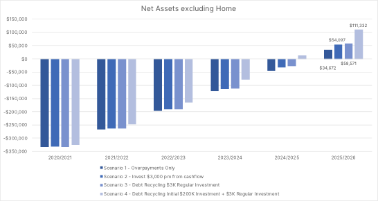

For many clients, being 'mortgage-free' is an important objective, potentially the most important.  

This goal is understandable, given the effects of compound interest, the drain on savings power and the peace of mind that owning your home outright can bring.

For other clients, being 'mortgage-free' ranks equally with different objectives, with the primary goal being to create wealth for retirement.

The most common strategy employed is to pay more than the monthly repayment, or deposit the cash to an offset account.  Your return is equal to the current interest rate on your mortgage, which is almost certainly higher than deposit rates. Unlike interest earned on deposit accounts, you incur no tax on this return.

In a low-interest-rate environment, clients with some risk tolerance often ask us whether this makes sense.  Should we pay the contracted level of repayments, and invest our excess savings in a share portfolio, or another property, they ask.  

A more nuanced approach is to target the elimination of debt used to purchase your home while maintaining and potentially increasing debt that is more tax-efficient.

Depending on the client's circumstances and macroeconomic outlook, we may recommend a debt recycling strategy to help them to create wealth and pay down their mortgage more quickly.

## Deductible v Non-Deductible Debt

Interest costs are a drain on savings power, but not all debt is created equal. It is essential to distinguish between tax-deductible and non-tax-deductible debt.

* Interest on amounts borrowed to purchase an asset with no prospect of taxable income, such as your home, is non-deductible.
* Interest on amounts borrowed to buy assets that are likely to generate taxable income, such as an investment property or shares, is deductible.

A borrower's ability to deduct interest expense against income received results in a lower after-tax borrowing cost. This tax benefit typically increases with the marginal tax rate of the individual; however, there may be a further boost when deductions cause taxable income to fall below thresholds for additional tax offsets.

*Example*

*David has two loans, secured by his home. David used the first loan to buy the house, and the outstanding loan balance is $300,000. David borrowed a further $300,000 recently and used this second loan to purchase shares. David earns $100,000 per annum, so his top rate of tax is 32.5%.*

*The interest rate on both loans is 3.00%, so he pays the bank $9,000 in interest on each loan each year. Because David used the second loan to purchase investments, the interest is tax-deductible and only costs David $6,075 after tax. If David were on the top marginal tax rate, the loan would only cost David $4,815 after tax.*

## Debt recycling strategy

A debt recycling strategy involves directing all after-tax cashflows to the repayment of non-deductible debt. These overpayments reduce the overall debt level, increasing borrowing capacity, which the borrower can use to drawdown a deductible loan and invest the loan proceeds in income-producing assets. The non-deductible debt is reduced further by any income and capital gains produced by these assets.

Depending on the objective of the borrower, the loan structures and their borrowing capacity, they may reduce the overall debt level or keep it static.

In both cases, the debt recycling strategy aims to reduce the after-tax cost of total debt by increasing the proportion of deductible debt.

The process is complete when you have reduced your non-deductible debt to zero, via regular cashflows or a combination of regular cashflows and the liquidation of the investment portfolio.

## Risks

Investing involves risk and borrowing to invest amplifies these risks.  It is highly likely that however long your investment horizon is, you will see the value of a diversified portfolio temporarily fall below the loan amount.  These strategies are highly dependent on the after-tax portfolio returns exceeding the after-tax cost of the debt.

You should also consider the heightened exposure to interest rate risk.  Rising rates will not only increase the cost of a variable rate home loan, and the cost when refinancing fixed rates loans.  They may also impact the market value of the investment portfolio, particularly the fixed income component as well as rate-sensitive sectors of the share market.

Your financial adviser can help you understand your risk tolerance and risk ability to determine whether these and similar strategies are right for you. Permanent loss of capital can occur when discomfort or a need to meet other financial obligations force an investor to sell during market volatility.

A change to personal circumstances can also impact the tax benefit. For example, a temporary drop in income may mean that your marginal tax rate is lower, increasing the after-tax cost of deductible debt and reducing the benefits of the strategy.

For more information, see [Understanding Risk](https://www.walbrook.com.au/education/understanding-risk).

## Case Study

*Doris and David are 38 and 40. They have two children, 8 and 10, and live in Yarraville. They are comfortable in their current home and have recently renovated, so there are no large expenditures on the horizon. Their financial situation is as follows:*

* *Doris earns $100,000 excluding superannuation*
* *David earns $90,000 excluding superannuation*
* *They spend $60,000 per annum, with an additional $5,000 earmarked for holidays*
* *Their home is worth $1,000,000*
* *They owe $500,000 on their mortgage, with 20 years remaining. The current interest rate is 3.00%, with contracted repayments of$2,772.99 per month*
* *They have $100,000 in a mortgage offset account, which they would like to maintain as a cash reserve*

*David and Doris' bank has approved a separate $300,000 home loan against their home, for investment purposes. The rate is slightly higher, at 3.20% pa, and the loan is interest-only for five years.*

*They have been making additional payments on their mortgage but now wonder if they should pay the minimum repayment and invest the excess cash flow instead.*

*David and Doris work with their adviser to assess the following options:*

* *Scenario 1 - using all excess cash flow to pay down their home loan*
* *Scenario 2 - investing $3,000 per month, funded by excess cash flow, and using the remaining excess cash flow to pay down their home loan*
* *Scenario 3 - investing $3,000 per month, funded by the investment loan, and use all excess cash flow to pay down their home loan*
* *Scenario 4 - investing an initial $200,000, funded by the investment loan, then regular $3,000 per month investments financed by the same loan. All excess cashflow, including income from the investments, is used to pay down the home loan.*

*The adviser uses tax rates applicable at 1 July 2020 to model the different outcomes. Results are highly sensitive to changes in return assumptions, and the income proportion of the estimated total return. As David and Doris have considerable savings power, moderate to high risk tolerance and a long time horizon, the adviser uses long-term assumptions for a Growth portfolio (4.09% growth, 2.47% income, 22.85% franking).*

*The adviser shows Doris and David the estimated growth in net assets (excluding the family home) over the subsequent five years, with net investment assets being the value of the portfolio plus the offset account, less the home loan and the investment loan.*

*The model estimates that if David and Doris employ a debt recycling strategy with regular investment, rather than merely directing all excess cash flow to the repayment of their home mortgage, by the end of 2025/26, they will be $23,899 better off under the debt recycling strategy.*

*Further, when compared with Scenario 1, by the end of 2025/26 David and Doris are estimated to be $74,660 better off by using the investment loan to make an initial $200,000 investment and subsequent $3,000 monthly investments.*

*These differences are expected, given the use of leverage and with forecast returns exceeding interest rates, and these additional estimated returns come with additional risk. The market and leverage risk increases from Scenario 1, which is the most conservative, to Scenario 4. Scenario 3, and to a lesser extent, Scenario 4, minimise market timing risk by investing regularly (monthly).*

*If the realised after-tax investment returns are lower than the after-tax cost of the debts, David and Doris will have been better off under Scenario 1, e.g. focusing on overpaying their mortgage.*

**Important Information**

Walbrook Wealth Management is a trading name of Barbacane Advisors Pty Ltd (ABN 32 626 694 139; AFSL No. 512465). Barbacane Advisors Pty Ltd is authorised to provide financial services and advice. This post is general information only and is not intended to provide you with financial advice as it does not consider your investment objectives, financial situation or needs, unless expressly indicated otherwise. You should consider whether the information is suitable for your circumstances and where uncertain, seek further professional advice. The author has based this communication on information from sources believed to be reliable at the time of its preparation. Despite our best efforts, no guarantee can be given that all information is accurate, reliable and complete. Any opinions expressed in this email are subject to change without notice, and we are not under any obligation to notify you with changes or updates to these opinions. To the extent permitted by law, we accept no liability for any loss or damage as a result of any reliance on this information.